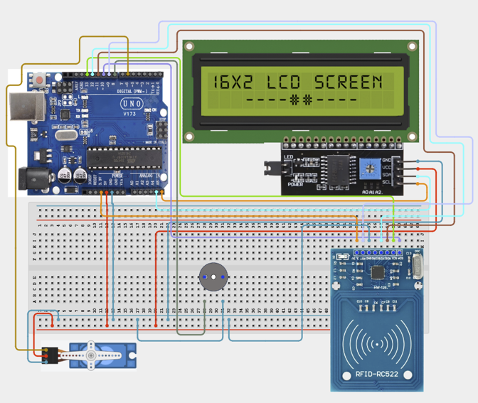

# Project 3.9: Smart Building Access System

| **Description** | In this project, learners will build a Smart Building Access System using RFID authentication, a Servo Motor door lock, an LCD Display, and a Buzzer. Authorized users can unlock the door by scanning a registered RFID card, while unauthorized users trigger an alarm. This project demonstrates how electronic access-control systems are used in offices, hotels, schools, laboratories, and smart homes.|
|------------------|----------------------------------------------------------------|
| **Use case**     |This project is connected to real-world uses such as: This project demonstrates how RFID authentication can be integrated with automated locking systems to improve building security. Similar systems are commonly used in smart homes, hotels, offices, and research laboratories.|

## Components (Things You will need)

|  |  |  |  |  |  |  |  |  | |
|---|---|---|---|---|---|---|---|---|---|

## Building the circuit

Things Needed:

- MFRC522 RFID Reader
- RFID Card/Tag
- Servo Motor
- I2C LCD Display
- Buzzer
- Breadboard
- Jumper Wires

## Mounting the component on the breadboard and wiring the circuit

**Step 1:** Connect a jumper wire from the Arduino 5V pin to the breadboard’s positive (+) power rail.

**Step 2:** Connect a jumper wire from the Arduino GND pin to the breadboard’s negative (−) ground rail.

**Step 3:** Connect the I2C LCD Display’s VCC to the positive (+) power rail.

**Step 4:** Connect the I2C LCD Display’s GND to the negative (−) ground rail.

**Step 5:** Connect the I2C LCD Display’s SDA to Arduino analog pin A4.

**Step 6:** Connect the I2C LCD Display’s SCL to Arduino analog pin A5.

**Step 7:** Connect the MFRC522 RFID Reader’s 3.3V pin directly to the Arduino 3.3V pin.

**Step 8:** Connect the MFRC522 RFID Reader’s GND to the breadboard’s negative (−) ground rail.

**Step 9:** Connect the RFID Reader’s RST pin to Arduino digital pin 9.

**Step 10:** Connect the RFID Reader’s SDA (SS) pin to Arduino digital pin 10.

**Step 11:** Connect the RFID Reader’s MOSI pin to Arduino digital pin 11.

**Step 12:** Connect the RFID Reader’s MISO pin to Arduino digital pin 12.

**Step 13:** Connect the RFID Reader’s SCK pin to Arduino digital pin 13.

**Step 14:** Leave the RFID Reader’s IRQ pin unconnected.

**Step 15:** Connect the Servo Motor’s VCC (red wire) to the positive (+) power rail.

**Step 16:** Connect the Servo Motor’s GND (brown/black wire) to the negative (−) ground rail.

**Step 17:** Connect the Servo Motor’s Signal (yellow/orange wire) to Arduino digital pin 6.

**Step 18:** Connect the Buzzer’s positive (+) or longer pin to Arduino digital pin 8.

**Step 19:** Connect the Buzzer’s negative (−) or shorter pin to the breadboard’s negative (−) ground rail.

**Step 20:** Carefully check all connections, especially the RFID Reader’s 3.3V power and SPI connections, before powering the Arduino.



_Make sure to connect the Arduino USB cable to the Arduino board._

## PROGRAMMING

**Step 1:** Open your Arduino IDE. See how to set up here: [Getting Started](../../STEMAIDE_CODER_Kit_Manual/Getting_Started/Arduino_IDE_Setup.md).

**Step 2:** Write the complete program implementing the system logic with appropriate pin definitions, setup configuration, and the main control loop.

```cpp

// Required Libraries
#include <SPI.h>
#include <MFRC522.h>
#include <Servo.h>
#include <Wire.h>
#include <LiquidCrystal_I2C.h>

// RFID Pins
#define SS_PIN 10
#define RST_PIN 9

// Create RFID Object
MFRC522 rfid(SS_PIN, RST_PIN);

// Create Servo Object
Servo doorServo;

// Create LCD Object
LiquidCrystal_I2C lcd(0x27, 16, 2);

// Pin Definitions
const int servoPin = 6;
const int buzzerPin = 8;

// Replace this UID with your own RFID card UID
String authorizedUID = "A1 B2 C3 D4";

void setup() {

  Serial.begin(9600);

  // Initialize SPI and RFID
  SPI.begin();
  rfid.PCD_Init();

  // Initialize LCD
  lcd.init();
  lcd.backlight();

  // Initialize Servo
  doorServo.attach(servoPin);
  doorServo.write(0);   // Door locked

  // Initialize Buzzer
  pinMode(buzzerPin, OUTPUT);
  digitalWrite(buzzerPin, LOW);

  // Startup Message
  lcd.clear();
  lcd.setCursor(0, 0);
  lcd.print("Scan RFID");
  lcd.setCursor(0, 1);
  lcd.print("Card...");
}

void loop() {

  // Wait for an RFID card
  if (!rfid.PICC_IsNewCardPresent()) {
    return;
  }

  // Read the RFID card
  if (!rfid.PICC_ReadCardSerial()) {
    return;
  }

  // Build UID string
  String cardUID = "";

  for (byte i = 0; i < rfid.uid.size; i++) {

    if (rfid.uid.uidByte[i] < 0x10) {
      cardUID += "0";
    }

    cardUID += String(rfid.uid.uidByte[i], HEX);

    if (i < rfid.uid.size - 1) {
      cardUID += " ";
    }
  }

  cardUID.toUpperCase();
  cardUID.trim();

  // Display UID in Serial Monitor
  Serial.print("Card UID: ");
  Serial.println(cardUID);

  lcd.clear();

  // Check if card is authorized
  if (cardUID == authorizedUID) {

    lcd.setCursor(0, 0);
    lcd.print("Access Granted");

    lcd.setCursor(0, 1);
    lcd.print("Door Opening");

    // Unlock Door
    doorServo.write(90);

    delay(3000);

    // Lock Door
    doorServo.write(0);

    lcd.clear();
    lcd.setCursor(0, 0);
    lcd.print("Door Locked");

    delay(1500);

  }
  else {

    lcd.setCursor(0, 0);
    lcd.print("Access Denied");

    lcd.setCursor(0, 1);
    lcd.print("Alarm Active");

    // Sound Alarm
    digitalWrite(buzzerPin, HIGH);

    delay(3000);

    digitalWrite(buzzerPin, LOW);
  }

  // Stop communication with the RFID card
  rfid.PICC_HaltA();
  rfid.PCD_StopCrypto1();

  // Return to waiting screen
  lcd.clear();
  lcd.setCursor(0, 0);
  lcd.print("Scan RFID");
  lcd.setCursor(0, 1);
  lcd.print("Card...");
}

```

**Step 3:** Save your code. _See the [Getting Started](../../STEMAIDE_CODER_Kit_Manual/Getting_Started/Arduino_IDE_Setup.md) section_

**Step 4:** Select the arduino board and port _See the [Getting Started](../../Getting Started/Arduino_IDE_Setup.md).

**Step 5:** Upload your code.

## CONCLUSION

When the program is running, the Smart Building Access System waits for an RFID card to be scanned. If an authorized card is detected, the LCD displays an access granted message, the servo motor unlocks the door temporarily, and then returns to the locked position. If an unauthorized card is scanned, the LCD displays an access denied message and the buzzer sounds, providing an audible alert to indicate unauthorized access.
