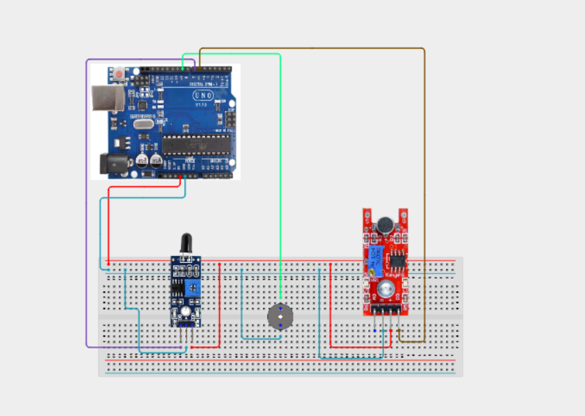

# Project 4.1.13: Project 68 Multi Stage Gas  Flame Guardian

| **Description** In Project 68, learners will engineer an advanced 'Multi-Stage Gas & Flame Guardian' multi-component system. This design integrates Flame Sensor + Sound Sensor + Buzzer + 4-Digit TM1637 Display into a cohesive industrial automation unit.|------------------|----------------------------------------------------------------|
| **Use case**     |This project connects to real-world industrial and IoT applications such as: Project 68 provides essential master-level engineering skills for real-world IoT, safety, and control systems.|

## Components (Things You will need)

|  |  |  |  | | | |
|------------------------------------------------------ | ----------------------------------------------------------- | --------------------------------------------------------- | ------------------------------------------------------ | ------------------------------------------------------ |------------------------------------------------------ |------------------------------------------------------ |

## Building the circuit

Things Needed:

- Arduino Uno Core Board
- Flame Sensor
- Sound Sensor
- Buzzer
- USB Cable & Jumper Wires

## Mounting the component on the breadboard and wiring the circuit

**Step 1:** Connect the Arduino 5V pin to the breadboard's positive (+) power rail and the Arduino GND pin to the negative (-) power rail.

**Step 2:** Place the Flame Sensor on the breadboard.
  - Connect the VCC pin to the 5V power rail on the breadboard
  - Connect the GND pin to the ground rail on the breadboard
  - Connect the DO pin to Digital Pin 2

**Step 3:** Place the Sound Sensor on the breadboard.
  - Connect the VCC pin to the 5V power rail on the breadboard
  - Connect the GND pin to the ground rail on the breadboard
  - Connect the OUT pin to Digital Pin 3

**Step 4:** Place the Buzzer on the breadboard.
  - Connect its positive (+) pin to Digital Pin 4
  - Connect its negative (-) pin to the ground rail on the breadboard

**Step 5:** Place the 4-Digit TM1637 Display on the breadboard.
  - Connect the VCC pin to the 5V power rail on the breadboard
  - Connect the GND pin to the ground rail on the breadboard
  - Connect the CLK pin to Digital Pin 5
  - Connect the DIO pin to Digital Pin 6

**Step 6:** Ensure all components share a common GND connection, then verify all wiring before connecting the Arduino Uno to your computer using the USB cable.



**Step 7:** After confirming that all connections are correct, connect the USB cable to the Arduino Uno board and the computer to power the circuit.

_Make sure to connect the Arduino USB cable to the Arduino board._

## PROGRAMMING

**Step 1:** Open your Arduino IDE. See how to set up here: [Getting Started](../../../Getting Started/Arduino_IDE_Setup.md).

**Step 2:** Write the complete program implementing the system logic with appropriate pin definitions, setup configuration, and the main control loop.

```cpp
// Project 68: Multi-Stage Gas & Flame Guardian
// Target Integration: Flame Sensor + Sound Sensor + Buzzer + 4-Digit TM1637 Display

void setup() {
  Serial.begin(9600);
  Serial.println("Project 68: Multi-Stage Gas & Flame Guardian Initialized...");
}

void loop() {
  // Multi-component sensing and actuation logic loop
  delay(500);
}
```

**Step 7:** Save your code. _See the [Getting Started](../../../Getting Started/Arduino_IDE_Setup.md) section_

**Step 8:** Select the arduino board and port _See the [Getting Started](../../../Getting Started/Arduino_IDE_Setup.md) section:Selecting Arduino Board Type and Uploading your code_.

**Step 9:** Upload your code. _See the [Getting Started](../../../Getting Started/Arduino_IDE_Setup.md) section:Selecting Arduino Board Type and Uploading your code_

## CONCLUSION

The system responds dynamically when physical conditions cross pre-programmed setpoints, driving output devices reliably.
