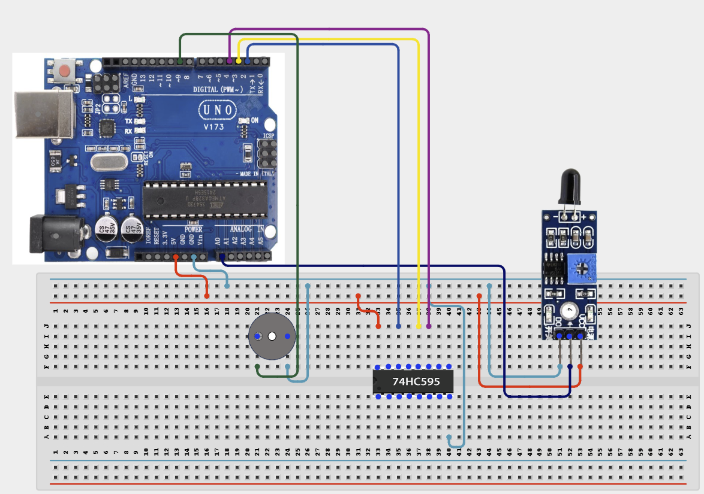

# Project 4.1.25: Project 80 Multi Channel LED Safety Array

| **Description** In Project 80, learners will engineer an advanced 'Multi-Channel LED Safety Array' multi-component system. This design integrates 74HC595 Shift Register + Flame Sensor + Active Buzzer into a cohesive industrial automation unit.|------------------|----------------------------------------------------------------|
| **Use case**     |This project connects to real-world industrial and IoT applications such as: Project 80 provides essential master-level engineering skills for real-world IoT, safety, and control systems.|

## Components (Things You will need)

|  |  |  |  | | | |
|------------------------------------------------------ | ----------------------------------------------------------- | --------------------------------------------------------- | ------------------------------------------------------ | ------------------------------------------------------ |------------------------------------------------------ |------------------------------------------------------ |

## Building the circuit

Things Needed:

- Arduino Uno Core Board
- 74HC595 Shift Register
- Flame Sensor
- Active Buzzer
- USB Cable & Jumper Wires

## Mounting the component on the breadboard and wiring the circuit

**Step 1:** Connect the Arduino 5V pin to the breadboard's positive (+) power rail and the Arduino GND pin to the negative (-) power rail.

**Step 2:** Place the 74HC595 Shift Register on the breadboard.
  - Connect the VCC (Pin 16) to the 5V power rail on the breadboard
  - Connect the GND (Pin 8) to the ground rail on the breadboard
  - Connect the DS / Data pin to Digital Pin 2
  - Connect the ST_CP / Latch pin to Digital Pin 3
  - Connect the SH_CP / Clock pin to Digital Pin 4
  - Connect Q0-Q7 to LEDs through 220Ω resistors

**Step 3:** Place the Flame Sensor on the breadboard.
  - Connect the VCC pin to the 5V power rail on the breadboard
  - Connect the GND pin to the ground rail on the breadboard
  - Connect the DO pin to Analog Pin A0

**Step 4:** Place the Active Buzzer on the breadboard.
  - Connect its positive (+) pin to Digital Pin 9
  - Connect its negative (-) pin to the ground rail on the breadboard

**Step 5:** Ensure all components share a common GND connection, then verify all wiring before connecting the Arduino Uno to your computer using the USB cable.



**Step 6:** After confirming that all connections are correct, connect the USB cable to the Arduino Uno board and the computer to power the circuit.

_Make sure to connect the Arduino USB cable to the Arduino board._

## PROGRAMMING

**Step 1:** Open your Arduino IDE. See how to set up here: [Getting Started](../../../Getting Started/Arduino_IDE_Setup.md).

**Step 2:** Write the complete program implementing the system logic with appropriate pin definitions, setup configuration, and the main control loop.

```cpp
// Project 80: Multi-Channel LED Safety Array
// Pin Definitions
const int DS_PIN = 2;     // Data Pin (74HC595)
const int ST_CP_PIN = 3;  // Latch Pin (74HC595)
const int SH_CP_PIN = 4;  // Clock Pin (74HC595)
const int FLAME_PIN = A0; // Flame Sensor
const int BUZZER_PIN = 9; // Active Buzzer

void setup() {
  pinMode(DS_PIN, OUTPUT);
  pinMode(ST_CP_PIN, OUTPUT);
  pinMode(SH_CP_PIN, OUTPUT);
  pinMode(FLAME_PIN, INPUT);
  pinMode(BUZZER_PIN, OUTPUT);
  
  Serial.begin(9600);
  Serial.println("System Initialized...");
}

void loop() {
  int flameValue = analogRead(FLAME_PIN);
  
  if (flameValue < 500) { // Threshold met
    digitalWrite(BUZZER_PIN, HIGH);
    updateShiftRegister(0xFF); // Turn on all LEDs
    Serial.println("WARNING: Flame Detected!");
  } else {
    digitalWrite(BUZZER_PIN, LOW);
    updateShiftRegister(0x00); // Turn off all LEDs
  }
  delay(100);
}

void updateShiftRegister(byte data) {
  digitalWrite(ST_CP_PIN, LOW);
  shiftOut(DS_PIN, SH_CP_PIN, MSBFIRST, data);
  digitalWrite(ST_CP_PIN, HIGH);
}

```

**Step 7:** Save your code. _See the [Getting Started](../../../Getting Started/Arduino_IDE_Setup.md) section_

**Step 8:** Select the arduino board and port _See the [Getting Started](../../../Getting Started/Arduino_IDE_Setup.md) section:Selecting Arduino Board Type and Uploading your code_.

**Step 9:** Upload your code. _See the [Getting Started](../../../Getting Started/Arduino_IDE_Setup.md) section:Selecting Arduino Board Type and Uploading your code_

## CONCLUSION

The system responds dynamically when physical conditions cross pre-programmed setpoints, driving output devices reliably.
