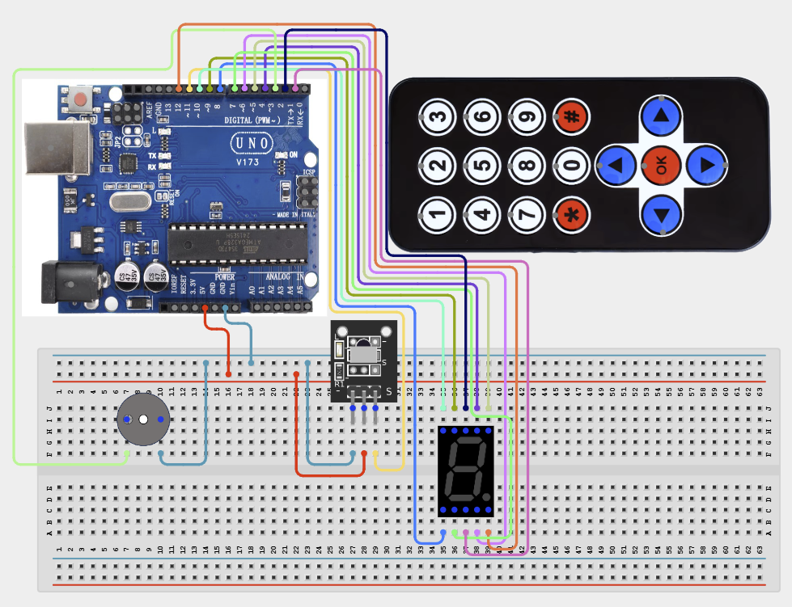

# Project 4.2.10: Project 100 Remote Controlled 7 Segment Scorekeeper

| **Description** In Project 100, learners will construct an expert interactive system titled 'Remote Controlled 7-Segment Scorekeeper'. This manual details the complete synthesis of IR Receiver + Remote + 1-Digit 7-Segment Display + Active Buzzer into an intuitive, high-performance automated control platform.|------------------|----------------------------------------------------------------|
| **Use case**     |This project connects to real-world industrial and IoT applications such as: Project 100 equips students with professional skills in embedded human-machine interface (HMI) design and automated motion control.|

## Components (Things You will need)

|  |  |  |  | | | |
|------------------------------------------------------ | ----------------------------------------------------------- | --------------------------------------------------------- | ------------------------------------------------------ | ------------------------------------------------------ |------------------------------------------------------ |------------------------------------------------------ |

## Building the circuit

Things Needed:

- Arduino Uno Core Board = 1
- IR Receiver = 1
- Remote = 1
- 1-Digit 7-Segment Display = 1
- USB Cable & Jumper Wires = 1
- Buzzer = 1

## Mounting the component on the breadboard and wiring the circuit

**Step 1:** Inventory all modules listed in the Required Components table.

**Step 2:** Connect the IR Receiver Signal pin to Arduino Digital Pin 11.

**Step 3:** Connect the Active Buzzer positive/signal pin to Arduino Digital Pin 3.

**Step 4:** Connect the 7-Segment display segment pins (A-G) to Arduino Digital Pins 4 through 10, the Decimal Point (DP) to Pin 12, and the Common pins (com.1 and com.2) to Digital Pins 1 and 2, respectively.

**Step 5:** Connect all device GND pins to the Arduino GND pin and power/VCC pins to the 5V rail.

**Step 6:** Connect USB programming cable only after verifying all signal path wiring.



_Make sure to connect the Arduino USB cable to the Arduino board._

## PROGRAMMING

**Step 1:** Open your Arduino IDE. See how to set up here: [Getting Started](../../../Getting Started/Arduino_IDE_Setup.md).

**Step 2:** Write the complete program implementing the system logic with appropriate pin definitions, setup configuration, and the main control loop.

```cpp
// Project 100: Remote Controlled 7-Segment Scorekeeper
// Pins 4-10: 7-Segment Segments A-G | Pin 11: IR Receiver | Pin 3: Buzzer

const int irPin = 11;
const int buzzerPin = 3;
const int segmentPins[] = {4, 5, 6, 7, 8, 9, 10};

void setup() {
  Serial.begin(9600);
  pinMode(irPin, INPUT);
  pinMode(buzzerPin, OUTPUT);
  for (int i = 0; i < 7; i++) {
    pinMode(segmentPins[i], OUTPUT);
  }
  Serial.println("Hardware Initialized: Waiting for IR Commands...");
}

void loop() {
  // TODO: Add IR library parsing logic here
  // TODO: Define specific digit logic for pins 4-10
  delay(100);
}
```

**Step 7:** Save your code. _See the [Getting Started](../../../Getting Started/Arduino_IDE_Setup.md) section_

**Step 8:** Select the arduino board and port _See the [Getting Started](../../../Getting Started/Arduino_IDE_Setup.md) section:Selecting Arduino Board Type and Uploading your code_.

**Step 9:** Upload your code. _See the [Getting Started](../../../Getting Started/Arduino_IDE_Setup.md) section:Selecting Arduino Board Type and Uploading your code_

## CONCLUSION

Operating physical input devices instantly modifies actuator behavior and updates visual indicators in real time.
