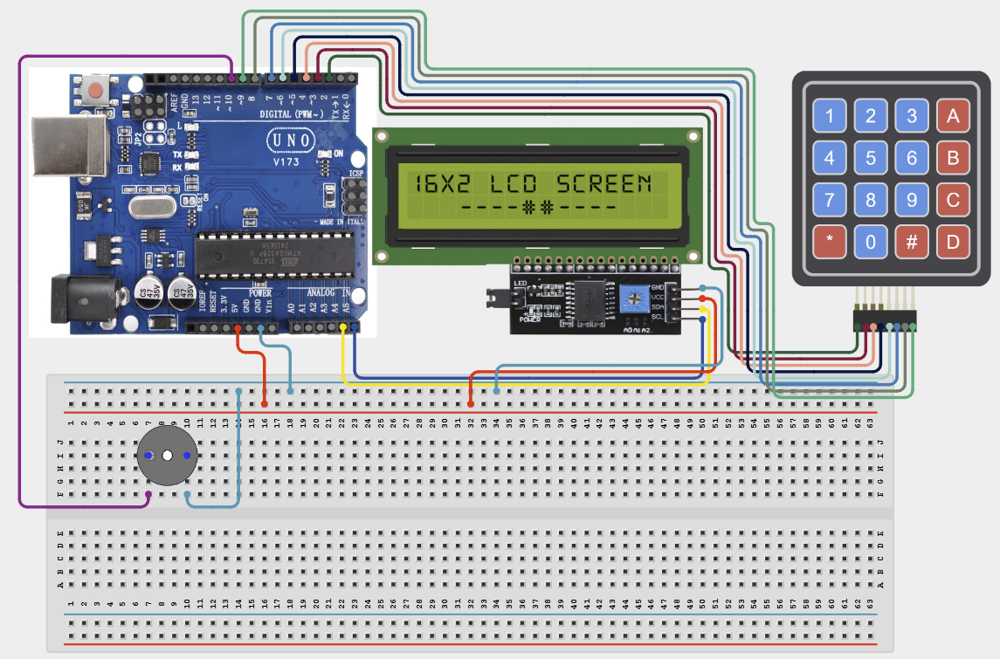

# Project 4.2.11: Project 101 Interactive Keypad Calculator Engine

| **Description** In Project 101, learners will construct an expert interactive system titled 'Interactive Keypad Calculator Engine'. This manual details the complete synthesis of 4x4 Matrix Keypad + IIC 1602 LCD + Active Buzzer into an intuitive, high-performance automated control platform.|------------------|----------------------------------------------------------------|
| **Use case**     |This project connects to real-world industrial and IoT applications such as: Project 101 equips students with professional skills in embedded human-machine interface (HMI) design and automated motion control.|

## Components (Things You will need)

|  |  |  |  | | | |
|------------------------------------------------------ | ----------------------------------------------------------- | --------------------------------------------------------- | ------------------------------------------------------ | ------------------------------------------------------ |------------------------------------------------------ |------------------------------------------------------ |

## Building the circuit

Things Needed:

- Arduino Uno Core Board = 1
- 4x4 Matrix Keypad = 1
- IIC 1602 LCD = 1
- Active Buzzer = 1
- USB Cable & Jumper Wires = 1

## Mounting the component on the breadboard and wiring the circuit

**Step 1:** Inventory all modules listed in the Required Components table.

**Step 2:** Connect 4x4 Matrix Keypad Rows to Pins 2, 3, 4, 5.

**Step 3:** Connect 4x4 Matrix Keypad Columns to Pins 6, 7, 8, 9.

**Step 4:** Connect IIC 1602 LCD SDA to A4 and SCL to A5.

**Step 5:** Connect Active Buzzer to Pin 10.

**Step 6:** Connect all VCC to 5V and GND to GND.

**Step 7:** Connect USB programming cable only after verifying all signal path wiring.



_Make sure to connect the Arduino USB cable to the Arduino board._

## PROGRAMMING

**Step 1:** Open your Arduino IDE. See how to set up here: [Getting Started](../../../Getting Started/Arduino_IDE_Setup.md).

**Step 2:** Write the complete program implementing the system logic with appropriate pin definitions, setup configuration, and the main control loop.

```cpp
#include <Keypad.h>
#include <Wire.h>
#include <LiquidCrystal_I2C.h>

// Keypad Configuration
byte rowPins[4] = {2, 3, 4, 5};
byte colPins[4] = {6, 7, 8, 9};
// TODO: Initialize Keypad library instance here

// LCD and Buzzer Configuration
LiquidCrystal_I2C lcd(0x27, 16, 2);
const int buzzerPin = 10;

void setup() {
  Serial.begin(9600);
  lcd.init();
  lcd.backlight();
  pinMode(buzzerPin, OUTPUT);
  Serial.println("Project 101: Interactive Keypad Calculator Engine Hardware Online");
}

void loop() {
  // TODO: Add keypad parsing logic here
  // TODO: Update LCD and provide buzzer feedback on input
  delay(100);
}
```

**Step 7:** Save your code. _See the [Getting Started](../../../Getting Started/Arduino_IDE_Setup.md) section_

**Step 8:** Select the arduino board and port _See the [Getting Started](../../../Getting Started/Arduino_IDE_Setup.md) section:Selecting Arduino Board Type and Uploading your code_.

**Step 9:** Upload your code. _See the [Getting Started](../../../Getting Started/Arduino_IDE_Setup.md) section:Selecting Arduino Board Type and Uploading your code_

## CONCLUSION

Operating physical input devices instantly modifies actuator behavior and updates visual indicators in real time.
