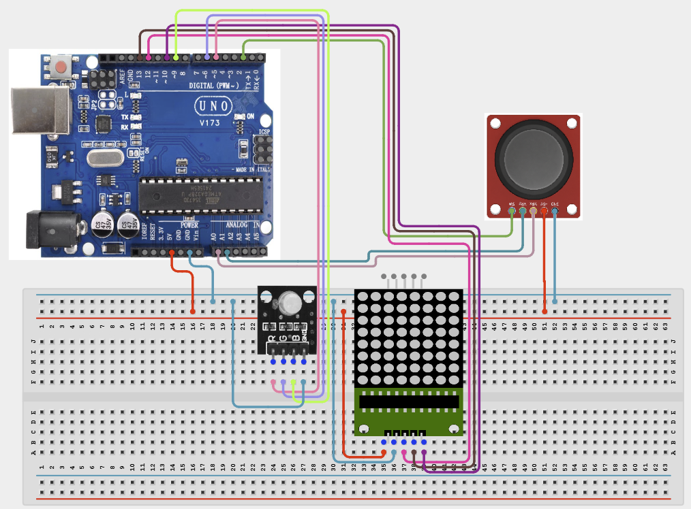

# Project 4.2.12: Project 102 Joystick Controlled RGB Matrix Palette

| **Description** In Project 102, learners will construct an expert interactive system titled 'Joystick Controlled RGB Matrix Palette'. This manual details the complete synthesis of XY Joystick Module + RGB 3-Color Module + 8x8 Dot Matrix Display into an intuitive, high-performance automated control platform.|------------------|----------------------------------------------------------------|
| **Use case**     |This project connects to real-world industrial and IoT applications such as: Project 102 equips students with professional skills in embedded human-machine interface (HMI) design and automated motion control.|

## Components (Things You will need)

|  |  |  |  | | | |
|------------------------------------------------------ | ----------------------------------------------------------- | --------------------------------------------------------- | ------------------------------------------------------ | ------------------------------------------------------ |------------------------------------------------------ |------------------------------------------------------ |

## Building the circuit

Things Needed:

- Arduino Uno Core Board = 1
- XY Joystick Module = 1
- RGB 3-Color Module = 1
- 8x8 Dot Matrix Display = 1
- USB Cable & Jumper Wires = 1

## Mounting the component on the breadboard and wiring the circuit

**Step 1:** Inventory all modules listed in the Required Components table.

**Step 2:** Connect Joystick VRx to A0, VRy to A1, and SW to D2 (Digital Input).

**Step 3:** Connect RGB LED pins (R, G, B) to PWM pins D5, D6, and D9, and 8x8 Matrix (DIN, CS, CLK) to D12, D10, and D13.

**Step 4:** Connect all VCC and 5V pins to the Arduino 5V rail, and all GND pins to the common GND rail.

**Step 5:** Double-check all VCC, 5V, 3.3V, and GND polarities to prevent electrical shorts.

**Step 6:** Connect USB programming cable only after verifying all signal path wiring.



_Make sure to connect the Arduino USB cable to the Arduino board._

## PROGRAMMING

**Step 1:** Open your Arduino IDE. See how to set up here: [Getting Started](../../../Getting Started/Arduino_IDE_Setup.md).

**Step 2:** Write the complete program implementing the system logic with appropriate pin definitions, setup configuration, and the main control loop.

```cpp
// Project 102: Joystick Controlled RGB Matrix Palette
// Define pins
const int VRx = A0;
const int VRy = A1;
const int SW = 2;
const int redPin = 5;
const int greenPin = 6;
const int bluePin = 9;

void setup() {
  pinMode(VRx, INPUT);
  pinMode(VRy, INPUT);
  pinMode(SW, INPUT_PULLUP);
  pinMode(redPin, OUTPUT);
  pinMode(greenPin, OUTPUT);
  pinMode(bluePin, OUTPUT);
  Serial.begin(9600);
  Serial.println("Project 102: Joystick Controlled RGB Matrix Palette Hardware Online");
}

void loop() {
  // Read joystick values
  int xVal = analogRead(VRx);
  int yVal = analogRead(VRy);
  int swVal = digitalRead(SW);
  
  // Interactive logic and display updates here
  delay(100);
}
```

**Step 7:** Save your code. _See the [Getting Started](../../../Getting Started/Arduino_IDE_Setup.md) section_

**Step 8:** Select the arduino board and port _See the [Getting Started](../../../Getting Started/Arduino_IDE_Setup.md) section:Selecting Arduino Board Type and Uploading your code_.

**Step 9:** Upload your code. _See the [Getting Started](../../../Getting Started/Arduino_IDE_Setup.md) section:Selecting Arduino Board Type and Uploading your code_

## CONCLUSION

Operating physical input devices instantly modifies actuator behavior and updates visual indicators in real time.
