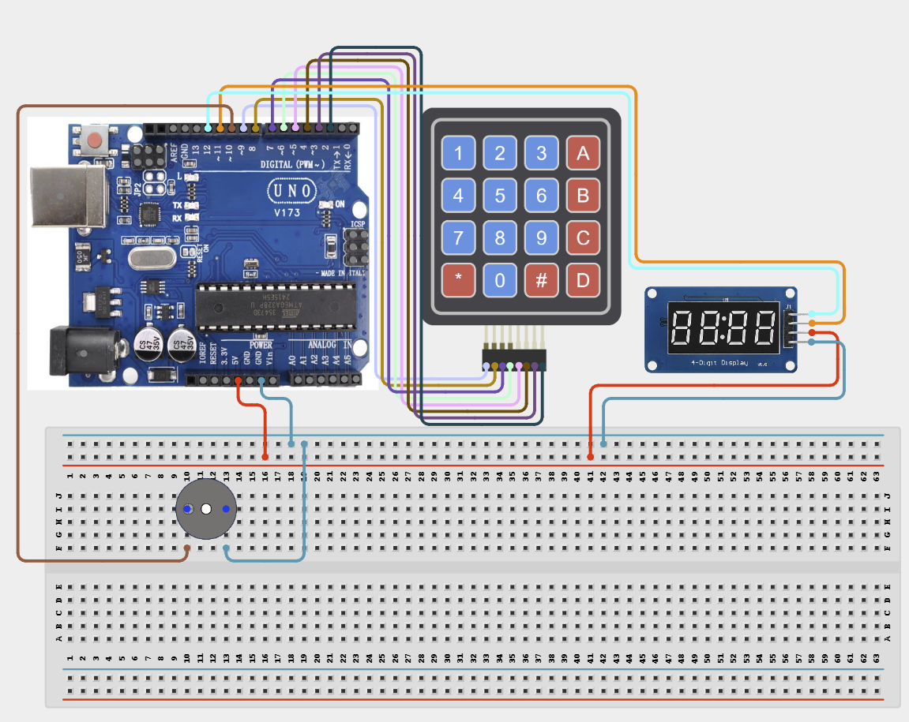

# Project 4.2.13: Project 103 Keypad Frequency Audio Tone Generator

| **Description** In Project 103, learners will construct an expert interactive system titled 'Keypad Frequency Audio Tone Generator'. This manual details the complete synthesis of 4x4 Matrix Keypad + Active Buzzer + TM1637 4-Digit Display into an intuitive, high-performance automated control platform.|------------------|----------------------------------------------------------------|
| **Use case**     |This project connects to real-world industrial and IoT applications such as: Project 103 equips students with professional skills in embedded human-machine interface (HMI) design and automated motion control.|

## Components (Things You will need)

|  |  |  |  | | | |
|------------------------------------------------------ | ----------------------------------------------------------- | --------------------------------------------------------- | ------------------------------------------------------ | ------------------------------------------------------ |------------------------------------------------------ |------------------------------------------------------ |

## Building the circuit

Things Needed:

- Arduino Uno Core Board = 1
- 4x4 Matrix Keypad = 1
- Active Buzzer = 1
- TM1637 4-Digit Display = 1
- USB Cable & Jumper Wires = 1

## Mounting the component on the breadboard and wiring the circuit

**Step 1:** Inventory all modules listed in the Required Components table.

**Step 2:** Connect the 4x4 Keypad rows to pins 9, 8, 7, 6 and columns to pins 5, 4, 3, 2.

**Step 3:** Connect the Active Buzzer to pin 10, TM1637 CLK to pin 12, and DIO to pin 11.

**Step 4:** Wire all component VCC/VDD pins to Arduino 5V and all GND pins to Arduino GND.

**Step 5:** Double-check all VCC, 5V, 3.3V, and GND polarities to prevent electrical shorts.

**Step 6:** Connect USB programming cable only after verifying all signal path wiring.



_Make sure to connect the Arduino USB cable to the Arduino board._

## PROGRAMMING

**Step 1:** Open your Arduino IDE. See how to set up here: [Getting Started](../../../Getting Started/Arduino_IDE_Setup.md).

**Step 2:** Write the complete program implementing the system logic with appropriate pin definitions, setup configuration, and the main control loop.

```cpp
#include <Keypad.h>
#include <TM1637Display.h>

const byte ROWS = 4;
const byte COLS = 4;
char keys[ROWS][COLS] = {
  {'1','2','3','A'},
  {'4','5','6','B'},
  {'7','8','9','C'},
  {'*','0','#','D'}
};
byte rowPins[ROWS] = {9, 8, 7, 6};
byte colPins[COLS] = {5, 4, 3, 2};
Keypad keypad = Keypad(makeKeymap(keys), rowPins, colPins, ROWS, COLS);

const int buzzerPin = 10;
const int CLK = 12;
const int DIO = 11;
TM1637Display display(CLK, DIO);

void setup() {
  pinMode(buzzerPin, OUTPUT);
  display.setBrightness(0x0f);
  display.showNumberDec(0);
}

void loop() {
  char key = keypad.getKey();
  if (key) {
    tone(buzzerPin, 1000, 100);
    if (key >= '0' && key <= '9') {
      display.showNumberDec(key - '0');
    }
  }
}
```

**Step 7:** Save your code. _See the [Getting Started](../../../Getting Started/Arduino_IDE_Setup.md) section_

**Step 8:** Select the arduino board and port _See the [Getting Started](../../../Getting Started/Arduino_IDE_Setup.md) section:Selecting Arduino Board Type and Uploading your code_.

**Step 9:** Upload your code. _See the [Getting Started](../../../Getting Started/Arduino_IDE_Setup.md) section:Selecting Arduino Board Type and Uploading your code_

## CONCLUSION

Operating physical input devices instantly modifies actuator behavior and updates visual indicators in real time.
