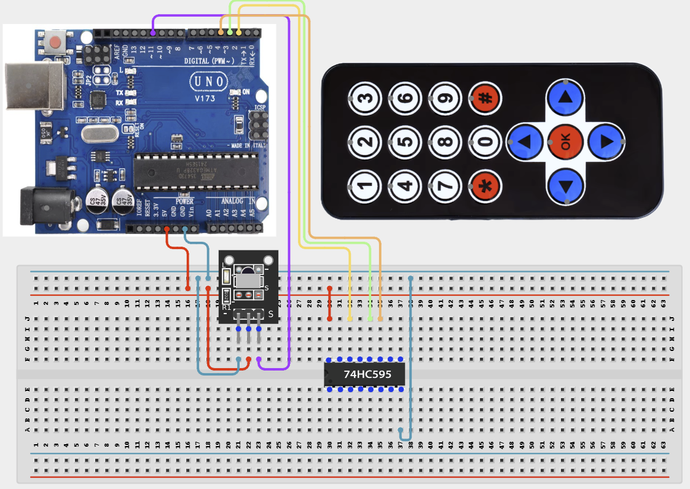

# Project 4.2.14: Project 104 IR Remote Multi Mode Lighting Console

| **Description** In Project 104, learners will construct an expert interactive system titled 'IR Remote Multi-Mode Lighting Console'. This manual details the complete synthesis of IR Receiver + Remote + 74HC595 Shift Register + 8 LEDs into an intuitive, high-performance automated control platform.|------------------|----------------------------------------------------------------|
| **Use case**     |This project connects to real-world industrial and IoT applications such as: Project 104 equips students with professional skills in embedded human-machine interface (HMI) design and automated motion control.|

## Components (Things You will need)

|  |  |  |  | | | |
|------------------------------------------------------ | ----------------------------------------------------------- | --------------------------------------------------------- | ------------------------------------------------------ | ------------------------------------------------------ |------------------------------------------------------ |------------------------------------------------------ |

## Building the circuit

Things Needed:

- Arduino Uno Core Board = 1
- IR Receiver = 1
- Remote = 1
- 74HC595 Shift Register = 1
- USB Cable & Jumper Wires = 1

## Mounting the component on the breadboard and wiring the circuit

**Step 1:** Inventory all modules listed in the Required Components table.

**Step 2:** Connect IR Receiver Signal to Arduino Pin 11.

**Step 3:** Connect 74HC595 Data to Pin 2, Latch to Pin 3, and Clock to Pin 4.

**Step 4:** Connect all VCC pins to 5V and all GND pins to Arduino GND.

**Step 5:** Double-check all VCC, 5V, 3.3V, and GND polarities to prevent electrical shorts.

**Step 6:** Connect USB programming cable only after verifying all signal path wiring.



_Make sure to connect the Arduino USB cable to the Arduino board._

## PROGRAMMING

**Step 1:** Open your Arduino IDE. See how to set up here: [Getting Started](../../../Getting Started/Arduino_IDE_Setup.md).

**Step 2:** Write the complete program implementing the system logic with appropriate pin definitions, setup configuration, and the main control loop.

```cpp
#include <IRremote.h>

const int RECV_PIN = 11;
const int DS_PIN = 2;
const int STCP_PIN = 3;
const int SHCP_PIN = 4;

IRrecv irrecv(RECV_PIN);
decode_results results;

void setup() {
  Serial.begin(9600);
  irrecv.enableIRIn();
  pinMode(DS_PIN, OUTPUT);
  pinMode(STCP_PIN, OUTPUT);
  pinMode(SHCP_PIN, OUTPUT);
  Serial.println("System Online: IR & Shift Register Ready");
}

void updateShiftRegister(byte data) {
  digitalWrite(STCP_PIN, LOW);
  shiftOut(DS_PIN, SHCP_PIN, LSBFIRST, data);
  digitalWrite(STCP_PIN, HIGH);
}

void loop() {
  if (irrecv.decode(&results)) {
    Serial.println(results.value, HEX);
    updateShiftRegister(lowByte(results.value));
    irrecv.resume();
  }
  delay(100);
}
```

**Step 7:** Save your code. _See the [Getting Started](../../../Getting Started/Arduino_IDE_Setup.md) section_

**Step 8:** Select the arduino board and port _See the [Getting Started](../../../Getting Started/Arduino_IDE_Setup.md) section:Selecting Arduino Board Type and Uploading your code_.

**Step 9:** Upload your code. _See the [Getting Started](../../../Getting Started/Arduino_IDE_Setup.md) section:Selecting Arduino Board Type and Uploading your code_

## CONCLUSION

Operating physical input devices instantly modifies actuator behavior and updates visual indicators in real time.
