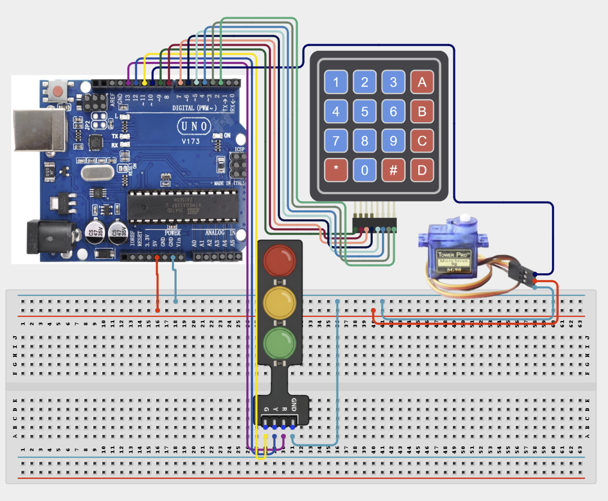

# Project 4.2.16: Project 106 Keypad Access Gate Barrier

| **Description** In Project 106, learners will construct an expert interactive system titled 'Keypad Access Gate Barrier'. This manual details the complete synthesis of 4x4 Matrix Keypad + Servo Motor SG90 + Traffic Light Module + Buzzer into an intuitive, high-performance automated control platform.|------------------|----------------------------------------------------------------|
| **Use case**     |This project connects to real-world industrial and IoT applications such as: Project 106 equips students with professional skills in embedded human-machine interface (HMI) design and automated motion control.|

## Components (Things You will need)

|  |  |  |  | | | |
|------------------------------------------------------ | ----------------------------------------------------------- | --------------------------------------------------------- | ------------------------------------------------------ | ------------------------------------------------------ |------------------------------------------------------ |------------------------------------------------------ |

## Building the circuit

Things Needed:

- Arduino Uno Core Board = 1
- 4x4 Matrix Keypad = 1
- Servo Motor SG90 = 1
- Traffic Light Module = 1
- USB Cable & Jumper Wires = 1

## Mounting the component on the breadboard and wiring the circuit

**Step 1:** Inventory all modules listed in the Required Components table.

**Step 2:** Connect the 4x4 Matrix Keypad Rows (1-4) to Arduino Pins 9, 8, 7, 6 and Columns (1-4) to Pins 5, 4, 3, 2.

**Step 3:** Connect the SG90 Servo signal to Pin 10, VCC to 5V, and GND to GND.

**Step 4:** Wire the Traffic Light Module: Red to Pin 13, Yellow to Pin 12, Green to Pin 11, and GND to GND.

**Step 5:** Connect the Buzzer Positive to Pin A0 and Negative to GND.

**Step 6:** Double-check all polarities and signal paths before connecting the USB cable for programming.



_Make sure to connect the Arduino USB cable to the Arduino board._

## PROGRAMMING

**Step 1:** Open your Arduino IDE. See how to set up here: [Getting Started](../../../Getting Started/Arduino_IDE_Setup.md).

**Step 2:** Write the complete program implementing the system logic with appropriate pin definitions, setup configuration, and the main control loop.

```cpp
#include <Keypad.h>
#include <Servo.h>

const byte ROWS = 4;
const byte COLS = 4;
char keys[ROWS][COLS] = {
  {'1','2','3','A'},
  {'4','5','6','B'},
  {'7','8','9','C'},
  {'*','0','#','D'}
};
byte rowPins[ROWS] = {9, 8, 7, 6};
byte colPins[COLS] = {5, 4, 3, 2};
Keypad keypad = Keypad(makeKeymap(keys), rowPins, colPins, ROWS, COLS);

Servo gateServo;
const int redPin = 13;
const int yellowPin = 12;
const int greenPin = 11;
const int buzzerPin = A0;

void setup() {
  Serial.begin(9600);
  gateServo.attach(10);
  pinMode(redPin, OUTPUT);
  pinMode(yellowPin, OUTPUT);
  pinMode(greenPin, OUTPUT);
  pinMode(buzzerPin, OUTPUT);
  gateServo.write(0);
  Serial.println("System Initialized");
}

void loop() {
  char key = keypad.getKey();
  if (key) {
    tone(buzzerPin, 1000, 100);
    digitalWrite(yellowPin, HIGH);
    gateServo.write(90);
    digitalWrite(greenPin, HIGH);
    delay(2000);
    gateServo.write(0);
    digitalWrite(greenPin, LOW);
    digitalWrite(yellowPin, LOW);
  }
}

```

**Step 7:** Save your code. _See the [Getting Started](../../../Getting Started/Arduino_IDE_Setup.md) section_

**Step 8:** Select the arduino board and port _See the [Getting Started](../../../Getting Started/Arduino_IDE_Setup.md) section:Selecting Arduino Board Type and Uploading your code_.

**Step 9:** Upload your code. _See the [Getting Started](../../../Getting Started/Arduino_IDE_Setup.md) section:Selecting Arduino Board Type and Uploading your code_

## CONCLUSION

Operating physical input devices instantly modifies actuator behavior and updates visual indicators in real time.
