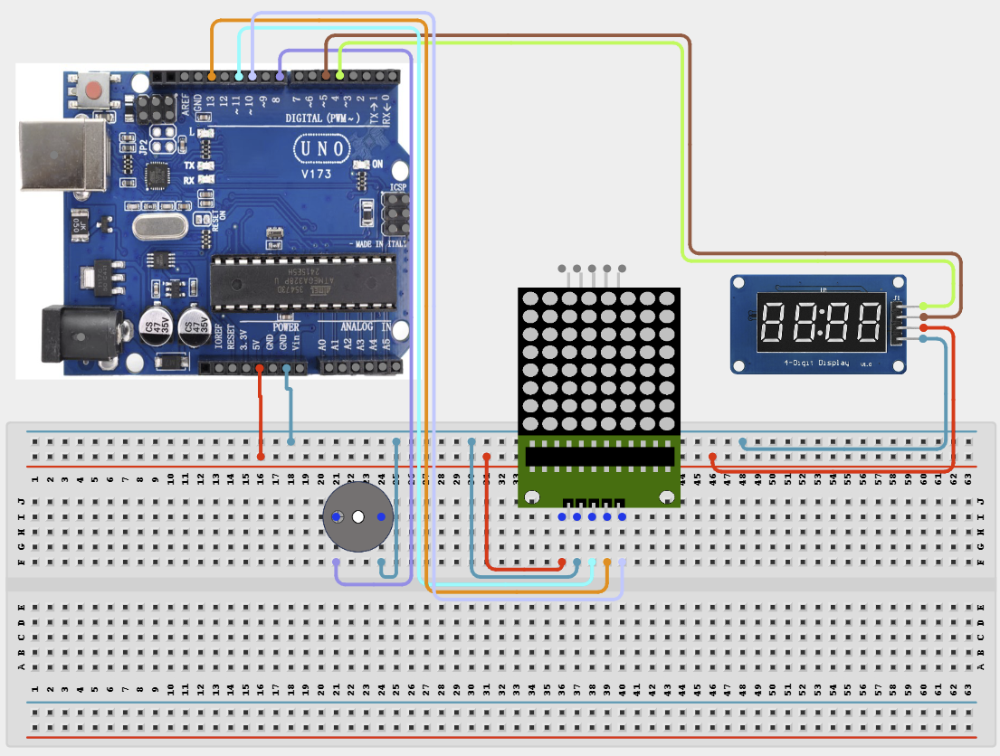

# Project 4.2.18: Project 108 Interactive Dot Matrix Reflex Game

| **Description** In Project 108, learners will construct an expert interactive system titled 'Interactive Dot Matrix Reflex Game'. This manual details the complete synthesis of Pushbutton + 8x8 Dot Matrix + Active Buzzer + TM1637 Display into an intuitive, high-performance automated control platform.|------------------|----------------------------------------------------------------|
| **Use case**     |This project connects to real-world industrial and IoT applications such as: Project 108 equips students with professional skills in embedded human-machine interface (HMI) design and automated motion control.|

## Components (Things You will need)

|  |  |  |  | | | |
|------------------------------------------------------ | ----------------------------------------------------------- | --------------------------------------------------------- | ------------------------------------------------------ | ------------------------------------------------------ |------------------------------------------------------ |------------------------------------------------------ |

## Building the circuit

Things Needed:

- Arduino Uno Core Board = 1
- Pushbutton = 1
- 8x8 Dot Matrix = 1
- Active Buzzer = 1
- USB Cable & Jumper Wires = 1

## Mounting the component on the breadboard and wiring the circuit

**Step 1:** Inventory all modules listed in the Required Components table.

**Step 2:** Connect the Pushbutton to Pin 2 and the Active Buzzer to Pin 8.

**Step 3:** Wire the 8x8 Matrix (DIN to 11, CS to 10, CLK to 13) and TM1637 Display (DIO to 5, CLK to 4).

**Step 4:** Connect all VCC pins to the 5V rail and all GND pins to the GND rail.

**Step 5:** Double-check all VCC, 5V, 3.3V, and GND polarities to prevent electrical shorts.

**Step 6:** Connect USB programming cable only after verifying all signal path wiring.



_Make sure to connect the Arduino USB cable to the Arduino board._

## PROGRAMMING

**Step 1:** Open your Arduino IDE. See how to set up here: [Getting Started](../../../Getting Started/Arduino_IDE_Setup.md).

**Step 2:** Write the complete program implementing the system logic with appropriate pin definitions, setup configuration, and the main control loop.

```cpp
#include <LedControl.h>
#include <TM1637Display.h>

// Project 108: Interactive Dot Matrix Reflex Game Pin Setup
#define BUTTON_PIN 2
#define BUZZER_PIN 8
#define MATRIX_DIN 11
#define MATRIX_CS  10
#define MATRIX_CLK 13
#define TM1637_DIO 5
#define TM1637_CLK 4

// Initialize display objects
LedControl lc = LedControl(MATRIX_DIN, MATRIX_CLK, MATRIX_CS, 1);
TM1637Display display(TM1637_CLK, TM1637_DIO);

void setup() {
  Serial.begin(9600);
  pinMode(BUTTON_PIN, INPUT_PULLUP);
  pinMode(BUZZER_PIN, OUTPUT);

  // Initialize Dot Matrix
  lc.shutdown(0, false);
  lc.setIntensity(0, 8);
  lc.clearDisplay(0);

  // Initialize TM1637 Display
  display.setBrightness(0x0f);

  Serial.println("Hardware Initialized on Defined Pins.");
}

void loop() {
  // Game logic goes here
  delay(100);
}
```

**Step 7:** Save your code. _See the [Getting Started](../../../Getting Started/Arduino_IDE_Setup.md) section_

**Step 8:** Select the arduino board and port _See the [Getting Started](../../../Getting Started/Arduino_IDE_Setup.md) section:Selecting Arduino Board Type and Uploading your code_.

**Step 9:** Upload your code. _See the [Getting Started](../../../Getting Started/Arduino_IDE_Setup.md) section:Selecting Arduino Board Type and Uploading your code_

## CONCLUSION

Operating physical input devices instantly modifies actuator behavior and updates visual indicators in real time.
