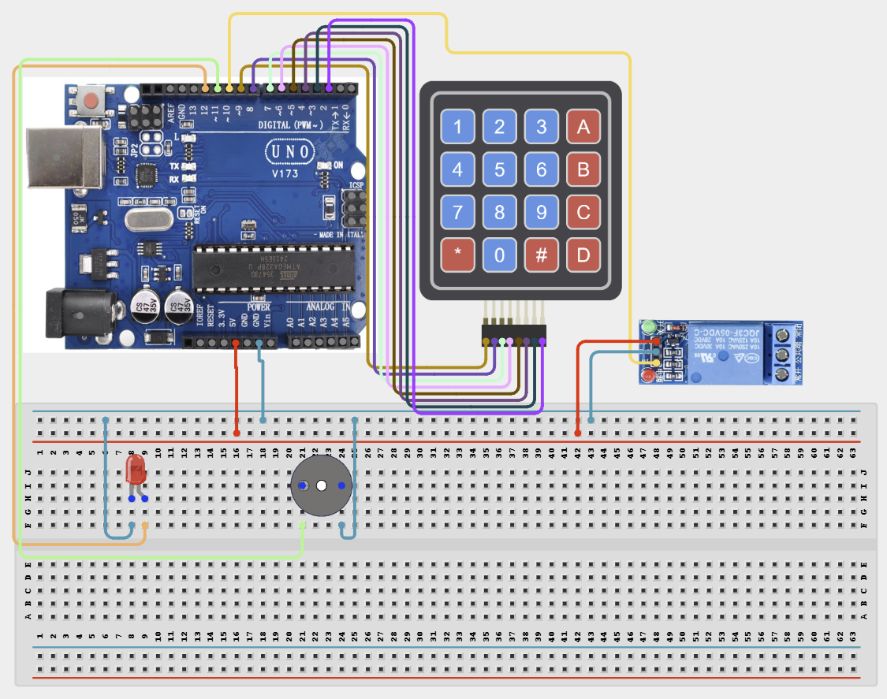

# Project 4.2.19: Project 109 Keypad Emergency Power Shutoff System

| **Description** In Project 109, learners will construct an expert interactive system titled 'Keypad Emergency Power Shutoff System'. This manual details the complete synthesis of 4x4 Matrix Keypad + Relay Module + Active Buzzer + Red LED into an intuitive, high-performance automated control platform.|------------------|----------------------------------------------------------------|
| **Use case**     |This project connects to real-world industrial and IoT applications such as: Project 109 equips students with professional skills in embedded human-machine interface (HMI) design and automated motion control.|

## Components (Things You will need)

|  |  |  |  | | | |
|------------------------------------------------------ | ----------------------------------------------------------- | --------------------------------------------------------- | ------------------------------------------------------ | ------------------------------------------------------ |------------------------------------------------------ |------------------------------------------------------ |

## Building the circuit

Things Needed:

- Arduino Uno Core Board = 1
- 4x4 Matrix Keypad = 1
- Relay Module = 1
- Active Buzzer = 1
- USB Cable & Jumper Wires = 1

## Mounting the component on the breadboard and wiring the circuit

**Step 1:** Inventory all modules listed in the Required Components table.

**Step 2:** Connect the 4x4 Matrix Keypad Rows 1-4 to Pins 9, 8, 7, 6 and Columns 1-4 to Pins 5, 4, 3, 2.

**Step 3:** Connect the Relay Module signal to Pin 10, the Active Buzzer to Pin 11, and the Red LED to Pin 12.

**Step 4:** Wire all module VCC pins to the Arduino 5V rail and all GND pins to the Arduino GND rail.

**Step 5:** Double-check all VCC, 5V, 3.3V, and GND polarities to prevent electrical shorts.

**Step 6:** Connect USB programming cable only after verifying all signal path wiring.



_Make sure to connect the Arduino USB cable to the Arduino board._

## PROGRAMMING

**Step 1:** Open your Arduino IDE. See how to set up here: [Getting Started](../../../Getting Started/Arduino_IDE_Setup.md).

**Step 2:** Write the complete program implementing the system logic with appropriate pin definitions, setup configuration, and the main control loop.

```cpp
#include <Keypad.h>

const byte ROWS = 4;
const byte COLS = 4;
char keys[ROWS][COLS] = {
  {'1','2','3','A'},
  {'4','5','6','B'},
  {'7','8','9','C'},
  {'*','0','#','D'}
};

byte rowPins[ROWS] = {9, 8, 7, 6};
byte colPins[COLS] = {5, 4, 3, 2};

Keypad keypad = Keypad(makeKeymap(keys), rowPins, colPins, ROWS, COLS);

const int RELAY_PIN = 10;
const int BUZZER_PIN = 11;
const int LED_PIN = 12;

void setup() {
  pinMode(RELAY_PIN, OUTPUT);
  pinMode(BUZZER_PIN, OUTPUT);
  pinMode(LED_PIN, OUTPUT);
  Serial.begin(9600);
  digitalWrite(RELAY_PIN, HIGH); // System starts ON
}
```

**Step 7:** Save your code. _See the [Getting Started](../../../Getting Started/Arduino_IDE_Setup.md) section_

**Step 8:** Select the arduino board and port _See the [Getting Started](../../../Getting Started/Arduino_IDE_Setup.md) section:Selecting Arduino Board Type and Uploading your code_.

**Step 9:** Upload your code. _See the [Getting Started](../../../Getting Started/Arduino_IDE_Setup.md) section:Selecting Arduino Board Type and Uploading your code_

## CONCLUSION

Operating physical input devices instantly modifies actuator behavior and updates visual indicators in real time.
