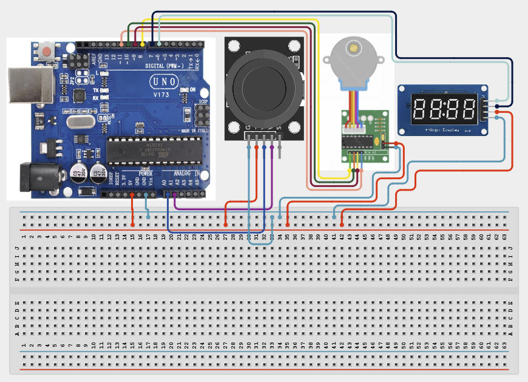

# Project 4.2.1: Project 91 Joystick Dual Axis Stepper Arm Controller

| **Description** In Project 91, learners will build an interactive robotic positioning system combining an XY Joystick Module, a 28BYJ-48 Stepper Motor driven by a ULN2003 driver board, and a TM1637 4-Digit Display. Deflecting the joystick along the X-axis controls clockwise and counter-clockwise stepper motor rotation velocity, while the real-time rotational angle or step count is displayed continuously on the 4-digit display screen.|------------------|----------------------------------------------------------------|
| **Use case**     |This project connects to real-world industrial and IoT applications such as: Proportional joystick motor control combined with numeric position feedback forms the standard architecture for industrial CNC machines, camera gimbals, and surgical robotic arms.|

## Components (Things You will need)

|  |  |  |  | | | |
|------------------------------------------------------ | ----------------------------------------------------------- | --------------------------------------------------------- | ------------------------------------------------------ | ------------------------------------------------------ |------------------------------------------------------ |------------------------------------------------------ |

## Building the circuit

Things Needed:

- Arduino Uno Core Board = 1
- XY Joystick Module = 1
- 28BYJ-48 Stepper Motor = 1
- ULN2003 Motor Driver Board = 1
- TM1637 4-Digit Display Module = 1
- USB Cable & Jumper Wires = 1

## Mounting the component on the breadboard and wiring the circuit

**Step 1:** Inventory all modules listed in the Required Components table.

**Step 2:** Connect line [Joystick VRX] to [A0] — (Analog X-axis speed input.).

**Step 3:** Connect line [Joystick VRY] to [A1] — (Analog Y-axis input.).

**Step 4:** Connect [ULN2003 IN1 to Pin 8, IN2 to Pin 10, IN3 to Pin 9, and IN4 to Pin 11] — (Stepper coil sequence outputs.).

**Step 5:** Connect line [TM1637 CLK / DIO] to [Pins 6 / 7] — (Display clock and data lines.).

**Step 6:** Double-check all VCC, 5V, 3.3V, and GND polarities to prevent electrical shorts.

**Step 7:** Connect USB programming cable only after verifying all signal path wiring.



_Make sure to connect the Arduino USB cable to the Arduino board._

## PROGRAMMING

**Step 1:** Open your Arduino IDE. See how to set up here: [Getting Started](../../../Getting Started/Arduino_IDE_Setup.md).

**Step 2:** Write the complete program implementing the system logic with appropriate pin definitions, setup configuration, and the main control loop.

```cpp
// Project 91: Joystick Dual-Axis Stepper Arm Controller
#include <Stepper.h>
#include <TM1637Display.h>

const int STEPS_PER_REV = 2048;
Stepper myStepper(STEPS_PER_REV, 8, 10, 9, 11);
TM1637Display display(6, 7);
int currentAngle = 0;

void setup() {
  display.setBrightness(7);
  display.showNumberDec(currentAngle);
  Serial.begin(9600);
}

void loop() {
  int xVal = analogRead(A0);
  if (xVal > 700) {
    myStepper.setSpeed(10);
    myStepper.step(64);
    currentAngle += 10;
    display.showNumberDec(currentAngle);
  } else if (xVal < 300) {
    myStepper.setSpeed(10);
    myStepper.step(-64);
    currentAngle -= 10;
    display.showNumberDec(currentAngle);
  }
  delay(50);
}
```

**Step 7:** Save your code. _See the [Getting Started](../../../Getting Started/Arduino_IDE_Setup.md) section_

**Step 8:** Select the arduino board and port _See the [Getting Started](../../../Getting Started/Arduino_IDE_Setup.md) section:Selecting Arduino Board Type and Uploading your code_.

**Step 9:** Upload your code. _See the [Getting Started](../../../Getting Started/Arduino_IDE_Setup.md) section:Selecting Arduino Board Type and Uploading your code_

## CONCLUSION

Deflecting the joystick right rotates the stepper motor clockwise and increments the display count; deflecting left reverses rotation and decrements the display count.
