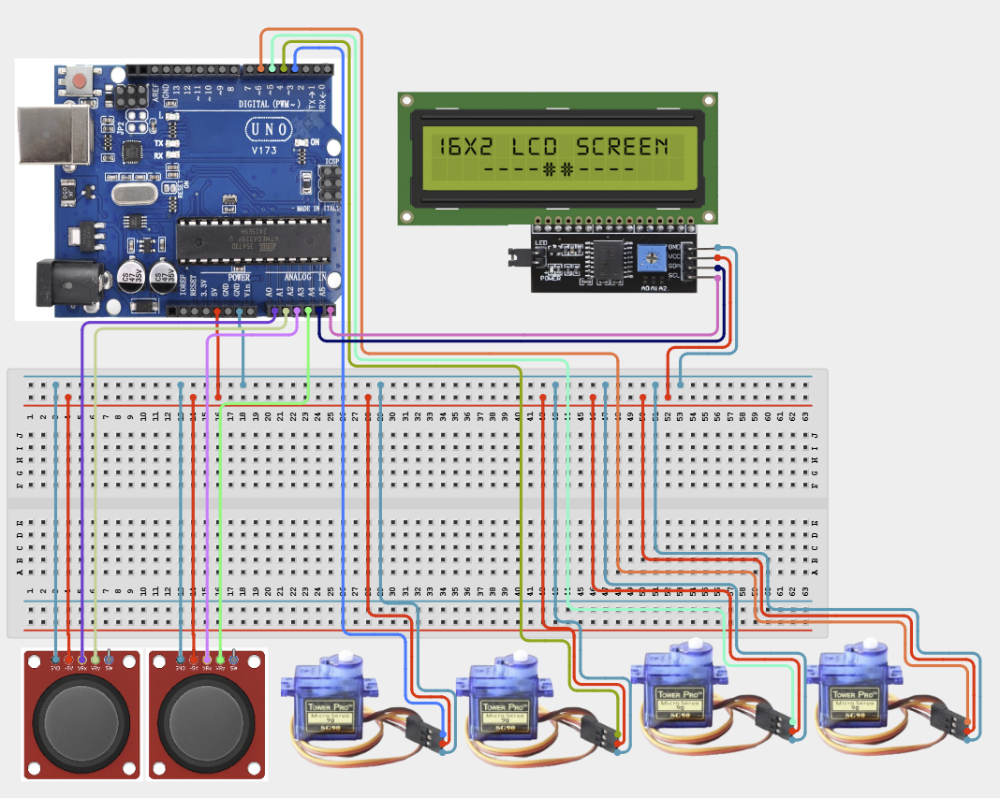

# Project 4.2.20: Project 110 Dual Joystick Robotic Arm Controller

| **Description** In Project 110, learners will construct an expert interactive system titled 'Dual Joystick Robotic Arm Controller'. This manual details the complete synthesis of 2 XY Joysticks + 4 Servo Motors SG90 + IIC 1602 LCD into an intuitive, high-performance automated control platform.|------------------|----------------------------------------------------------------|
| **Use case**     |This project connects to real-world industrial and IoT applications such as: Project 110 equips students with professional skills in embedded human-machine interface (HMI) design and automated motion control.|

## Components (Things You will need)

|  |  |  |  | | | |
|------------------------------------------------------ | ----------------------------------------------------------- | --------------------------------------------------------- | ------------------------------------------------------ | ------------------------------------------------------ |------------------------------------------------------ |------------------------------------------------------ |

## Building the circuit

Things Needed:

- Arduino Uno Core Board
- 2 XY Joysticks
- 4 Servo Motors SG90
- IIC 1602 LCD
- USB Cable & Jumper Wires

## Mounting the component on the breadboard and wiring the circuit

**Step 1:** Connect the Arduino 5V pin to the breadboard's positive (+) power rail and the Arduino GND pin to the negative (-) power rail.

**Step 2:** Place the First XY Joystick on the breadboard.
  - Connect the VCC pin to the 5V power rail on the breadboard
  - Connect the GND pin to the ground rail on the breadboard
  - Connect the VRx pin to Analog Pin A0
  - Connect the VRy pin to Analog Pin A1

**Step 3:** Place the Second XY Joystick on the breadboard.
  - Connect the VCC pin to the 5V power rail on the breadboard
  - Connect the GND pin to the ground rail on the breadboard
  - Connect the VRx pin to Analog Pin A2
  - Connect the VRy pin to Analog Pin A3

**Step 4:** Place the 4 Servo Motors (SG90) on the breadboard.
  - Connect all 4 red wires to the 5V power rail on the breadboard
  - Connect all 4 brown wires to the ground rail on the breadboard
  - Connect the orange/yellow control wires to Digital Pins 9, 10, 11, and 12 respectively

**Step 5:** Place the IIC 1602 LCD on the breadboard.
  - Connect the VCC pin to the 5V power rail on the breadboard
  - Connect the GND pin to the ground rail on the breadboard
  - Connect the SDA pin to Analog Pin A4
  - Connect the SCL pin to Analog Pin A5

**Step 6:** Ensure all components share a common GND connection, then verify all wiring before connecting the Arduino Uno to your computer using the USB cable.



**Step 7:** After confirming that all connections are correct, connect the USB cable to the Arduino Uno board and the computer to power the circuit.

_Make sure to connect the Arduino USB cable to the Arduino board._

## PROGRAMMING

**Step 1:** Open your Arduino IDE. See how to set up here: [Getting Started](../../../Getting Started/Arduino_IDE_Setup.md).

**Step 2:** Write the complete program implementing the system logic with appropriate pin definitions, setup configuration, and the main control loop.

```cpp
#include <Wire.h>
#include <LiquidCrystal_I2C.h>
#include <Servo.h>

Servo servo1, servo2, servo3, servo4;
LiquidCrystal_I2C lcd(0x27, 16, 2);

void setup() {
  servo1.attach(3);
  servo2.attach(5);
  servo3.attach(6);
  servo4.attach(9);
  
  lcd.init();
  lcd.backlight();
  lcd.setCursor(0, 0);
  lcd.print("Robot Arm Ready");
}

void loop() {
  int val1 = map(analogRead(A0), 0, 1023, 0, 180);
  int val2 = map(analogRead(A1), 0, 1023, 0, 180);
  int val3 = map(analogRead(A2), 0, 1023, 0, 180);
  int val4 = map(analogRead(A3), 0, 1023, 0, 180);
  
  servo1.write(val1);
  servo2.write(val2);
  servo3.write(val3);
  servo4.write(val4);
  
  lcd.setCursor(0, 1);
  lcd.print("J1:"); lcd.print(val1);
  lcd.print(" J2:"); lcd.print(val3);
  delay(20);
}

```

**Step 7:** Save your code. _See the [Getting Started](../../../Getting Started/Arduino_IDE_Setup.md) section_

**Step 8:** Select the arduino board and port _See the [Getting Started](../../../Getting Started/Arduino_IDE_Setup.md) section:Selecting Arduino Board Type and Uploading your code_.

**Step 9:** Upload your code. _See the [Getting Started](../../../Getting Started/Arduino_IDE_Setup.md) section:Selecting Arduino Board Type and Uploading your code_

## CONCLUSION

Operating physical input devices instantly modifies actuator behavior and updates visual indicators in real time.
