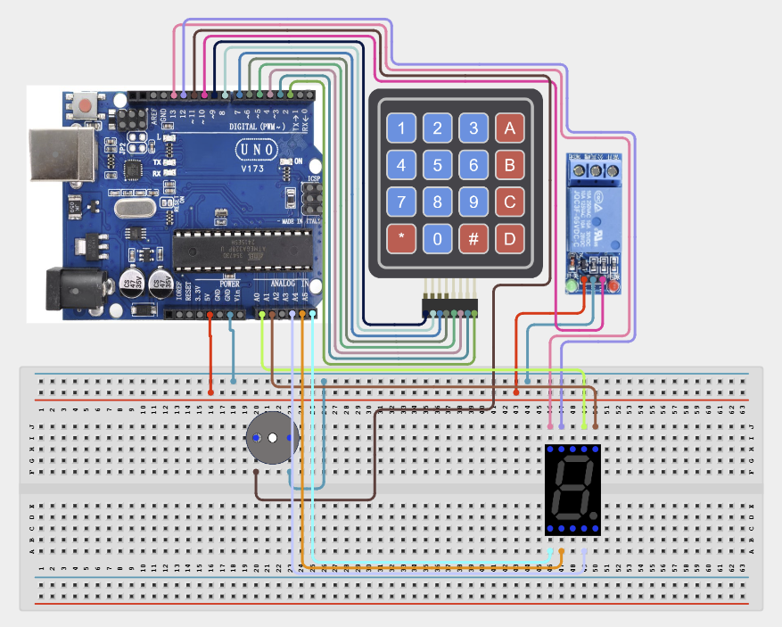

# Project 4.2.22: Project 112 Keypad Password Lock with Relay Isolation

| **Description** In Project 112, learners will construct an expert interactive system titled 'Keypad Password Lock with Relay Isolation'. This manual details the complete synthesis of 4x4 Matrix Keypad + Relay Module + 7-Segment Display + Buzzer into an intuitive, high-performance automated control platform.|------------------|----------------------------------------------------------------|
| **Use case**     |This project connects to real-world industrial and IoT applications such as: Project 112 equips students with professional skills in embedded human-machine interface (HMI) design and automated motion control.|

## Components (Things You will need)

|  |  |  |  | | | |
|------------------------------------------------------ | ----------------------------------------------------------- | --------------------------------------------------------- | ------------------------------------------------------ | ------------------------------------------------------ |------------------------------------------------------ |------------------------------------------------------ |

## Building the circuit

Things Needed:

- Arduino Uno Core Board = 1
- 4x4 Matrix Keypad = 1
- Relay Module = 1
- 7-Segment Display = 1
- USB Cable & Jumper Wires = 1

## Mounting the component on the breadboard and wiring the circuit

**Step 1:** Connect Keypad Rows R1-R4 to digital pins 9, 8, 7, 6 and Columns C1-C4 to digital pins 5, 4, 3, 2.

**Step 2:** Wire the Relay Module Signal pin to Arduino digital pin 10.

**Step 3:** Connect the 7-Segment Display segments A, B, C, D, E, F, G to Arduino pins A0, A1, A2, A3, A4, A5, D12 respectively. Ensure a 220Ω resistor is connected in series with each segment to prevent damage. Connect the Common pin to GND. Connect the Buzzer positive (+) lead to digital pin 11 and its negative (-) lead to GND.

**Step 4:** Connect line [Power Lines] to [5V / 3.3V / GND] — (Common power and ground reference rails.).

**Step 5:** Double-check all VCC, 5V, 3.3V, and GND polarities to prevent electrical shorts.

**Step 6:** Connect USB programming cable only after verifying all signal path wiring.



_Make sure to connect the Arduino USB cable to the Arduino board._

## PROGRAMMING

**Step 1:** Open your Arduino IDE. See how to set up here: [Getting Started](../../../Getting Started/Arduino_IDE_Setup.md).

**Step 2:** Write the complete program implementing the system logic with appropriate pin definitions, setup configuration, and the main control loop.

```cpp
#include <Keypad.h>

const byte ROWS = 4;
const byte COLS = 4;
char keys[ROWS][COLS] = {
  {'1','2','3','A'},
  {'4','5','6','B'},
  {'7','8','9','C'},
  {'*','0','#','D'}
};

byte rowPins[ROWS] = {9, 8, 7, 6};
byte colPins[COLS] = {5, 4, 3, 2};

Keypad keypad = Keypad(makeKeymap(keys), rowPins, colPins, ROWS, COLS);

const int relayPin = 10;
const int buzzerPin = 11;
int segmentPins[] = {A0, A1, A2, A3, A4, A5, 12};

// Digit patterns [a, b, c, d, e, f, g]
byte digits[10][7] = {
  {1,1,1,1,1,1,0}, // 0
  {0,1,1,0,0,0,0}, // 1
  {1,1,0,1,1,0,1}, // 2
  {1,1,1,1,0,0,1}, // 3
  {0,1,1,0,0,1,1}, // 4
  {1,0,1,1,0,1,1}, // 5
  {1,0,1,1,1,1,1}, // 6
  {1,1,1,0,0,0,0}, // 7
  {1,1,1,1,1,1,1}, // 8
  {1,1,1,1,0,1,1}  // 9
};

void displayDigit(int num) {
  if (num < 0 || num > 9) return;
  for (int i = 0; i < 7; i++) {
    digitalWrite(segmentPins[i], digits[num][i]);
  }
}

void setup() {
  pinMode(relayPin, OUTPUT);
  pinMode(buzzerPin, OUTPUT);
  for (int i = 0; i < 7; i++) {
    pinMode(segmentPins[i], OUTPUT);
  }
  digitalWrite(relayPin, LOW);
  Serial.begin(9600);
  Serial.println("System Ready");
}

void loop() {
  char key = keypad.getKey();
  if (key) {
    Serial.println(key);
    if (key >= '0' && key <= '9') {
      displayDigit(key - '0');
    }
        // Logic for password validation goes here
  }
}
```

**Step 7:** Save your code. _See the [Getting Started](../../../Getting Started/Arduino_IDE_Setup.md) section_

**Step 8:** Select the arduino board and port _See the [Getting Started](../../../Getting Started/Arduino_IDE_Setup.md) section:Selecting Arduino Board Type and Uploading your code_.

**Step 9:** Upload your code. _See the [Getting Started](../../../Getting Started/Arduino_IDE_Setup.md) section:Selecting Arduino Board Type and Uploading your code_

## CONCLUSION

Operating physical input devices instantly modifies actuator behavior and updates visual indicators in real time.
