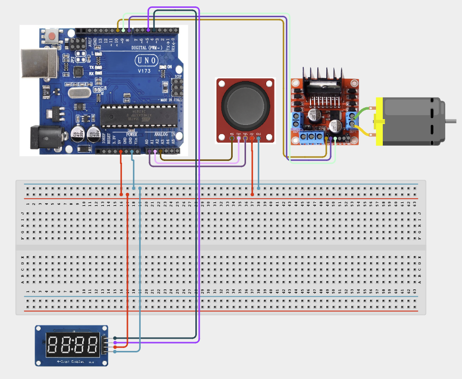

# Project 4.2.23: Project 113 Joystick Velocity Controlled Motor Drive

| **Description** In Project 113, learners will construct an expert interactive system titled 'Joystick Velocity Controlled Motor Drive'. This manual details the complete synthesis of XY Joystick + DC Motor + L298N Driver + TM1637 4-Digit Display into an intuitive, high-performance automated control platform.|------------------|----------------------------------------------------------------|
| **Use case**     |This project connects to real-world industrial and IoT applications such as: Project 113 equips students with professional skills in embedded human-machine interface (HMI) design and automated motion control.|

## Components (Things You will need)

|  |  |  |  | | | |
|------------------------------------------------------ | ----------------------------------------------------------- | --------------------------------------------------------- | ------------------------------------------------------ | ------------------------------------------------------ |------------------------------------------------------ |------------------------------------------------------ |

## Building the circuit

Things Needed:

- Arduino Uno Core Board
- XY Joystick
- DC Motor
- L298N Driver
- USB Cable & Jumper Wires

## Mounting the component on the breadboard and wiring the circuit

**Step 1:** Connect the Arduino 5V pin to the breadboard's positive (+) power rail and the Arduino GND pin to the negative (-) power rail.

**Step 2:** Place the XY Joystick on the breadboard.
  - Connect the VCC pin to the 5V power rail on the breadboard
  - Connect the GND pin to the ground rail on the breadboard
  - Connect the VRx pin to Analog Pin A0
  - Connect the VRy pin to Analog Pin A1
  - Connect the SW pin to Digital Pin 2

**Step 3:** Place the L298N Motor Driver on the breadboard (for the DC Motor).
  - Connect the 5V pin to the 5V power rail on the breadboard
  - Connect the GND pin to the ground rail on the breadboard
  - Connect ENA to Digital Pin 10
  - Connect IN1 to Digital Pin 8
  - Connect IN2 to Digital Pin 9
  - Connect the DC motor to the driver's output terminals

**Step 4:** Place the TM1637 4-Digit Display on the breadboard.
  - Connect the VCC pin to the 5V power rail on the breadboard
  - Connect the GND pin to the ground rail on the breadboard
  - Connect the CLK pin to Digital Pin 4
  - Connect the DIO pin to Digital Pin 5

**Step 5:** Ensure all components share a common GND connection, then verify all wiring before connecting the Arduino Uno to your computer using the USB cable.



**Step 6:** After confirming that all connections are correct, connect the USB cable to the Arduino Uno board and the computer to power the circuit.

_Make sure to connect the Arduino USB cable to the Arduino board._

## PROGRAMMING

**Step 1:** Open your Arduino IDE. See how to set up here: [Getting Started](../../../Getting Started/Arduino_IDE_Setup.md).

**Step 2:** Write the complete program implementing the system logic with appropriate pin definitions, setup configuration, and the main control loop.

```cpp
#include <TM1637Display.h>
// Pins for TM1637
#define CLK 4
#define DIO 5
// Pins for L298N
#define IN1 8
#define IN2 9
#define ENA 10
// Pins for Joystick
#define JOY_X A0
#define JOY_Y A1
#define JOY_SW 2

TM1637Display display(CLK, DIO);

void setup() {
  pinMode(IN1, OUTPUT);
  pinMode(IN2, OUTPUT);
  pinMode(ENA, OUTPUT);
  pinMode(JOY_SW, INPUT_PULLUP);
  display.setBrightness(0x0f);
  Serial.begin(9600);
}

void loop() {
  int xVal = analogRead(JOY_X);
  int speed = map(xVal, 512, 1023, 0, 255); // Forward speed
  
  if (xVal > 520) {
    digitalWrite(IN1, HIGH);
    digitalWrite(IN2, LOW);
    analogWrite(ENA, speed);
  } else {
    digitalWrite(IN1, LOW);
    digitalWrite(IN2, LOW);
    analogWrite(ENA, 0);
  }
  
  display.showNumberDec(xVal);
  delay(100);
}
```

**Step 7:** Save your code. _See the [Getting Started](../../../Getting Started/Arduino_IDE_Setup.md) section_

**Step 8:** Select the arduino board and port _See the [Getting Started](../../../Getting Started/Arduino_IDE_Setup.md) section:Selecting Arduino Board Type and Uploading your code_.

**Step 9:** Upload your code. _See the [Getting Started](../../../Getting Started/Arduino_IDE_Setup.md) section:Selecting Arduino Board Type and Uploading your code_

## CONCLUSION

Operating physical input devices instantly modifies actuator behavior and updates visual indicators in real time.
