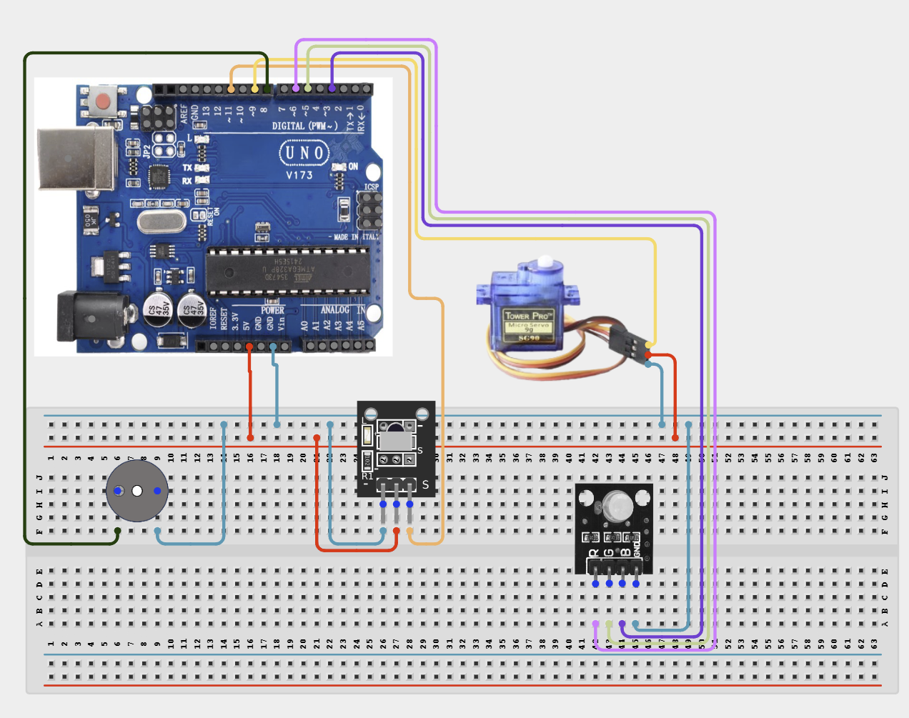

# Project 4.2.24: Project 114 IR Remote Servo Turret Positioner

| **Description** In Project 114, learners will construct an expert interactive system titled 'IR Remote Servo Turret Positioner'. This manual details the complete synthesis of IR Remote + Servo Motor SG90 + Active Buzzer + RGB LED Module into an intuitive, high-performance automated control platform.|------------------|----------------------------------------------------------------|
| **Use case**     |This project connects to real-world industrial and IoT applications such as: Project 114 equips students with professional skills in embedded human-machine interface (HMI) design and automated motion control.|

## Components (Things You will need)

|  |  |  |  | | | |
|------------------------------------------------------ | ----------------------------------------------------------- | --------------------------------------------------------- | ------------------------------------------------------ | ------------------------------------------------------ |------------------------------------------------------ |------------------------------------------------------ |

## Building the circuit

Things Needed:

- Arduino Uno Core Board = 1
- IR Remote = 1
- Servo Motor SG90 = 1
- Active Buzzer = 1
- USB Cable & Jumper Wires = 1
- RGB LED Module = 1

## Mounting the component on the breadboard and wiring the circuit

**Step 1:** Inventory all modules listed in the Required Components table.

**Step 2:** Connect the IR Receiver Signal pin to Arduino Digital Pin 11.

**Step 3:** Wire the Servo Motor Signal (orange) to Pin 9 and the Buzzer Positive to Pin 8.

**Step 4:** Connect the RGB LED pins: Red to Pin 5, Green to Pin 6, and Blue to Pin 3.

**Step 5:** Double-check all VCC, 5V, 3.3V, and GND polarities to prevent electrical shorts.

**Step 6:** Connect USB programming cable only after verifying all signal path wiring.



_Make sure to connect the Arduino USB cable to the Arduino board._

## PROGRAMMING

**Step 1:** Open your Arduino IDE. See how to set up here: [Getting Started](../../../Getting Started/Arduino_IDE_Setup.md).

**Step 2:** Write the complete program implementing the system logic with appropriate pin definitions, setup configuration, and the main control loop.

```cpp
#include <Servo.h>
#include <IRremote.h>

// --- Pin Definitions ---
const int IR_RECV_PIN = 11;  // IR Receiver Signal
const int SERVO_PWM_PIN = 9; // Servo Signal (PWM)
const int BUZZER_PIN = 8;    // Active Buzzer Positive
const int LED_RED = 5;       // RGB Red Pin
const int LED_GREEN = 6;     // RGB Green Pin
const int LED_BLUE = 3;      // RGB Blue Pin

// --- Object Initialization ---
Servo turretServo;
IRrecv irReceiver(IR_RECV_PIN);
decode_results irResults;

void setup() {
  Serial.begin(9600);

  // Start IR Receiver
  irReceiver.enableIRIn();

  // Attach Servo
  turretServo.attach(SERVO_PWM_PIN);
  turretServo.write(90); // Start at center position

  // Configure Output Pins
  pinMode(BUZZER_PIN, OUTPUT);
  pinMode(LED_RED, OUTPUT);
  pinMode(LED_GREEN, OUTPUT);
  pinMode(LED_BLUE, OUTPUT);

  Serial.println("System Ready: Project 114 Online");
}

void loop() {
  // Check if an IR signal is received
  if (irReceiver.decode(&irResults)) {
    long command = irResults.value;
    Serial.print("IR Code Received: ");
    Serial.println(command, HEX);

    // Visual and Audio Feedback
    digitalWrite(BUZZER_PIN, HIGH);
    delay(50);
    digitalWrite(BUZZER_PIN, LOW);

    // Resume receiver for next signal
    irReceiver.resume();
  }
  delay(100); // System stability delay
}
```

**Step 7:** Save your code. _See the [Getting Started](../../../Getting Started/Arduino_IDE_Setup.md) section_

**Step 8:** Select the arduino board and port _See the [Getting Started](../../../Getting Started/Arduino_IDE_Setup.md) section:Selecting Arduino Board Type and Uploading your code_.

**Step 9:** Upload your code. _See the [Getting Started](../../../Getting Started/Arduino_IDE_Setup.md) section:Selecting Arduino Board Type and Uploading your code_

## CONCLUSION

Operating physical input devices instantly modifies actuator behavior and updates visual indicators in real time.
