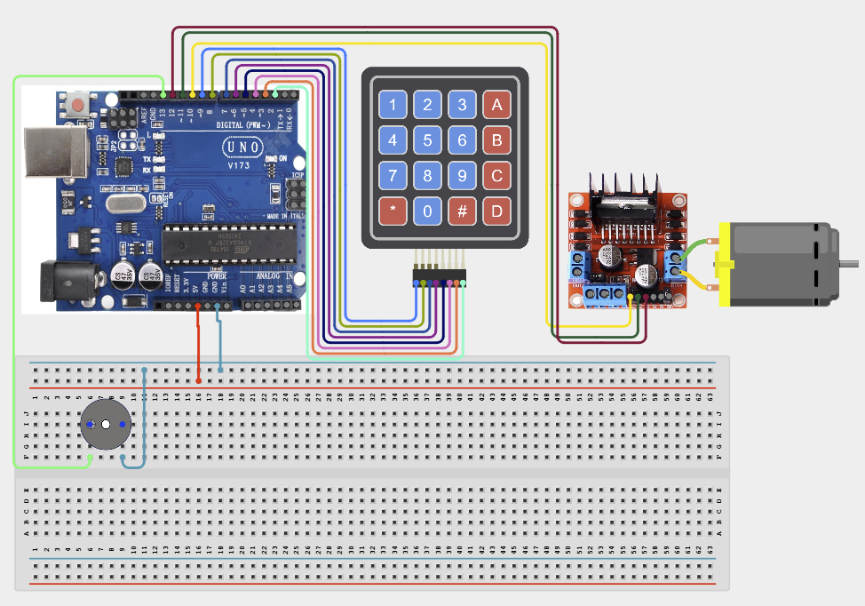

# Project 4.2.25: Project 115 Keypad PIN Activated Motor Starter

| **Description** In Project 115, learners will construct an expert interactive system titled 'Keypad PIN Activated Motor Starter'. This manual details the complete synthesis of 4x4 Matrix Keypad + DC Motor + Fan Blade + L298N Driver + Active Buzzer into an intuitive, high-performance automated control platform.|------------------|----------------------------------------------------------------|
| **Use case**     |This project connects to real-world industrial and IoT applications such as: Project 115 equips students with professional skills in embedded human-machine interface (HMI) design and automated motion control.|

## Components (Things You will need)

|  |  |  |  | | | |
|------------------------------------------------------ | ----------------------------------------------------------- | --------------------------------------------------------- | ------------------------------------------------------ | ------------------------------------------------------ |------------------------------------------------------ |------------------------------------------------------ |

## Building the circuit

Things Needed:

- Arduino Uno Core Board = 1
- 4x4 Matrix Keypad = 1
- DC Motor = 1
- Fan Blade = 1
- USB Cable & Jumper Wires = 1

## Mounting the component on the breadboard and wiring the circuit

**Step 1:** Inventory all modules listed in the Required Components table.

**Step 2:** Connect the 4x4 Matrix Keypad: Rows 1-4 to Digital Pins 9, 8, 7, 6; Columns 1-4 to Digital Pins 5, 4, 3, 2.

**Step 3:** Wire the L298N Motor Driver: ENA to Pin 10 (PWM), IN1 to Pin 11, and IN2 to Pin 12.

**Step 4:** Connect the Active Buzzer: Positive lead (+) to Digital Pin 13 and Negative lead to GND.

**Step 5:** Important: Connect an external 9V-12V power supply to the L298N driver VMS/GND terminals to power the motor; ensure the external ground is shared with the Arduino GND.

**Step 6:** Double-check all polarities and connect the USB cable only after verifying the shared ground and signal paths.



_Make sure to connect the Arduino USB cable to the Arduino board._

## PROGRAMMING

**Step 1:** Open your Arduino IDE. See how to set up here: [Getting Started](../../../Getting Started/Arduino_IDE_Setup.md).

**Step 2:** Write the complete program implementing the system logic with appropriate pin definitions, setup configuration, and the main control loop.

```cpp
// Project 115: Keypad PIN Activated Motor Starter
#include <Keypad.h>

const byte ROWS = 4;
const byte COLS = 4;
char keys[ROWS][COLS] = {{'1','2','3','A'},{'4','5','6','B'},{'7','8','9','C'},{'*','0','#','D'}};
byte rowPins[ROWS] = {9, 8, 7, 6};
byte colPins[COLS] = {5, 4, 3, 2};
Keypad keypad = Keypad(makeKeymap(keys), rowPins, colPins, ROWS, COLS);

const int ENA = 10; // PWM pin for speed control
const int IN1 = 11;
const int IN2 = 12;
const int BUZZER = 13;

void setup() {
  Serial.begin(9600);
  pinMode(ENA, OUTPUT);
  pinMode(IN1, OUTPUT);
  pinMode(IN2, OUTPUT);
  pinMode(BUZZER, OUTPUT);
  Serial.println("System Ready. External power required for L298N.");
}

void loop() {
  char key = keypad.getKey();
  if (key) {
    digitalWrite(BUZZER, HIGH);
    delay(100);
    digitalWrite(BUZZER, LOW);
    Serial.println(key);
  }
}
```

**Step 7:** Save your code. _See the [Getting Started](../../../Getting Started/Arduino_IDE_Setup.md) section_

**Step 8:** Select the arduino board and port _See the [Getting Started](../../../Getting Started/Arduino_IDE_Setup.md) section:Selecting Arduino Board Type and Uploading your code_.

**Step 9:** Upload your code. _See the [Getting Started](../../../Getting Started/Arduino_IDE_Setup.md) section:Selecting Arduino Board Type and Uploading your code_

## CONCLUSION

Operating physical input devices instantly modifies actuator behavior and updates visual indicators in real time.
