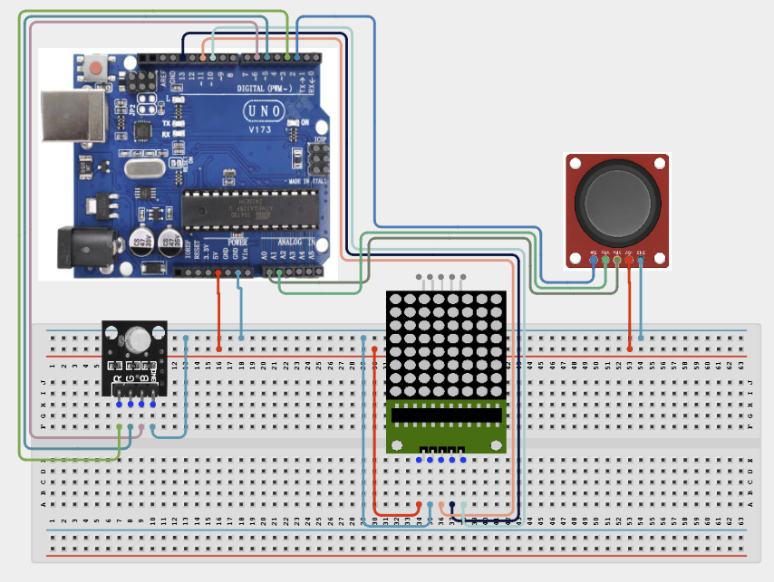

# Project 4.2.26: Project 116 Joystick Dynamic Dot Matrix Pointer

| **Description** In Project 116, learners will construct an expert interactive system titled 'Joystick Dynamic Dot Matrix Pointer'. This manual details the complete synthesis of XY Joystick + MAX7219 8x8 Dot Matrix + RGB LED Module into an intuitive, high-performance automated control platform.|------------------|----------------------------------------------------------------|
| **Use case**     |This project connects to real-world industrial and IoT applications such as: Project 116 equips students with professional skills in embedded human-machine interface (HMI) design and automated motion control.|

## Components (Things You will need)

|  |  |  |  | | | |
|------------------------------------------------------ | ----------------------------------------------------------- | --------------------------------------------------------- | ------------------------------------------------------ | ------------------------------------------------------ |------------------------------------------------------ |------------------------------------------------------ |

## Building the circuit

Things Needed:

- Arduino Uno Core Board = 1
- XY Joystick = 1
- MAX7219 8x8 Dot Matrix = 1
- RGB LED Module = 1
- USB Cable & Jumper Wires = 1

## Mounting the component on the breadboard and wiring the circuit

**Step 1:** Inventory all modules: Arduino Uno, XY Joystick, MAX7219, RGB LED.

**Step 2:** Connect Joystick: Connect VRx to A0, VRy to A1, and SW to D2. Connect VCC to 5V and GND to GND.

**Step 3:** Connect MAX7219: Connect DIN to D11, CS to D10, and CLK to D13. Connect VCC to 5V and GND to GND.

**Step 4:** Connect RGB LED: Connect the Red, Green, and Blue pins to D3, D5, and D6 respectively. Connect the common pin to GND.

**Step 5:** Verify all connections, ensuring no loose wires or short circuits between pins.

**Step 6:** Connect the USB cable to the Arduino Uno only after the final inspection.



_Make sure to connect the Arduino USB cable to the Arduino board._

## PROGRAMMING

**Step 1:** Open your Arduino IDE. See how to set up here: [Getting Started](../../../Getting Started/Arduino_IDE_Setup.md).

**Step 2:** Write the complete program implementing the system logic with appropriate pin definitions, setup configuration, and the main control loop.

```cpp
// Project 116: Joystick Dynamic Dot Matrix Pointer
// Target Setup: XY Joystick + MAX7219 8x8 Dot Matrix + RGB LED Module

#include <LedControl.h> // Ensure LedControl library is installed

// MAX7219 pins: DIN, CLK, CS
LedControl lc = LedControl(11, 13, 10, 1);

const int joyX = A0;
const int joyY = A1;
const int joySW = 2;
const int redPin = 3;
const int greenPin = 5;
const int bluePin = 6;

void setup() {
  pinMode(joySW, INPUT_PULLUP);
  pinMode(redPin, OUTPUT);
  pinMode(greenPin, OUTPUT);
  pinMode(bluePin, OUTPUT);
  
  lc.shutdown(0, false);
  lc.setIntensity(0, 8);
  lc.clearDisplay(0);
  Serial.begin(9600);
}

void loop() {
  int xVal = map(analogRead(joyX), 0, 1023, 0, 7);
  int yVal = map(analogRead(joyY), 0, 1023, 0, 7);
  
  lc.clearDisplay(0);
  lc.setLed(0, yVal, xVal, true);
  
  // Basic RGB feedback based on joystick position
  analogWrite(redPin, map(analogRead(joyX), 0, 1023, 0, 255));
  analogWrite(greenPin, map(analogRead(joyY), 0, 1023, 0, 255));
  
  delay(50);
}

```

**Step 7:** Save your code. _See the [Getting Started](../../../Getting Started/Arduino_IDE_Setup.md) section_

**Step 8:** Select the arduino board and port _See the [Getting Started](../../../Getting Started/Arduino_IDE_Setup.md) section:Selecting Arduino Board Type and Uploading your code_.

**Step 9:** Upload your code. _See the [Getting Started](../../../Getting Started/Arduino_IDE_Setup.md) section:Selecting Arduino Board Type and Uploading your code_

## CONCLUSION

Operating physical input devices instantly modifies actuator behavior and updates visual indicators in real time.
