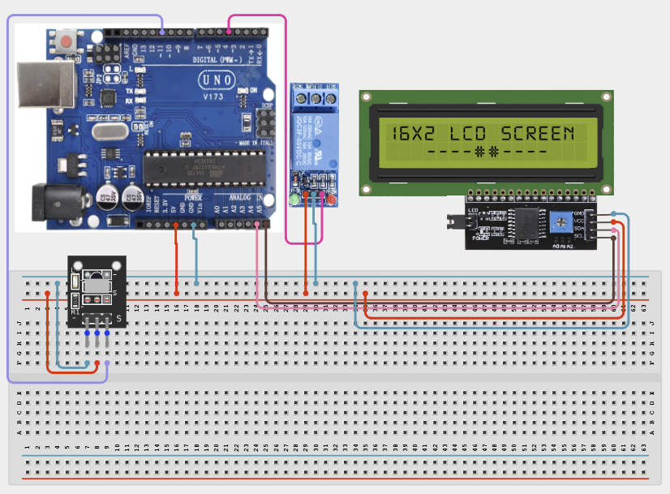

# Project 4.2.27: Project 117 IR Remote Multi Channel Appliance Switch

| **Description** In Project 117, learners will construct an expert interactive system titled 'IR Remote Multi-Channel Appliance Switch'. This manual details the complete synthesis of IR Remote + 4-Channel Relay Module + IIC 1602 LCD into an intuitive, high-performance automated control platform.|------------------|----------------------------------------------------------------|
| **Use case**     |This project connects to real-world industrial and IoT applications such as: Project 117 equips students with professional skills in embedded human-machine interface (HMI) design and automated motion control.|

## Components (Things You will need)

|  |  |  |  | | | |
|------------------------------------------------------ | ----------------------------------------------------------- | --------------------------------------------------------- | ------------------------------------------------------ | ------------------------------------------------------ |------------------------------------------------------ |------------------------------------------------------ |

## Building the circuit

Things Needed:

- Arduino Uno Core Board = 1
- IR Remote = 1
- 1-Channel Relay Module = 1
- IIC 1602 LCD = 1
- USB Cable & Jumper Wires = 1

## Mounting the component on the breadboard and wiring the circuit

**Step 1:** Inventory all modules listed in the Required Components table.

**Step 2:** Connect the IR Receiver: Connect OUT to Digital Pin 11, VCC to 5V, and GND to GND.

**Step 3:** Connect the 1-Channel Relay Module: Connect IN to Digital Pin 4. Connect VCC to 5V and GND to GND.

**Step 4:** Connect the IIC 1602 LCD: Connect SDA to A4, SCL to A5, VCC to 5V, and GND to GND.

**Step 5:** Double-check all VCC, 5V, and GND polarities to prevent electrical shorts.

**Step 6:** Connect USB programming cable only after verifying all signal path wiring.



_Make sure to connect the Arduino USB cable to the Arduino board._

## PROGRAMMING

**Step 1:** Open your Arduino IDE. See how to set up here: [Getting Started](../../../Getting Started/Arduino_IDE_Setup.md).

**Step 2:** Write the complete program implementing the system logic with appropriate pin definitions, setup configuration, and the main control loop.

```cpp
#include <IRremote.h>
#include <Wire.h>
#include <LiquidCrystal_I2C.h>

const int IR_PIN = 11;
const int RELAY_PINS[] = {4};
LiquidCrystal_I2C lcd(0x27, 16, 2);

void setup() {
  Serial.begin(9600);
  IrReceiver.begin(IR_PIN);
  lcd.init();
  lcd.backlight();
  lcd.print("Project 117 Ready");
  
  pinMode(RELAY_PINS[0], OUTPUT);
  digitalWrite(RELAY_PINS[0], HIGH); // Relay is active low
}

void loop() {
  if (IrReceiver.decode()) {
    unsigned long code = IrReceiver.decodedIRData.command;
    Serial.println(code);
    
    // Toggle the single relay based on received code
    if (code == 0x01) digitalWrite(RELAY_PINS[0], !digitalRead(RELAY_PINS[0]));
    
    IrReceiver.resume();
  }
}
```

**Step 7:** Save your code. _See the [Getting Started](../../../Getting Started/Arduino_IDE_Setup.md) section_

**Step 8:** Select the arduino board and port _See the [Getting Started](../../../Getting Started/Arduino_IDE_Setup.md) section:Selecting Arduino Board Type and Uploading your code_.

**Step 9:** Upload your code. _See the [Getting Started](../../../Getting Started/Arduino_IDE_Setup.md) section:Selecting Arduino Board Type and Uploading your code_

## CONCLUSION

Operating physical input devices instantly modifies actuator behavior and updates visual indicators in real time.
