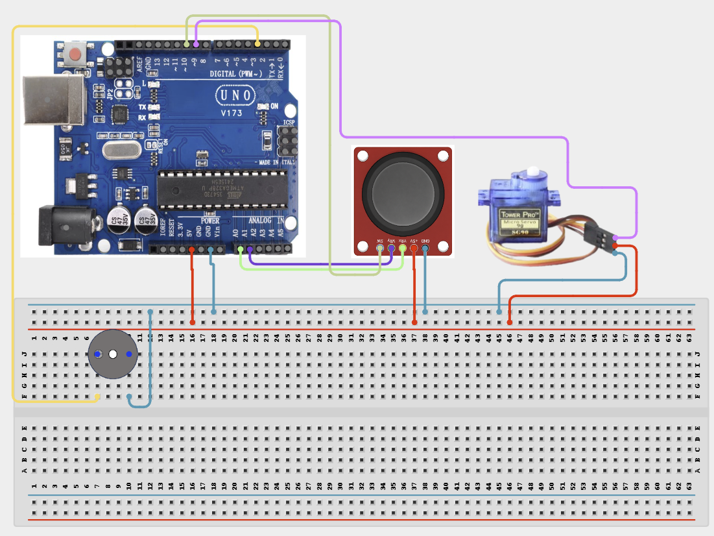

# Project 4.2.29: Project 119 Joystick Industrial Pan Tilt Camera Rig

| **Description** In Project 119, learners will construct an expert interactive system titled 'Joystick Industrial Pan-Tilt Camera Rig'. This manual details the complete synthesis of XY Joystick + 2 Servo Motors SG90 + Active Buzzer + LED into an intuitive, high-performance automated control platform.|------------------|----------------------------------------------------------------|
| **Use case**     |This project connects to real-world industrial and IoT applications such as: Project 119 equips students with professional skills in embedded human-machine interface (HMI) design and automated motion control.|

## Components (Things You will need)

|  |  |  |  | | | |
|------------------------------------------------------ | ----------------------------------------------------------- | --------------------------------------------------------- | ------------------------------------------------------ | ------------------------------------------------------ |------------------------------------------------------ |------------------------------------------------------ |

## Building the circuit

Things Needed:

- Arduino Uno Core Board = 1
- XY Joystick = 1
- 2 Servo Motors SG90 = 1
- Active Buzzer = 1
- USB Cable & Jumper Wires = 1

## Mounting the component on the breadboard and wiring the circuit

**Step 1:** Inventory all modules listed in the Required Components table.

**Step 2:** Connect Joystick VRx to A0, VRy to A1, and wire its VCC and GND to the 5V and GND rails.

**Step 3:** Connect Pan Servo signal to D9 and Tilt Servo signal to D10; connect their power and ground wires to the 5V/GND rails.

**Step 4:** Wire the Active Buzzer to D3 and LED to D4, ensuring shared GND for all components.

**Step 5:** Double-check all VCC, 5V, 3.3V, and GND polarities to prevent electrical shorts.

**Step 6:** Connect USB programming cable only after verifying all signal path wiring.



_Make sure to connect the Arduino USB cable to the Arduino board._

## PROGRAMMING

**Step 1:** Open your Arduino IDE. See how to set up here: [Getting Started](../../../Getting Started/Arduino_IDE_Setup.md).

**Step 2:** Write the complete program implementing the system logic with appropriate pin definitions, setup configuration, and the main control loop.

```cpp
#include <Servo.h>
Servo panServo; Servo tiltServo;
const int xPin = A0, yPin = A1;
const int buzzerPin = 3, ledPin = 4;
const int center = 512, threshold = 150;

void setup() {
  panServo.attach(9); tiltServo.attach(10);
  pinMode(buzzerPin, OUTPUT); pinMode(ledPin, OUTPUT);
  Serial.begin(9600);
}

void loop() {
  int xVal = analogRead(xPin); int yVal = analogRead(yPin);
  panServo.write(map(xVal, 0, 1023, 0, 180));
  tiltServo.write(map(yVal, 0, 1023, 0, 180));
  if (abs(xVal - center) > threshold || abs(yVal - center) > threshold) {
    digitalWrite(ledPin, HIGH); digitalWrite(buzzerPin, HIGH);
  } else {
    digitalWrite(ledPin, LOW); digitalWrite(buzzerPin, LOW);
  }
  delay(20);
}
```

**Step 7:** Save your code. _See the [Getting Started](../../../Getting Started/Arduino_IDE_Setup.md) section_

**Step 8:** Select the arduino board and port _See the [Getting Started](../../../Getting Started/Arduino_IDE_Setup.md) section:Selecting Arduino Board Type and Uploading your code_.

**Step 9:** Upload your code. _See the [Getting Started](../../../Getting Started/Arduino_IDE_Setup.md) section:Selecting Arduino Board Type and Uploading your code_

## CONCLUSION

Operating physical input devices instantly modifies actuator behavior and updates visual indicators in real time.
