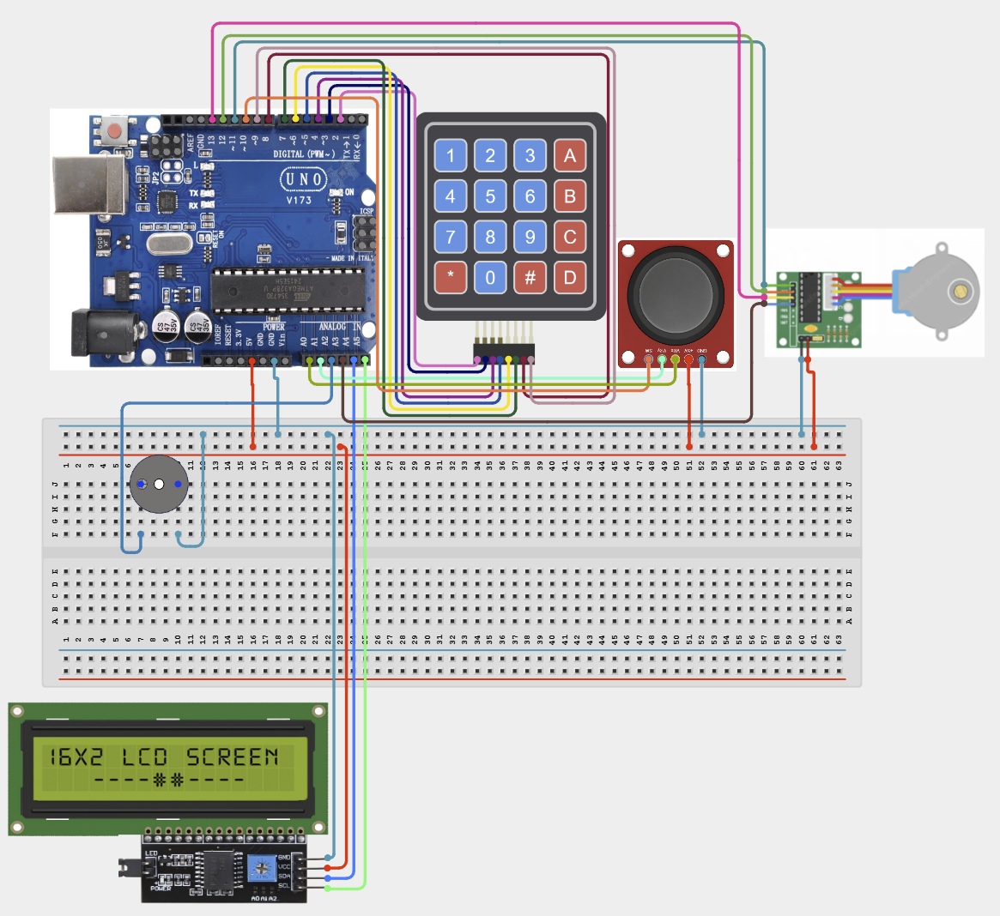

# Project 4.2.30: Project 120 Master Keypad  Joystick Automation Console

| **Description** In Project 120, learners will construct an expert interactive system titled 'Master Keypad & Joystick Automation Console'. This manual details the complete synthesis of 4x4 Keypad + XY Joystick + IIC 1602 LCD + Stepper Motor + Buzzer into an intuitive, high-performance automated control platform.|------------------|----------------------------------------------------------------|
| **Use case**     |This project connects to real-world industrial and IoT applications such as: Project 120 equips students with professional skills in embedded human-machine interface (HMI) design and automated motion control.|

## Components (Things You will need)

|  |  |  |  | | | |
|------------------------------------------------------ | ----------------------------------------------------------- | --------------------------------------------------------- | ------------------------------------------------------ | ------------------------------------------------------ |------------------------------------------------------ |------------------------------------------------------ |

## Building the circuit

Things Needed:

- Arduino Uno Core Board = 1
- 4x4 Keypad = 1
- XY Joystick = 1
- IIC 1602 LCD = 1
- USB Cable & Jumper Wires = 1

## Mounting the component on the breadboard and wiring the circuit

**Step 1:** Inventory all modules listed in the Required Components table.

**Step 2:** Connect the 4x4 Keypad: Rows to Digital pins 2, 3, 4, 5 and Columns to pins 6, 7, 8, 9.

**Step 3:** Wire the XY Joystick: VRx to A0, VRy to A1, and the Switch (SW) to Digital pin 10.

**Step 4:** Connect the IIC 1602 LCD: SDA to A4 and SCL to A5.

**Step 5:** Hook up the Stepper Motor via ULN2003 driver to pins 11, 12, 13, and A3.

**Step 6:** Connect the Buzzer to Pin A2 and provide 5V and GND to all modules.

**Step 7:** Double-check all VCC, 5V, 3.3V, and GND polarities to prevent electrical shorts.

**Step 8:** Connect USB programming cable only after verifying all signal path wiring.



_Make sure to connect the Arduino USB cable to the Arduino board._

## PROGRAMMING

**Step 1:** Open your Arduino IDE. See how to set up here: [Getting Started](../../../Getting Started/Arduino_IDE_Setup.md).

**Step 2:** Write the complete program implementing the system logic with appropriate pin definitions, setup configuration, and the main control loop.

```cpp
#include <Keypad.h>
#include <Wire.h>
#include <LiquidCrystal_I2C.h>
#include <Stepper.h>

// Pin Definitions
const int JOY_X = A0, JOY_Y = A1, JOY_SW = 10;
const int BUZZER = A2;
const int STEPS_PER_REV = 2048;
Stepper motor(STEPS_PER_REV, 11, 13, 12, A3);
LiquidCrystal_I2C lcd(0x27, 16, 2);

byte rowPins[4] = {2, 3, 4, 5};
byte colPins[4] = {6, 7, 8, 9};
char keys[4][4] = {{'1','2','3','A'},{'4','5','6','B'},{'7','8','9','C'},{'*','0','#','D'}};
Keypad keypad = Keypad(makeKeymap(keys), rowPins, colPins, 4, 4);

void setup() {
  Serial.begin(9600);
  pinMode(JOY_SW, INPUT_PULLUP);
  pinMode(BUZZER, OUTPUT);
  lcd.init();
  lcd.backlight();
  lcd.print("Console Online");
  motor.setSpeed(10);
  Serial.println("Project 120 initialized.");
}

void loop() {
  char key = keypad.getKey();
  if (key) Serial.println(key);
  delay(10);
}
```

**Step 7:** Save your code. _See the [Getting Started](../../../Getting Started/Arduino_IDE_Setup.md) section_

**Step 8:** Select the arduino board and port _See the [Getting Started](../../../Getting Started/Arduino_IDE_Setup.md) section:Selecting Arduino Board Type and Uploading your code_.

**Step 9:** Upload your code. _See the [Getting Started](../../../Getting Started/Arduino_IDE_Setup.md) section:Selecting Arduino Board Type and Uploading your code_

## CONCLUSION

Operating physical input devices instantly modifies actuator behavior and updates visual indicators in real time.
