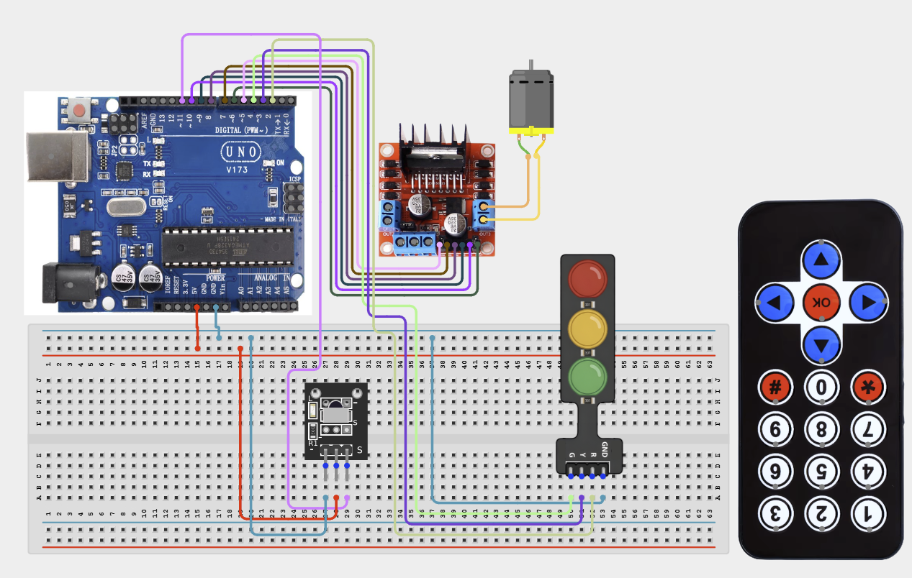

# Project 4.2.3: Project 93 IR Remote Dual DC Motor Drive

| **Description** In Project 93, learners will construct an expert interactive system titled 'IR Remote Dual DC Motor Drive'. This manual details the complete synthesis of IR Receiver + Remote + 2 DC Motors + L298N Driver + Traffic Light Module into an intuitive, high-performance automated control platform.|------------------|----------------------------------------------------------------|
| **Use case**     |This project connects to real-world industrial and IoT applications such as: Project 93 equips students with professional skills in embedded human-machine interface (HMI) design and automated motion control.|

## Components (Things You will need)

|  |  |  |  | | | |
|------------------------------------------------------ | ----------------------------------------------------------- | --------------------------------------------------------- | ------------------------------------------------------ | ------------------------------------------------------ |------------------------------------------------------ |------------------------------------------------------ |

## Building the circuit

Things Needed:

- Arduino Uno Core Board
- IR Receiver
- Remote
- DC Motors
- L298N Motor Driver
- Traffic Light Module
- USB Cable & Jumper Wires

## Mounting the component on the breadboard and wiring the circuit

**Step 1:** Connect the Arduino 5V pin to the breadboard's positive (+) power rail and the Arduino GND pin to the negative (-) power rail.

**Step 2:** Place the IR Receiver on the breadboard.
  - Connect the VCC pin to the 5V power rail on the breadboard
  - Connect the GND pin to the ground rail on the breadboard
  - Connect the OUT/Signal pin to Digital Pin 11

**Step 3:** Place the L298N Motor Driver on the breadboard (for the Dual DC Motors).
  - Connect the 5V pin to the 5V power rail on the breadboard
  - Connect the GND pin to the ground rail on the breadboard
  - Connect ENA, IN1, and IN2 to Digital Pins 9, 8, and 7 respectively (for Motor A)
  - Connect ENB, IN3, and IN4 to Digital Pins 3, 6, and 5 respectively (for Motor B)
  - Connect the DC motors to the driver's OUT1/OUT2 and OUT3/OUT4 terminals

**Step 4:** Place the Traffic Light Module on the breadboard.
  - Connect the Red, Yellow, and Green pins to Digital Pins 12, 13, and Analog Pin A0 respectively
  - Connect the GND pin to the ground rail on the breadboard

**Step 5:** Ensure all components share a common GND connection, then verify all wiring before connecting the Arduino Uno to your computer using the USB cable.



**Step 6:** After confirming that all connections are correct, connect the USB cable to the Arduino Uno board and the computer to power the circuit.

_Make sure to connect the Arduino USB cable to the Arduino board._

## PROGRAMMING

**Step 1:** Open your Arduino IDE. See how to set up here: [Getting Started](../../../Getting Started/Arduino_IDE_Setup.md).

**Step 2:** Write the complete program implementing the system logic with appropriate pin definitions, setup configuration, and the main control loop.

```cpp
// Project 93: IR Remote Dual DC Motor Drive
// Target Setup: IR Receiver + Remote + 2 DC Motors + L298N Driver + Traffic Light Module

void setup() {
  Serial.begin(9600);
  Serial.println("Project 93: IR Remote Dual DC Motor Drive Hardware Online");
}

void loop() {
  // Interactive input parsing and actuator drive routine
  delay(100);
}
```

**Step 7:** Save your code. _See the [Getting Started](../../../Getting Started/Arduino_IDE_Setup.md) section_

**Step 8:** Select the arduino board and port _See the [Getting Started](../../../Getting Started/Arduino_IDE_Setup.md) section:Selecting Arduino Board Type and Uploading your code_.

**Step 9:** Upload your code. _See the [Getting Started](../../../Getting Started/Arduino_IDE_Setup.md) section:Selecting Arduino Board Type and Uploading your code_

## CONCLUSION

Operating physical input devices instantly modifies actuator behavior and updates visual indicators in real time.
