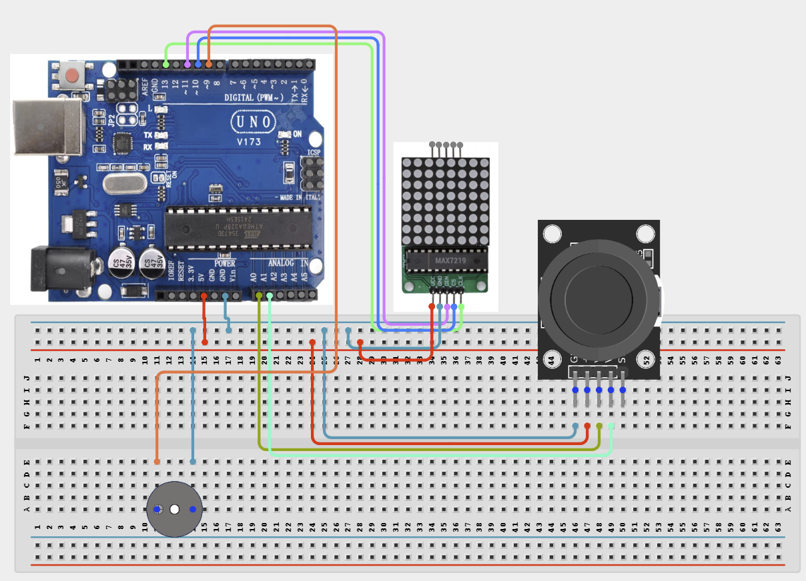

# Project 4.2.4: Project 94 Interactive Dot Matrix Arcade Snake Simulator

| **Description** In Project 94, learners will construct an expert interactive system titled 'Interactive Dot Matrix Arcade Snake Simulator'. This manual details the complete synthesis of XY Joystick + MAX7219 8x8 Dot Matrix + Active Buzzer into an intuitive, high-performance automated control platform.|------------------|----------------------------------------------------------------|
| **Use case**     |This project connects to real-world industrial and IoT applications such as: Project 94 equips students with professional skills in embedded human-machine interface (HMI) design and automated motion control.|

## Components (Things You will need)

|  |  |  |  | | | |
|------------------------------------------------------ | ----------------------------------------------------------- | --------------------------------------------------------- | ------------------------------------------------------ | ------------------------------------------------------ |------------------------------------------------------ |------------------------------------------------------ |

## Building the circuit

Things Needed:

- Arduino Uno Core Board = 1
- XY Joystick = 1
- MAX7219 8x8 Dot Matrix = 1
- Active Buzzer = 1
- USB Cable & Jumper Wires = 1

## Mounting the component on the breadboard and wiring the circuit

**Step 1:** Inventory all modules listed in the Required Components table.

**Step 2:** Connect line [Input Bus Leads] to [Digital / Analog Pins] — (Primary user control input channel.).

**Step 3:** Connect line [Actuator / Display Lines] to [PWM / I2C Pins] — (Output drive and rendering bus.).

**Step 4:** Connect line [Power Lines] to [5V / 3.3V / GND] — (Common power and ground reference rails.).

**Step 5:** Double-check all VCC, 5V, 3.3V, and GND polarities to prevent electrical shorts.

**Step 6:** Connect USB programming cable only after verifying all signal path wiring.



_Make sure to connect the Arduino USB cable to the Arduino board._

## PROGRAMMING

**Step 1:** Open your Arduino IDE. See how to set up here: [Getting Started](../../../Getting Started/Arduino_IDE_Setup.md).

**Step 2:** Write the complete program implementing the system logic with appropriate pin definitions, setup configuration, and the main control loop.

```cpp
#include <LedControl.h>

// Pin Definitions based on Circuit Connections
const int DIN = 11;
const int CS = 10;
const int CLK = 13;
const int joyX = A0;
const int joyY = A1;
const int joySW = 2;
const int buzzer = 9;

LedControl lc = LedControl(DIN, CLK, CS, 1);

void setup() {
  Serial.begin(9600);

  // Initialize Display
  lc.shutdown(0, false);
  lc.setIntensity(0, 8);
  lc.clearDisplay(0);

  // Initialize Pins
  pinMode(joySW, INPUT_PULLUP);
  pinMode(buzzer, OUTPUT);

  Serial.println("Project 94: Interactive Dot Matrix Arcade Snake Simulator Hardware Online");
}

void loop() {
  // Read Inputs
  int xVal = analogRead(joyX);
  int yVal = analogRead(joyY);
  bool swPressed = !digitalRead(joySW); // Active low

  // Simple Interaction: Sound buzzer and light LED on press
  if (swPressed) {
    tone(buzzer, 1000, 100);
    lc.setLed(0, 3, 3, true);
  } else {
    lc.setLed(0, 3, 3, false);
  }

  delay(50);
}
```

**Step 7:** Save your code. _See the [Getting Started](../../../Getting Started/Arduino_IDE_Setup.md) section_

**Step 8:** Select the arduino board and port _See the [Getting Started](../../../Getting Started/Arduino_IDE_Setup.md) section:Selecting Arduino Board Type and Uploading your code_.

**Step 9:** Upload your code. _See the [Getting Started](../../../Getting Started/Arduino_IDE_Setup.md) section:Selecting Arduino Board Type and Uploading your code_

## CONCLUSION

Operating physical input devices instantly modifies actuator behavior and updates visual indicators in real time.
