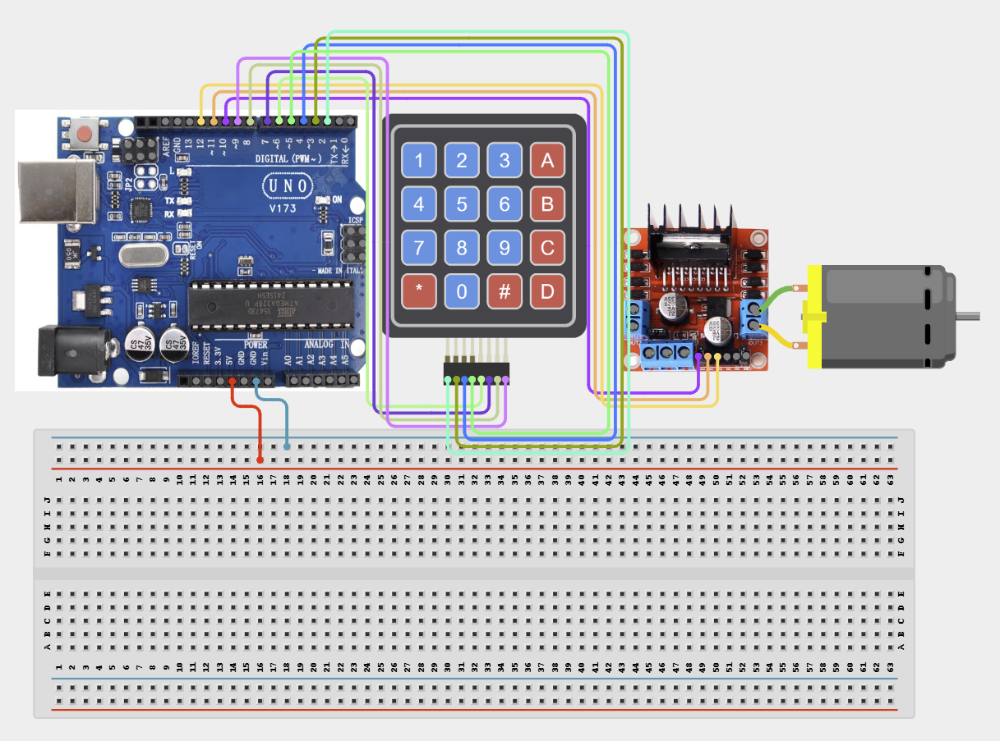

# Project 4.2.5: Project 95 Keypad Speed Controlled Fan

| **Description** In Project 95, learners will construct an expert interactive system titled 'Keypad Speed Controlled Fan'. This manual details the complete synthesis of 4x4 Matrix Keypad + DC Motor + Fan Blade + L298N Driver + 7-Segment Display into an intuitive, high-performance automated control platform.|------------------|----------------------------------------------------------------|
| **Use case**     |This project connects to real-world industrial and IoT applications such as: Project 95 equips students with professional skills in embedded human-machine interface (HMI) design and automated motion control.|

## Components (Things You will need)

|  |  |  |  | | | |
|------------------------------------------------------ | ----------------------------------------------------------- | --------------------------------------------------------- | ------------------------------------------------------ | ------------------------------------------------------ |------------------------------------------------------ |------------------------------------------------------ |

## Building the circuit

Things Needed:

- Arduino Uno Core Board = 1
- 4x4 Matrix Keypad = 1
- DC Motor = 1
- Fan Blade = 1
- USB Cable & Jumper Wires = 1

## Mounting the component on the breadboard and wiring the circuit

**Step 1:** Inventory all modules.

**Step 2:** Connect Keypad rows to pins 2-5 and columns to 6-9.

**Step 3:** Connect L298N driver ENA to pin 10, IN1 to 11, and IN2 to 12.

**Step 4:** Connect 7-Segment display pins to A0-A5.

**Step 5:** Connect 5V and GND from Arduino to the respective power rails.

**Step 6:** Verify all polarities before connecting USB.



_Make sure to connect the Arduino USB cable to the Arduino board._

## PROGRAMMING

**Step 1:** Open your Arduino IDE. See how to set up here: [Getting Started](../../../Getting Started/Arduino_IDE_Setup.md).

**Step 2:** Write the complete program implementing the system logic with appropriate pin definitions, setup configuration, and the main control loop.

```cpp
#include <Keypad.h>

const byte ROWS = 4; const byte COLS = 4;
char keys[ROWS][COLS] = {{'1','2','3','A'},{'4','5','6','B'},{'7','8','9','C'},{'*','0','#','D'}};
byte rowPins[ROWS] = {2, 3, 4, 5}; byte colPins[COLS] = {6, 7, 8, 9};
Keypad kpd = Keypad(makeKeymap(keys), rowPins, colPins, ROWS, COLS);

int enA = 10; int in1 = 11; int in2 = 12;

void setup() {
  pinMode(enA, OUTPUT); pinMode(in1, OUTPUT); pinMode(in2, OUTPUT);
  Serial.begin(9600);
}

void loop() {
  char key = kpd.getKey();
  if (key) {
    if (key == '1') analogWrite(enA, 100);
    else if (key == '2') analogWrite(enA, 200);
    else if (key == '3') analogWrite(enA, 255);
    else if (key == '0') analogWrite(enA, 0);
    digitalWrite(in1, HIGH); digitalWrite(in2, LOW);
  }
}
```

**Step 7:** Save your code. _See the [Getting Started](../../../Getting Started/Arduino_IDE_Setup.md) section_

**Step 8:** Select the arduino board and port _See the [Getting Started](../../../Getting Started/Arduino_IDE_Setup.md) section:Selecting Arduino Board Type and Uploading your code_.

**Step 9:** Upload your code. _See the [Getting Started](../../../Getting Started/Arduino_IDE_Setup.md) section:Selecting Arduino Board Type and Uploading your code_

## CONCLUSION

Operating physical input devices instantly modifies actuator behavior and updates visual indicators in real time.
