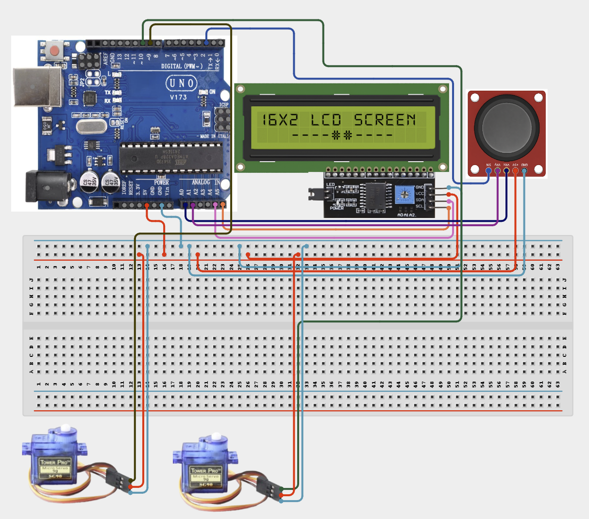

# Project 4.2.6: Project 96 Dual Axis Servo Camera Gimbal Stabilizer

| **Description** In Project 96, learners will construct an expert interactive system titled 'Dual-Axis Servo Camera Gimbal Stabilizer'. This manual details the complete synthesis of XY Joystick + 2 Servo Motors SG90 + IIC 1602 LCD into an intuitive, high-performance automated control platform.|------------------|----------------------------------------------------------------|
| **Use case**     |This project connects to real-world industrial and IoT applications such as: Project 96 equips students with professional skills in embedded human-machine interface (HMI) design and automated motion control.|

## Components (Things You will need)

|  |  |  |  | | | |
|------------------------------------------------------ | ----------------------------------------------------------- | --------------------------------------------------------- | ------------------------------------------------------ | ------------------------------------------------------ |------------------------------------------------------ |------------------------------------------------------ |

## Building the circuit

Things Needed:

- Arduino Uno Core Board = 1
- XY Joystick = 1
- 2 Servo Motors SG90 = 1
- IIC 1602 LCD = 1
- USB Cable & Jumper Wires = 1

## Mounting the component on the breadboard and wiring the circuit

**Step 1:** Inventory all modules and connect the XY Joystick VRx to A0, VRy to A1, and SW to Digital 2.

**Step 2:** Wire the Servo Motors: Connect Servo 1 (Tilt) signal to Pin 9 and Servo 2 (Pan) signal to Pin 10.

**Step 3:** Connect the IIC 1602 LCD: SDA to A4 and SCL to A5 for I2C data transfer.

**Step 4:** Establish Power Lines: Link all component VCC pins to 5V and GND pins to the common GND rail.

**Step 5:** Double-check all VCC, 5V, 3.3V, and GND polarities to prevent electrical shorts.

**Step 6:** Connect USB programming cable only after verifying all signal path wiring.



_Make sure to connect the Arduino USB cable to the Arduino board._

## PROGRAMMING

**Step 1:** Open your Arduino IDE. See how to set up here: [Getting Started](../../../Getting Started/Arduino_IDE_Setup.md).

**Step 2:** Write the complete program implementing the system logic with appropriate pin definitions, setup configuration, and the main control loop.

```cpp
#include <Servo.h>
#include <Wire.h>
#include <LiquidCrystal_I2C.h>

// Hardware Pin Definitions
const int PIN_JOY_X = A0;
const int PIN_JOY_Y = A1;
const int PIN_JOY_SW = 2;
const int PIN_SERVO_TILT = 9;
const int PIN_SERVO_PAN = 10;

// Object Initialization
Servo tiltServo;
Servo panServo;
LiquidCrystal_I2C lcd(0x27, 16, 2);

void setup() {
  // Configure Joystick switch with internal pullup
  pinMode(PIN_JOY_SW, INPUT_PULLUP);
  
  // Attach servos to PWM pins
  tiltServo.attach(PIN_SERVO_TILT);
  panServo.attach(PIN_SERVO_PAN);
  
  // Initialize LCD display
  lcd.init();
  lcd.backlight();
  lcd.setCursor(0, 0);
  lcd.print("Gimbal Stabilizer");
  delay(2000);
  lcd.clear();
}

void loop() {
  // 1. Read Inputs
  int xVal = analogRead(PIN_JOY_X);
  int yVal = analogRead(PIN_JOY_Y);
  int swState = digitalRead(PIN_JOY_SW);
  
  // 2. Map and Drive Servos
  // Map 0-1023 to 0-180 degree angles
  panServo.write(map(xVal, 0, 1023, 0, 180));
  tiltServo.write(map(yVal, 0, 1023, 0, 180));
  
  // 3. Update Visual Display
  lcd.setCursor(0, 0);
  lcd.print("X:"); lcd.print(xVal);
  lcd.print(" Y:"); lcd.print(yVal);
  lcd.print("   "); // Clear trailing digits
  
  lcd.setCursor(0, 1);
  lcd.print("SW:");
  lcd.print(swState == LOW ? "PRESSED" : "IDLE   ");
  
  delay(50); // Loop stability delay
}
```

**Step 7:** Save your code. _See the [Getting Started](../../../Getting Started/Arduino_IDE_Setup.md) section_

**Step 8:** Select the arduino board and port _See the [Getting Started](../../../Getting Started/Arduino_IDE_Setup.md) section:Selecting Arduino Board Type and Uploading your code_.

**Step 9:** Upload your code. _See the [Getting Started](../../../Getting Started/Arduino_IDE_Setup.md) section:Selecting Arduino Board Type and Uploading your code_

## CONCLUSION

Operating physical input devices instantly modifies actuator behavior and updates visual indicators in real time.
