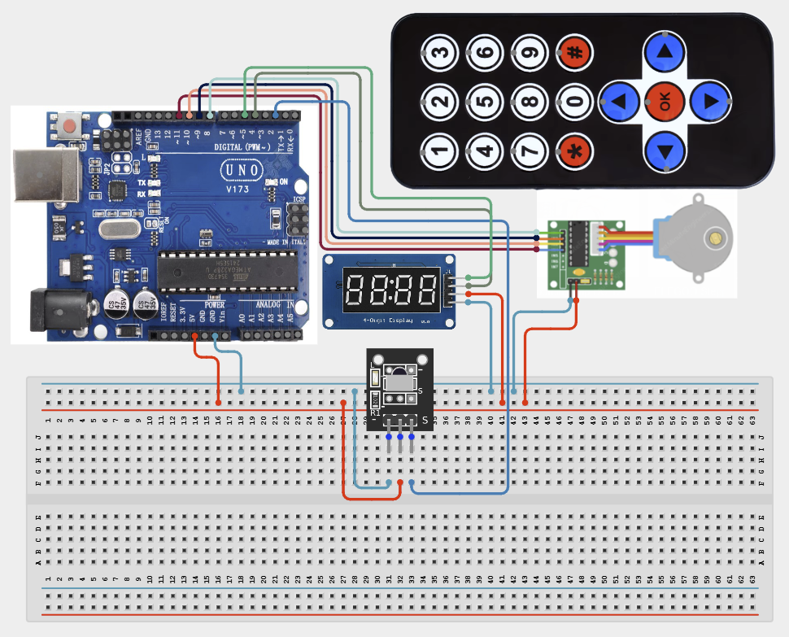

# Project 4.2.7: Project 97 IR Remote Stepper Angle Indexing Table

| **Description** In Project 97, learners will construct an expert interactive system titled 'IR Remote Stepper Angle Indexing Table'. This manual details the complete synthesis of IR Receiver & Remote + Stepper Motor + TM1637 4-Digit Display into an intuitive, high-performance automated control platform.|------------------|----------------------------------------------------------------|
| **Use case**     |This project connects to real-world industrial and IoT applications such as: Project 97 equips students with professional skills in embedded human-machine interface (HMI) design and automated motion control.|

## Components (Things You will need)

|  |  |  |  | | | |
|------------------------------------------------------ | ----------------------------------------------------------- | --------------------------------------------------------- | ------------------------------------------------------ | ------------------------------------------------------ |------------------------------------------------------ |------------------------------------------------------ |

## Building the circuit

Things Needed:

- Arduino Uno Core Board = 1
- IR Receiver & Remote = 1
- Stepper Motor = 1
- TM1637 4-Digit Display = 1
- USB Cable & Jumper Wires = 1

## Mounting the component on the breadboard and wiring the circuit

**Step 1:** Connect the IR Receiver Signal pin to Arduino D2, VCC to 5V, and GND to GND.

**Step 2:** Connect the TM1637 Display CLK pin to D5 and DIO pin to D4. Connect VCC to 5V and GND to GND.

**Step 3:** Connect the Stepper Driver (ULN2003) input pins (IN1-IN4) to Arduino pins D8-D11 respectively. Ensure the motor is powered (External 5V recommended for motors).

**Step 4:** Double-check all wiring to prevent electrical shorts.

**Step 5:** Connect USB programming cable.



_Make sure to connect the Arduino USB cable to the Arduino board._

## PROGRAMMING

**Step 1:** Open your Arduino IDE. See how to set up here: [Getting Started](../../../Getting Started/Arduino_IDE_Setup.md).

**Step 2:** Write the complete program implementing the system logic with appropriate pin definitions, setup configuration, and the main control loop.

```cpp
#include <IRremote.h>
#include <Stepper.h>
#include <TM1637Display.h>

const int IR_PIN = 2;
const int CLK = 5;
const int DIO = 4;
const int STEPS_PER_REV = 2048;

Stepper myStepper(STEPS_PER_REV, 8, 10, 9, 11);
TM1637Display display(CLK, DIO);

void setup() {
  IrReceiver.begin(IR_PIN);
  display.setBrightness(0x0f);
  display.showNumberDec(0);
  Serial.begin(9600);
}

void loop() {
  if (IrReceiver.decode()) {
    unsigned long code = IrReceiver.decodedIRData.command;
    Serial.println(code);
    
    // Example: Rotate 90 degrees on signal
    myStepper.step(512); 
    display.showNumberDec(code);
    
    IrReceiver.resume();
  }
}

```

**Step 7:** Save your code. _See the [Getting Started](../../../Getting Started/Arduino_IDE_Setup.md) section_

**Step 8:** Select the arduino board and port _See the [Getting Started](../../../Getting Started/Arduino_IDE_Setup.md) section:Selecting Arduino Board Type and Uploading your code_.

**Step 9:** Upload your code. _See the [Getting Started](../../../Getting Started/Arduino_IDE_Setup.md) section:Selecting Arduino Board Type and Uploading your code_

## CONCLUSION

Operating physical input devices instantly modifies actuator behavior and updates visual indicators in real time.
