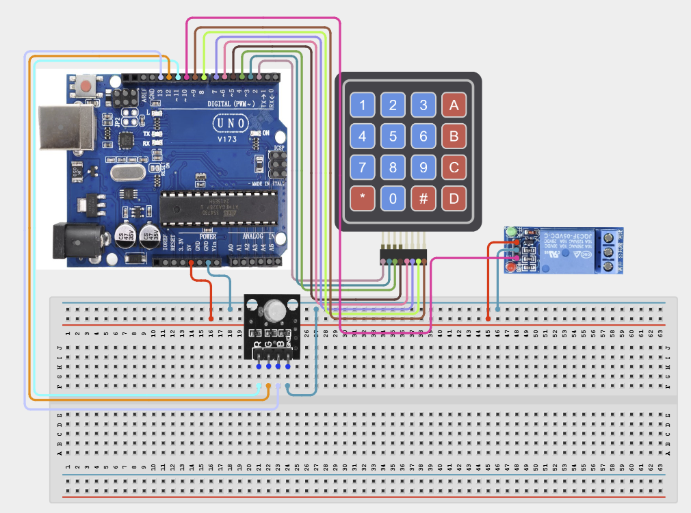

# Project 4.2.8: Project 98 Keypad Sequence Combination Security Lock

| **Description** In Project 98, learners will construct an expert interactive system titled 'Keypad Sequence Combination Security Lock'. This manual details the complete synthesis of 4x4 Matrix Keypad + Relay Module + RGB LED Module + Active Buzzer into an intuitive, high-performance automated control platform.|------------------|----------------------------------------------------------------|
| **Use case**     |This project connects to real-world industrial and IoT applications such as: Project 98 equips students with professional skills in embedded human-machine interface (HMI) design and automated motion control.|

## Components (Things You will need)

|  |  |  |  | | | |
|------------------------------------------------------ | ----------------------------------------------------------- | --------------------------------------------------------- | ------------------------------------------------------ | ------------------------------------------------------ |------------------------------------------------------ |------------------------------------------------------ |

## Building the circuit

Things Needed:

- Arduino Uno Core Board = 1
- 4x4 Matrix Keypad = 1
- Relay Module = 1
- RGB LED Module = 1
- USB Cable & Jumper Wires = 1

## Mounting the component on the breadboard and wiring the circuit

**Step 1:** Connect Keypad Rows 1-4 to Arduino pins 2-5.

**Step 2:** Connect Keypad Columns 1-4 to Arduino pins 6-9.

**Step 3:** Connect Relay Module Signal pin to pin 10.

**Step 4:** Connect RGB LED pins (R, G, B) to pins 11, 12, 13.

**Step 5:** Connect the Active Buzzer positive lead to pin A0 and the negative lead to GND.

**Step 6:** Connect all component VCC pins to the 5V rail and GND pins to the common ground rail.

**Step 7:** Double-check all connections before applying USB power.



_Make sure to connect the Arduino USB cable to the Arduino board._

## PROGRAMMING

**Step 1:** Open your Arduino IDE. See how to set up here: [Getting Started](../../../Getting Started/Arduino_IDE_Setup.md).

**Step 2:** Write the complete program implementing the system logic with appropriate pin definitions, setup configuration, and the main control loop.

```cpp
#include <Keypad.h>

const byte ROWS = 4;
const byte COLS = 4;
char keys[ROWS][COLS] = {
  {'1','2','3','A'},
  {'4','5','6','B'},
  {'7','8','9','C'},
  {'*','0','#','D'}
};
byte rowPins[ROWS] = {2, 3, 4, 5};
byte colPins[COLS] = {6, 7, 8, 9};
Keypad keypad = Keypad(makeKeymap(keys), rowPins, colPins, ROWS, COLS);

const int relayPin = 10;
const int redPin = 11;
const int greenPin = 12;
const int bluePin = 13;
const int buzzerPin = A0;

void setup() {
  Serial.begin(9600);
  pinMode(relayPin, OUTPUT);
  pinMode(redPin, OUTPUT);
  pinMode(greenPin, OUTPUT);
  pinMode(bluePin, OUTPUT);
  pinMode(buzzerPin, OUTPUT);
  Serial.println("Project 98: Keypad Security Lock Ready");
}

void loop() {
  char key = keypad.getKey();
  if (key) {
    Serial.println(key);
    // Add password verification logic here
  }
}

```

**Step 7:** Save your code. _See the [Getting Started](../../../Getting Started/Arduino_IDE_Setup.md) section_

**Step 8:** Select the arduino board and port _See the [Getting Started](../../../Getting Started/Arduino_IDE_Setup.md) section:Selecting Arduino Board Type and Uploading your code_.

**Step 9:** Upload your code. _See the [Getting Started](../../../Getting Started/Arduino_IDE_Setup.md) section:Selecting Arduino Board Type and Uploading your code_

## CONCLUSION

Operating physical input devices instantly modifies actuator behavior and updates visual indicators in real time.
