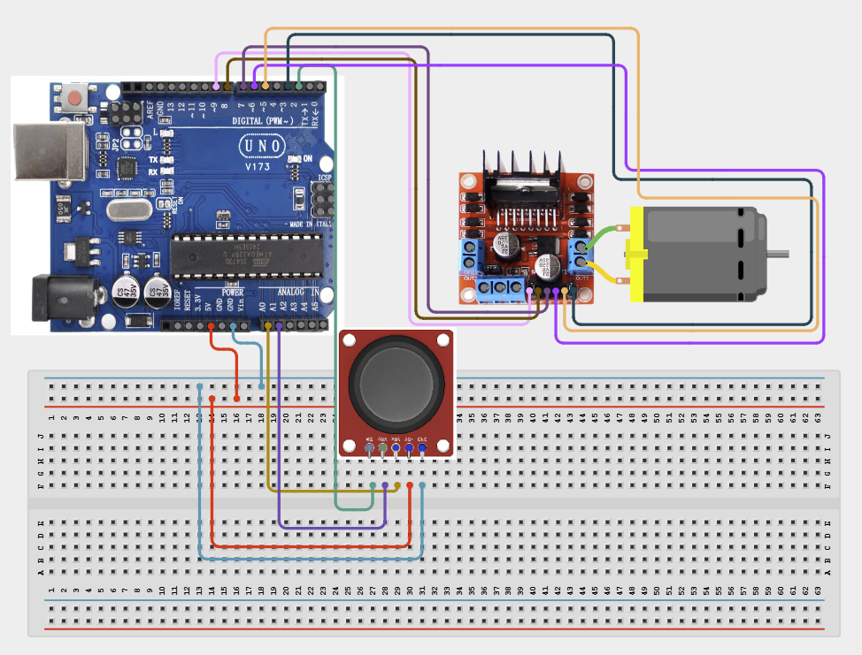

# Project 4.2.9: Project 99 Joystick Steering DC Rover Drive

| **Description** In Project 99, learners will construct an expert interactive system titled 'Joystick Steering DC Rover Drive'. This manual details the complete synthesis of XY Joystick + 2 DC Motors + L298N Driver + Traffic Light Module into an intuitive, high-performance automated control platform.|------------------|----------------------------------------------------------------|
| **Use case**     |This project connects to real-world industrial and IoT applications such as: Project 99 equips students with professional skills in embedded human-machine interface (HMI) design and automated motion control.|

## Components (Things You will need)

|  |  |  |  | | | |
|------------------------------------------------------ | ----------------------------------------------------------- | --------------------------------------------------------- | ------------------------------------------------------ | ------------------------------------------------------ |------------------------------------------------------ |------------------------------------------------------ |

## Building the circuit

Things Needed:

- Arduino Uno Core Board = 1
- XY Joystick = 1
- 2 DC Motors = 1
- L298N Driver = 1
- USB Cable & Jumper Wires = 1

## Mounting the component on the breadboard and wiring the circuit

**Step 1:** Inventory all modules listed in the Required Components table.

**Step 2:** Wire the XY Joystick: VCC to 5V, GND to GND, VRX to Analog A0, VRY to Analog A1, and SW to Digital D2.

**Step 3:** Wire the L298N Driver: Connect ENA to D9, IN1 to D8, IN2 to D7, ENB to D3, IN3 to D6, and IN4 to D5.

**Step 4:** Power the motors: Connect an external 12V supply to the L298N 12V terminal and tie the external GND to the Arduino GND.

**Step 5:** Double-check all VCC, 5V, 3.3V, and GND polarities to prevent electrical shorts.

**Step 6:** Connect USB programming cable only after verifying all signal path wiring.



_Make sure to connect the Arduino USB cable to the Arduino board._

## PROGRAMMING

**Step 1:** Open your Arduino IDE. See how to set up here: [Getting Started](../../../Getting Started/Arduino_IDE_Setup.md).

**Step 2:** Write the complete program implementing the system logic with appropriate pin definitions, setup configuration, and the main control loop.

```cpp
// Project 99: Joystick Steering DC Rover Drive
const int VRX_PIN = A0; 
const int VRY_PIN = A1;
const int ENA = 9; 
const int IN1 = 8; 
const int IN2 = 7;
const int ENB = 3; 
const int IN3 = 6; 
const int IN4 = 5;

void setup() {
  pinMode(ENA, OUTPUT); 
  pinMode(IN1, OUTPUT); 
  pinMode(IN2, OUTPUT);
  pinMode(ENB, OUTPUT); 
  pinMode(IN3, OUTPUT); 
  pinMode(IN4, OUTPUT);
  Serial.begin(9600);
}

void loop() {
  int xVal = analogRead(VRX_PIN); 
  int yVal = analogRead(VRY_PIN);
  
  // Calculate speed and steering
  int speed = map(abs(yVal - 512), 0, 512, 0, 255);
  int steering = map(xVal, 0, 1023, -127, 127);
  
  // Differential drive logic
  int leftMotor = speed + steering;
  int rightMotor = speed - steering;

  // Constrain to PWM range
  leftMotor = constrain(leftMotor, -255, 255);
  rightMotor = constrain(leftMotor, -255, 255);

  // Apply motor logic
  digitalWrite(IN1, leftMotor > 0);
  digitalWrite(IN2, leftMotor < 0);
  digitalWrite(IN3, rightMotor > 0);
  digitalWrite(IN4, rightMotor < 0);
  
  analogWrite(ENA, abs(leftMotor));
  analogWrite(ENB, abs(rightMotor));
  
  delay(20);
}

```

**Step 7:** Save your code. _See the [Getting Started](../../../Getting Started/Arduino_IDE_Setup.md) section_

**Step 8:** Select the arduino board and port _See the [Getting Started](../../../Getting Started/Arduino_IDE_Setup.md) section:Selecting Arduino Board Type and Uploading your code_.

**Step 9:** Upload your code. _See the [Getting Started](../../../Getting Started/Arduino_IDE_Setup.md) section:Selecting Arduino Board Type and Uploading your code_

## CONCLUSION

Operating physical input devices instantly modifies actuator behavior and updates visual indicators in real time.
