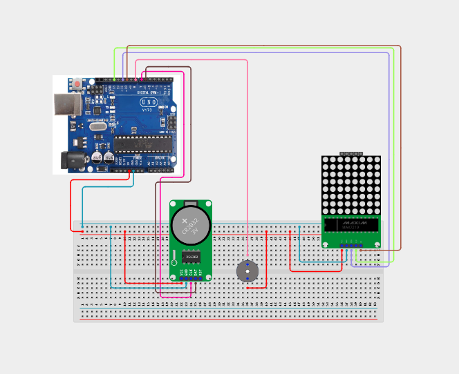

# Project 4.3.11: Real Time Clock Industrial Shift Siren

| **Description** | In this project, learners will build a scheduled work shift siren controller combining a DS3231 RTC module, an Active Buzzer (siren), and a MAX7219 8x8 Dot Matrix display. The display outputs the current hour, and when the RTC time hits programmed intervals (e.g. shift start/ends), the active buzzer sounds a warning pattern.|
|------------------|----------------------------------------------------------------|
| **Use case**     |This system models industrial warehouse alarm bells, school class period sirens, automated shift warning systems, and time-based facility alarms.|

## Components (Things You will need)

|  |  |  |  |  |  |  |
| --- | --- | --- | --- | --- | --- | --- |

## Building the circuit

Things Needed:

- Arduino Uno
- DS3231 RTC Module 
- MAX7219 8x8 LED Dot Matrix Module
- Active Buzzer
- USB Cable & Jumper Wires

## Mounting the component on the breadboard and wiring the circuit

**Step 1:** Establish 5V and GND rails on the breadboard from the Arduino pins.

**Step 2:** Connect DS3231 RTC: SDA to Arduino A4, SCL to Arduino A5, VCC to 5V, and GND to GND.

**Step 3:** Place MAX7219 Dot Matrix display: Connect VCC to 5V, GND to GND, DIN to Pin 11, CS to Pin 10, and CLK to Pin 13.

**Step 4:** Place the active buzzer and connect the positive (+) lead to Pin 8 and negative (-) lead to the GND rail.

**Step 5:** Inspect all SPI data lines and I2C lines to ensure no wires are crossed.

**Step 6:** Power up the system using the USB cable and verify the display clears on startup.



_Make sure to connect the Arduino USB cable to the Arduino board._

## PROGRAMMING

**Step 1:** Open your Arduino IDE. See how to set up here: [Getting Started](../../../STEMAIDE_CODER_Kit_Manual/Getting_Started/Arduino_IDE_Setup.md).

**Step 2:** Write the complete program implementing the system logic with appropriate pin definitions, setup configuration, and the main control loop.

```cpp
#include <Wire.h>
#include <RTClib.h>
#include <LedControl.h>

RTC_DS3231 rtc;
LedControl lc = LedControl(11, 13, 10, 1); // DIN, CLK, CS, NumDevices
const int buzzerPin = 8;

void setup() {
  Serial.begin(9600);
  pinMode(buzzerPin, OUTPUT);
  digitalWrite(buzzerPin, LOW);

  lc.shutdown(0, false);
  lc.setIntensity(0, 5);
  lc.clearDisplay(0);

  if (!rtc.begin()) {
    Serial.println("RTC not found!");
    while (1);
  }
  if (rtc.lostPower()) {
    rtc.adjust(DateTime(F(__DATE__), F(__TIME__)));
  }
}

void loop() {
  DateTime now = rtc.now();
  int hour = now.hour();
  int minute = now.minute();
  int second = now.second();

  // Simple visual: Display current hour digit on Dot Matrix
  lc.clearDisplay(0);
  lc.setDigit(0, 0, hour % 10, false);

  // Siren conditions: 08:00:00 (Start), 12:00:00 (Lunch), 17:00:00 (End)
  // Check exact hour and minute, sound for the first 5 seconds
  bool isShiftTrigger = ((hour == 8 || hour == 12 || hour == 17) && (minute == 0) && (second < 5));

  if (isShiftTrigger) {
    // Pulse the buzzer
    digitalWrite(buzzerPin, HIGH);
    delay(200);
    digitalWrite(buzzerPin, LOW);
    delay(200);
  } else {
    digitalWrite(buzzerPin, LOW);
    delay(1000);
  }
}
```

**Step 3:** Save your code. _See the [Getting Started](../../../STEMAIDE_CODER_Kit_Manual/Getting_Started/Arduino_IDE_Setup.md) section_

**Step 4:** Select the Arduino board and port. _See the [Getting Started](../../../STEMAIDE_CODER_Kit_Manual/Getting_Started/Arduino_IDE_Setup.md)_.

**Step 5:** Upload your code.

## CONCLUSION

The Real Time Clock Industrial Shift Siren demonstrates scheduled warning systems. Linking clock registers to visual dot matrices and pulsing warning sounders creates a reliable automated shift manager.
