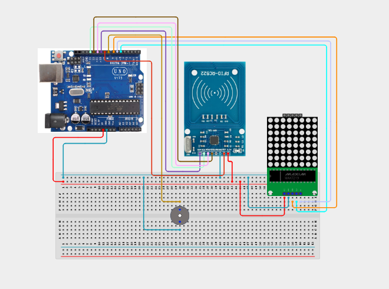

# Project 4.3.12: RFID Inventory Tag Counter

| **Description** | In this project, learners will build an automated inventory scanner using an MFRC522 RFID reader, a MAX7219 8x8 LED Dot Matrix, an Active Buzzer, and Red & Green LEDs. Each time a unique item tag scans, the green LED blinks, the buzzer beeps, the item count increments, and the count displays on the dot matrix. Scanning a special master reset card resets the count to 0 and blinks the red LED.|
|------------------|----------------------------------------------------------------|
| **Use case**     |This system models industrial shipping container logs, automated warehouse stock counters, barcode-replacement checkouts, and tool crib scanners.|

## Components (Things You will need)

|  |  |  |  |  |  |  |  |
| --- | --- | --- | --- | --- | --- | --- | --- |

## Building the circuit

Things Needed:

- Arduino Uno Core Board = 1
- MFRC522 RFID Reader Module = 1
- MAX7219 8x8 LED Dot Matrix Module = 1
- Active Buzzer = 1
- Green LED = 1
- Red LED = 1
- Resistors (220 ohm) = 2
- USB Cable & Jumper Wires

## Mounting the component on the breadboard and wiring the circuit

**Step 1:** Setup VCC, 3.3V, and GND rails on the breadboard from the Arduino pins.

**Step 2:** Connect the MFRC522: 3.3V to 3.3V, GND to GND, MISO to Pin 12, MOSI to Pin 11, SCK to Pin 13, SS (SDA) to Pin 10, and RST to Pin 9.

**Step 3:** Place MAX7219: Connect VCC to 5V, GND to GND, DIN to Pin 7, CS to Pin 6, and CLK to Pin 5.

**Step 4:** Place the active buzzer: Connect positive (+) to Pin 8 and negative (-) to the GND rail.

**Step 5:** Connect the Green LED to Pin 4 and Red LED to Pin 3 (each via a 220 ohm resistor), with cathodes to GND.

**Step 6:** Verify all SPI data pins and upload the sketch.



_Make sure to connect the Arduino USB cable to the Arduino board._

## PROGRAMMING

**Step 1:** Open your Arduino IDE. See how to set up here: [Getting Started](../../../STEMAIDE_CODER_Kit_Manual/Getting_Started/Arduino_IDE_Setup.md).

**Step 2:** Write the complete program implementing the system logic with appropriate pin definitions, setup configuration, and the main control loop.

```cpp
#include <SPI.h>
#include <MFRC522.h>
#include <LedControl.h>

#define SS_PIN 10
#define RST_PIN 9
#define BUZZER_PIN 8
#define GREEN_LED 4
#define RED_LED 3

MFRC522 mfrc522(SS_PIN, RST_PIN);
LedControl lc = LedControl(7, 5, 6, 1); // DIN, CLK, CS, NumDevices

int inventoryCount = 0;

void setup() {
  Serial.begin(9600);
  SPI.begin();
  mfrc522.PCD_Init();
  
  pinMode(BUZZER_PIN, OUTPUT);
  pinMode(GREEN_LED, OUTPUT);
  pinMode(RED_LED, OUTPUT);
  
  digitalWrite(BUZZER_PIN, LOW);
  digitalWrite(GREEN_LED, LOW);
  digitalWrite(RED_LED, LOW);
  
  lc.shutdown(0, false);
  lc.setIntensity(0, 5);
  lc.clearDisplay(0);
  
  // Show starting digit 0
  lc.setDigit(0, 0, 0, false);
  Serial.println("Inventory Counter Ready");
}

void loop() {
  if (!mfrc522.PICC_IsNewCardPresent() || !mfrc522.PICC_ReadCardSerial()) return;

  String uid = "";
  for (byte i = 0; i < mfrc522.uid.size; i++) {
     uid.concat(String(mfrc522.uid.uidByte[i] < 0x10 ? " 0" : " "));
     uid.concat(String(mfrc522.uid.uidByte[i], HEX));
  }
  uid.toUpperCase();
  uid = uid.substring(1);
  Serial.print("Tag Scanned: "); Serial.println(uid);

  // Check if reset card scanned (Change to your tag's UID)
  if (uid == "FF FF FF FF" || uid == "F3 A9 C8 B2") {
    inventoryCount = 0;
    lc.clearDisplay(0);
    lc.setDigit(0, 0, 0, false);
    
    // Reset alert
    digitalWrite(RED_LED, HIGH);
    digitalWrite(BUZZER_PIN, HIGH);
    delay(500);
    digitalWrite(BUZZER_PIN, LOW);
    digitalWrite(RED_LED, LOW);
    
    Serial.println("Inventory Reset Completed.");
  } else {
    // Normal inventory scan
    inventoryCount++;
    lc.clearDisplay(0);
    lc.setDigit(0, 0, inventoryCount % 10, false); // Display single digit counter
    
    // Green confirmation
    digitalWrite(GREEN_LED, HIGH);
    digitalWrite(BUZZER_PIN, HIGH);
    delay(100);
    digitalWrite(BUZZER_PIN, LOW);
    digitalWrite(GREEN_LED, LOW);
    
    Serial.print("Inventory Added. Total Count: ");
    Serial.println(inventoryCount);
  }

  mfrc522.PICC_HaltA();
  delay(1000);
}
```

**Step 3:** Save your code. _See the [Getting Started](../../../STEMAIDE_CODER_Kit_Manual/Getting_Started/Arduino_IDE_Setup.md) section_

**Step 4:** Select the Arduino board and port. _See the [Getting Started](../../../STEMAIDE_CODER_Kit_Manual/Getting_Started/Arduino_IDE_Setup.md)_.

**Step 5:** Upload your code.

## CONCLUSION

The RFID Inventory Tag Counter shows how security identification can drive automation. By parsing tag serial numbers and mapping item counts to numeric displays, learners build a base framework for commercial logistics trackers.
