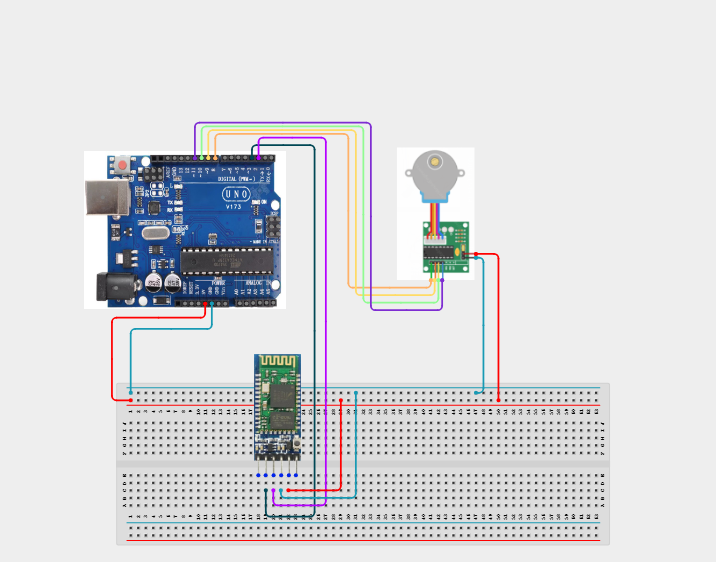

# Project 4.3.13: Wireless Bluetooth Stepper Motor Controller

| **Description** | In this project, learners will build an adjustable indexer utilizing an HC-05 Bluetooth module, a 28BYJ-48 Stepper Motor, a ULN2003 Driver Board, and a TM1637 4-Digit Display. Wireless command bytes turn the stepper forward or backward, and the current stepping position is shown on the 4-digit display.|
|------------------|----------------------------------------------------------------|
| **Use case**     |This system models remote motorized window blinds, automated assembly lines, industrial turntable positioning, and remote antenna steering controls.|

## Components (Things You will need)

|  |  |  |  |  |  |  |  |
| --- | --- | --- | --- | --- | --- | --- | --- |

## Building the circuit

Things Needed:

- Arduino Uno Core Board = 1
- HC-05 Bluetooth Module = 1
- 28BYJ-48 Stepper Motor = 1
- ULN2003 Driver Board = 1
- TM1637 4-Digit Display Module = 1
- USB Cable & Jumper Wires

## Mounting the component on the breadboard and wiring the circuit

**Step 1:** Link the 5V and GND rails on the breadboard from the Arduino pins.

**Step 2:** Connect HC-05 Bluetooth: VCC to 5V, GND to GND, TX to Pin 2, and RX to Pin 3.

**Step 3:** Place the ULN2003 Driver. Connect VCC to the 5V rail, GND to GND, and inputs IN1, IN2, IN3, IN4 to Arduino Pins 8, 9, 10, and 11. Connect the stepper motor wire harness to the white socket.

**Step 4:** Place the TM1637 display: connect VCC to 5V, GND to GND, CLK to Pin 5, and DIO to Pin 4.

**Step 5:** Connect the motor driver VCC pin to the Arduino 5V power line (and ensure common ground connection).

**Step 6:** Inspect all connections, checking the motor coil driver pins, and upload the code.



_Make sure to connect the Arduino USB cable to the Arduino board._

## PROGRAMMING

**Step 1:** Open your Arduino IDE. See how to set up here: [Getting Started](../../../STEMAIDE_CODER_Kit_Manual/Getting_Started/Arduino_IDE_Setup.md).

**Step 2:** Write the complete program implementing the system logic with appropriate pin definitions, setup configuration, and the main control loop.

```cpp
#include <Stepper.h>
#include <SoftwareSerial.h>
#include <TM1637Display.h>

const int stepsPerRevolution = 2048; // Standard for 28BYJ-48 motor
// Initialize stepper pin sequence: IN1, IN3, IN2, IN4
Stepper myStepper(stepsPerRevolution, 8, 10, 9, 11);

SoftwareSerial BT(2, 3); // RX, TX
TM1637Display display(5, 4); // CLK, DIO

int stepPosition = 0;

void setup() {
  BT.begin(9600);
  myStepper.setSpeed(10); // 10 RPM
  display.setBrightness(7);
  display.showNumberDec(stepPosition);
}

void loop() {
  if (BT.available()) {
    char cmd = BT.read();
    
    if (cmd == 'F') { // Step Forward
      myStepper.step(512); // Turn 90 degrees
      stepPosition += 512;
      BT.println("Moved Forward 90 Degrees.");
    } 
    else if (cmd == 'B') { // Step Backward
      myStepper.step(-512); // Turn 90 degrees backward
      stepPosition -= 512;
      BT.println("Moved Backward 90 Degrees.");
    }
    
    display.showNumberDec(stepPosition);
  }
}
```

**Step 3:** Save your code. _See the [Getting Started](../../../STEMAIDE_CODER_Kit_Manual/Getting_Started/Arduino_IDE_Setup.md) section_

**Step 4:** Select the Arduino board and port. _See the [Getting Started](../../../STEMAIDE_CODER_Kit_Manual/Getting_Started/Arduino_IDE_Setup.md)_.

**Step 5:** Upload your code.

## CONCLUSION

The Wireless Bluetooth Stepper Motor Controller demonstrates high-precision mechanical rotation. Integrating stepper phase coils with remote serial commands and segment registers provides a solid base for advanced CNC axis indexers.
