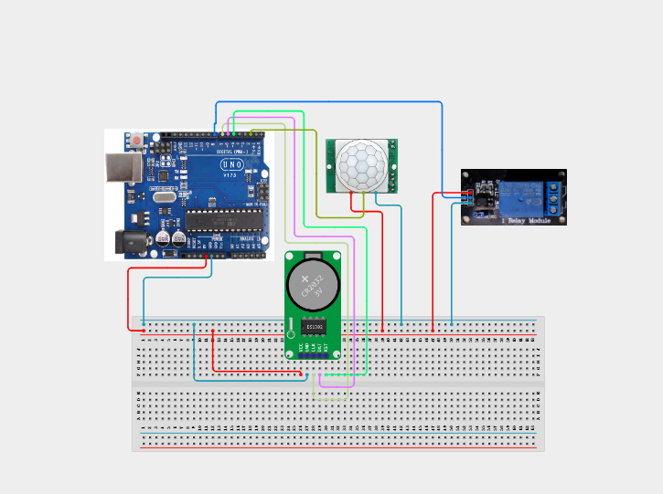

# Project 4.3.14: Smart RTC Energy Saver

| **Description** | In this Project, learners will build a smart energy management system that combines a DS3231 Real-Time Clock, a PIR Motion Sensor, and a Relay Module. The RTC enforces an office work-hours schedule, while the PIR detects room occupancy. The relay energises a connected load only when both conditions are true — saving energy by shutting off devices automatically when no movement is detected or outside office hours.|------------------|----------------------------------------------------------------|
| **Use case**     |This system mirrors real-world occupancy-based energy saving used in offices, classrooms, and warehouses where lights and HVAC equipment are only powered when the room is occupied during business hours, reducing waste and electricity costs.|

## Components (Things You will need)

|  |  |  |  |  |  |  |  |
|----------------------------------------------------- |----------------------------------------------------- |----------------------------------------------------- |----------------------------------------------------- |----------------------------------------------------- |----------------------------------------------------- |----------------------------------------------------- |-----------------------------------------------------|

## Building the circuit

Things Needed:

- Arduino Uno Core Board = 1
- DS3231 RTC Module = 1
- PIR Motion Sensor = 1
- Relay Module = 1
- Red LED = 1
- Active Buzzer = 1
- USB Cable & Jumper Wires

## Mounting the component on the breadboard and wiring the circuit

**Step 1:** Place the Arduino Uno and breadboard on your workspace.

**Step 2:** Connect the Arduino 5V pin to the breadboard positive (+) power rail and Arduino GND to the negative (–) rail.

**Step 3:** Place the DS3231 RTC module on the breadboard. Connect DS3231 VCC to the 5V rail, GND to the GND rail, SDA to Arduino A4, and SCL to Arduino A5.

**Step 4:** Place the PIR motion sensor on the breadboard. Connect PIR VCC to 5V, GND to GND, and the signal (OUT) pin to Arduino Digital Pin 2.

**Step 5:** Place the relay module beside the breadboard. Connect relay VCC to 5V, GND to GND, and IN to Arduino Digital Pin 8.

**Step 6:** Connect the Red LED positive (+) leg to Arduino Digital Pin 9 through a 220 Ω resistor, and the negative (–) leg to GND.

**Step 7:** Place the active buzzer on the breadboard. Connect the buzzer positive (+) pin to Arduino Digital Pin 7, and the negative (–) pin to GND.

**Step 8:** Verify all VCC, 5V, 3.3V, and GND polarities, then connect the USB cable from the Arduino to the computer.



_Make sure to connect the Arduino USB cable to the Arduino board._

## PROGRAMMING

**Step 1:** Open your Arduino IDE. See how to set up here: [Getting Started](../../../Getting Started/Arduino_IDE_Setup.md).

**Step 2:** Copy and paste the program below into your IDE. Study each section to understand how the Smart RTC Energy Saver works.

```cpp
#include <Wire.h>
#include <RTClib.h>

// Pin definitions
const int pirPin    = 2;
const int buzzerPin = 7;
const int relayPin  = 8;
const int redLED    = 9;

RTC_DS3231 rtc;

unsigned long lastMotionTime = 0;
const unsigned long idleTimeout = 10000; // 10 seconds

void setup() {
  Serial.begin(9600);
  pinMode(pirPin,    INPUT);
  pinMode(buzzerPin, OUTPUT);
  pinMode(relayPin,  OUTPUT);
  pinMode(redLED,    OUTPUT);
  digitalWrite(relayPin, HIGH); // Relay OFF (Active-LOW module)

  Wire.begin();
  if (!rtc.begin()) {
    Serial.println("RTC not found!");
    while (1);
  }
  if (rtc.lostPower()) rtc.adjust(DateTime(F(__DATE__), F(__TIME__)));
}

void loop() {
  DateTime now = rtc.now();
  bool isWorkHours = (now.hour() >= 8 && now.hour() < 17);
  bool motionDetected = (digitalRead(pirPin) == HIGH);

  if (motionDetected) lastMotionTime = millis();

  unsigned long idleMs = millis() - lastMotionTime;
  bool isIdle = (idleMs > idleTimeout);

  if (isWorkHours && !isIdle) {
    digitalWrite(relayPin, LOW);   // Turn Load ON
    digitalWrite(redLED,   LOW);
    digitalWrite(buzzerPin, LOW);
  } else if (isWorkHours && isIdle) {
    // Warn before shutting off
    tone(buzzerPin, 1000, 300);
    delay(500);
    digitalWrite(relayPin, HIGH);  // Turn Load OFF
    digitalWrite(redLED,   HIGH);
  } else {
    digitalWrite(relayPin, HIGH);  // Outside work hours
    digitalWrite(redLED,   HIGH);
    digitalWrite(buzzerPin, LOW);
  }

  Serial.print("Time: ");
  Serial.print(now.hour()); Serial.print(":"); Serial.print(now.minute());
  Serial.print(" | Motion: "); Serial.print(motionDetected ? "YES" : "NO");
  Serial.print(" | WorkHrs: "); Serial.println(isWorkHours ? "YES" : "NO");
  delay(500);
}
```

**Step 7:** Save your code. _See the [Getting Started](../../../Getting Started/Arduino_IDE_Setup.md) section_

**Step 8:** Select the arduino board and port _See the [Getting Started](../../../Getting Started/Arduino_IDE_Setup.md)_.

**Step 9:** Upload your code. 

## CONCLUSION

The Smart RTC Energy Saver demonstrates how a DS3231 Real-Time Clock and a PIR "
Motion Sensor can be combined to create an intelligent, occupancy-aware energy "
control system. The relay only powers the connected load during office hours "
and when human presence is detected — automatically switching off with a "
warning beep after 10 seconds of idle time.

The main system flow is:

RTC + PIR → Arduino → Relay/LED/Buzzer → Load Control

Through this project, learners gain practical skills in integrating time-based scheduling, motion detection, and automated relay switching.
