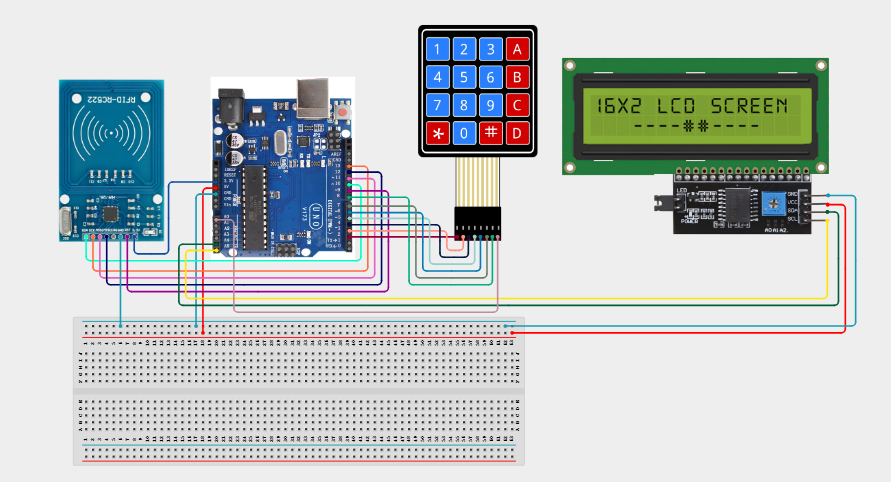

# Project 4.3.15: Project 135 RFID Access Logging System

| **Description** In Project 135, learners will build an RFID Access Logging System that uses an MFRC522 RFID reader and a DS3231 Real-Time Clock to record time-stamped access events. When a valid RFID card is scanned, the system reads the current date and time from the RTC and displays the card UID and timestamp on both the I2C LCD and the Serial Monitor. This demonstrates how IoT security systems track and log access events reliably.|------------------|----------------------------------------------------------------|
| **Use case**     |Access logging systems are used in offices, data centres, schools, and secure warehouses where every entry and exit must be tracked for compliance, audit trails, and security incident investigation. This project gives learners hands-on experience with RFID, RTC, and data logging.|

## Components (Things You will need)

|  |  |  |  |  |  |  |  |
|----------------------------------------------------- |----------------------------------------------------- |----------------------------------------------------- |----------------------------------------------------- |----------------------------------------------------- |----------------------------------------------------- |----------------------------------------------------- |-----------------------------------------------------|

## Building the circuit

Things Needed:

- Arduino Uno Core Board = 1
- MFRC522 RFID Module = 1
- DS3231 RTC Module = 1
- IIC 1602 LCD = 1
- Active Buzzer = 1
- USB Cable & Jumper Wires

## Mounting the component on the breadboard and wiring the circuit

**Step 1:** Place the Arduino Uno and breadboard on your workspace. Connect the 5V and GND pins to the breadboard power rails.

**Step 2:** Place the MFRC522 RFID module. Connect MFRC522 3.3V to Arduino 3.3V, GND to GND rail, SDA/SS to Pin 10, SCK to Pin 13, MOSI to Pin 11, MISO to Pin 12, and RST to Pin 9.

**Step 3:** Place the DS3231 RTC module. Connect DS3231 VCC to 5V, GND to GND, SDA to Arduino A4, and SCL to Arduino A5.

**Step 4:** Place the IIC 1602 LCD. Connect LCD VCC to 5V, GND to GND, SDA to A4, and SCL to A5 (sharing the I2C bus with the RTC).

**Step 5:** Place the active buzzer. Connect the positive (+) pin to Arduino Pin 8 and the negative (–) pin to GND.

**Step 6:** Verify all VCC, 3.3V, and GND polarities, then connect the Arduino USB cable to the computer.



_Make sure to connect the Arduino USB cable to the Arduino board._

## PROGRAMMING

**Step 1:** Open your Arduino IDE. See how to set up here: [Getting Started](../../../STEMAIDE_CODER_Kit_Manual/Getting_Started/Arduino_IDE_Setup.md).

**Step 2:** Copy and paste the program below into your IDE. Study each section to understand how the RFID Access Logging System works.

```cpp
#include <SPI.h>
#include <MFRC522.h>
#include <Wire.h>
#include <RTClib.h>
#include <LiquidCrystal_I2C.h>

#define SS_PIN   10
#define RST_PIN   9
#define BUZZER    8

MFRC522 rfid(SS_PIN, RST_PIN);
RTC_DS3231 rtc;
LiquidCrystal_I2C lcd(0x27, 16, 2);

void setup() {
  Serial.begin(9600);
  SPI.begin();
  rfid.PCD_Init();
  Wire.begin();
  rtc.begin();
  if (rtc.lostPower()) rtc.adjust(DateTime(F(__DATE__), F(__TIME__)));
  lcd.init(); lcd.backlight();
  pinMode(BUZZER, OUTPUT);
  lcd.print("Scan RFID Card");
  Serial.println("Project 135: RFID Access Logger Online");
}

void loop() {
  if (!rfid.PICC_IsNewCardPresent() || !rfid.PICC_ReadCardSerial()) return;

  // Read UID
  String uid = "";
  for (byte i = 0; i < rfid.uid.size; i++) {
    uid += (rfid.uid.uidByte[i] < 0x10 ? "0" : "");
    uid += String(rfid.uid.uidByte[i], HEX);
    if (i < rfid.uid.size - 1) uid += ":";
  }
  uid.toUpperCase();

  // Read timestamp
  DateTime now = rtc.now();
  char timeStr[20];
  sprintf(timeStr, "%02d/%02d %02d:%02d:%02d",
          now.month(), now.day(), now.hour(), now.minute(), now.second());

  // Display on LCD
  lcd.clear();
  lcd.setCursor(0, 0); lcd.print("UID: " + uid);
  lcd.setCursor(0, 1); lcd.print(timeStr);

  // Log to Serial Monitor
  Serial.print("ACCESS | UID: "); Serial.print(uid);
  Serial.print(" | Time: ");      Serial.println(timeStr);

  // Beep confirmation
  tone(BUZZER, 1200, 200);

  rfid.PICC_HaltA();
  rfid.PCD_StopCrypto1();
  delay(2000);
  lcd.clear(); lcd.print("Scan RFID Card");
}
```

**Step 7:** Save your code. _See the [Getting Started](../../../STEMAIDE_CODER_Kit_Manual/Getting_Started/Arduino_IDE_Setup.md) section_

**Step 8:** Select the arduino board and port _See the [Getting Started](../../../STEMAIDE_CODER_Kit_Manual/Getting_Started/Arduino_IDE_Setup.md)_.

**Step 9:** Upload your code. 

## CONCLUSION

The RFID Access Logging System combines an MFRC522 RFID reader, a DS3231 RTC, "
and an I2C LCD to create a functional, time-stamped access tracking system. "
Every time a card is scanned, the UID and time are displayed on the LCD and "
sent to the Serial Monitor, replicating the core behaviour of professional access-control systems.

The main system flow is:

RFID Card → MFRC522 → Arduino → RTC Timestamp → LCD + Serial Log

Through this project, learners develop skills in RFID reading, I2C device management, and real-time event logging.
