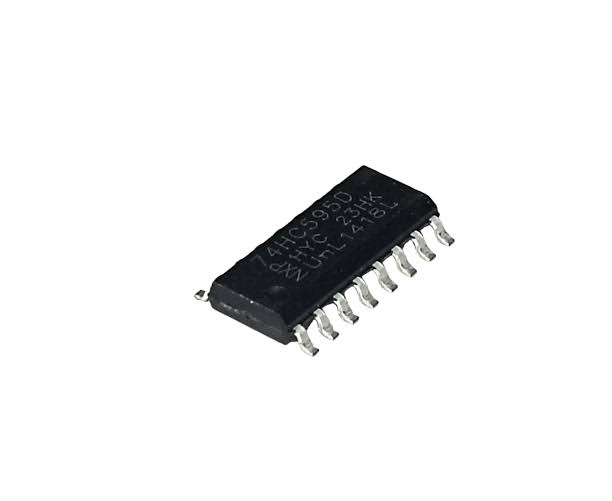
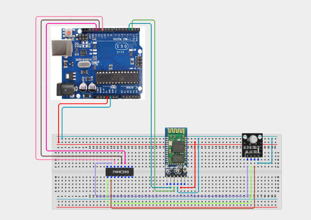

# Project 4.3.16: Project 136 Bluetooth Multi-Color Mood Lighting Console

| **Description** In Project 136, learners will build a wireless mood lighting console that uses an HC-05 Bluetooth Module and a 74HC595 8-bit Shift Register to control multiple LED colour channels from a smartphone. Bluetooth commands are received by the Arduino and decoded to shift a specific 8-bit pattern into the shift register, toggling individual LED outputs to produce different colour moods while the buzzer confirms each command.|------------------|----------------------------------------------------------------|
| **Use case**     |Wireless LED lighting controllers are used in event management, stage lighting, smart homes, restaurants, and retail displays where colour ambience can be changed remotely without physical switches. This project introduces shift-register LED multiplexing and Bluetooth UI design.|

## Components (Things You will need)

|  |  |  |  |  |  |  |
|----------------------------------------------------- |----------------------------------------------------- |----------------------------------------------------- |----------------------------------------------------- |----------------------------------------------------- |----------------------------------------------------- |-----------------------------------------------------|

## Building the circuit

Things Needed:

- Arduino Uno Core Board = 1
- HC-05 Bluetooth Module = 1
- 74HC595 Shift Register = 1
- LEDs (assorted colours) = 8
- 220 Ω Resistors = 8
- Active Buzzer = 1
- USB Cable & Jumper Wires

## Mounting the component on the breadboard and wiring the circuit

**Step 1:** Place the Arduino Uno and breadboard on your workspace. Connect 5V and GND to the breadboard power rails.

**Step 2:** Place the HC-05 Bluetooth module. Connect HC-05 VCC to 5V, GND to GND, TXD to Arduino Pin 2 (RX), and RXD to Arduino Pin 3 (TX — use a voltage divider or level shifter to protect the HC-05).

**Step 3:** Place the 74HC595 shift register on the breadboard. Connect pin 16 (VCC) and pin 10 (SRCLR) to 5V. Connect pin 8 (GND) and pin 13 (OE) to GND. Connect pin 14 (DS/Data) to Arduino Pin 11, pin 12 (RCLK/Latch) to Arduino Pin 12, and pin 11 (SHCP/Clock) to Arduino Pin 13.

**Step 4:** Connect the eight output pins (QA–QH, pins 15, 1–7) of the 74HC595 through individual 220 Ω resistors to the anodes of eight LEDs. Connect all LED cathodes to GND.

**Step 5:** Place the active buzzer. Connect the positive (+) pin to Arduino Pin 8 and the negative (–) pin to GND.

**Step 6:** Verify all VCC and GND connections, then connect the Arduino USB cable to the computer.



_Make sure to connect the Arduino USB cable to the Arduino board._

## PROGRAMMING

**Step 1:** Open your Arduino IDE. See how to set up here: [Getting Started](../../../STEMAIDE_CODER_Kit_Manual/Getting_Started/Arduino_IDE_Setup.md).

**Step 2:** Copy and paste the program below into your IDE. Study each section to understand how the Bluetooth Mood Lighting Console works.

```cpp
#include <SoftwareSerial.h>

SoftwareSerial BT(2, 3);   // RX, TX

const int dataPin  = 11;   // 74HC595 DS
const int latchPin = 12;   // 74HC595 RCLK
const int clockPin = 13;   // 74HC595 SHCP
const int buzzerPin = 8;

void setup() {
  BT.begin(9600);
  Serial.begin(9600);
  pinMode(dataPin,   OUTPUT);
  pinMode(latchPin,  OUTPUT);
  pinMode(clockPin,  OUTPUT);
  pinMode(buzzerPin, OUTPUT);
  updateLEDs(0b00000000); // All OFF
  Serial.println("Project 136: Bluetooth Mood Lighting Online");
}

void loop() {
  if (BT.available()) {
    char cmd = BT.read();
    tone(buzzerPin, 1000, 100); // Short confirmation beep

    switch (cmd) {
      case 'R': updateLEDs(0b00000001); Serial.println("Red");    break;
      case 'G': updateLEDs(0b00000010); Serial.println("Green");  break;
      case 'B': updateLEDs(0b00000100); Serial.println("Blue");   break;
      case 'Y': updateLEDs(0b00000011); Serial.println("Yellow"); break;
      case 'C': updateLEDs(0b00000110); Serial.println("Cyan");   break;
      case 'M': updateLEDs(0b00000101); Serial.println("Magenta");break;
      case 'W': updateLEDs(0b00000111); Serial.println("White");  break;
      case 'A': updateLEDs(0b11111111); Serial.println("All ON"); break;
      case '0': updateLEDs(0b00000000); Serial.println("All OFF");break;
      default: Serial.println("Unknown cmd"); break;
    }
  }
}

void updateLEDs(byte pattern) {
  digitalWrite(latchPin, LOW);
  shiftOut(dataPin, clockPin, MSBFIRST, pattern);
  digitalWrite(latchPin, HIGH);
}
```

**Step 7:** Save your code. _See the [Getting Started](../../../STEMAIDE_CODER_Kit_Manual/Getting_Started/Arduino_IDE_Setup.md) section_

**Step 8:** Select the arduino board and port _See the [Getting Started](../../../STEMAIDE_CODER_Kit_Manual/Getting_Started/Arduino_IDE_Setup.md)_.

**Step 9:** Upload your code. 

## CONCLUSION

The Bluetooth Multi-Color Mood Lighting Console demonstrates how a single Arduino "
digital interface (74HC595 shift register) can expand GPIO capacity to drive eight "
independent LED outputs wirelessly via Bluetooth. Single-character commands from "
a smartphone app control the entire light palette.

The main system flow is:

Smartphone → HC-05 Bluetooth → Arduino → 74HC595 → LEDs

Through this project, learners master serial-to-parallel LED multiplexing, Bluetooth command parsing, and shift register operation.
