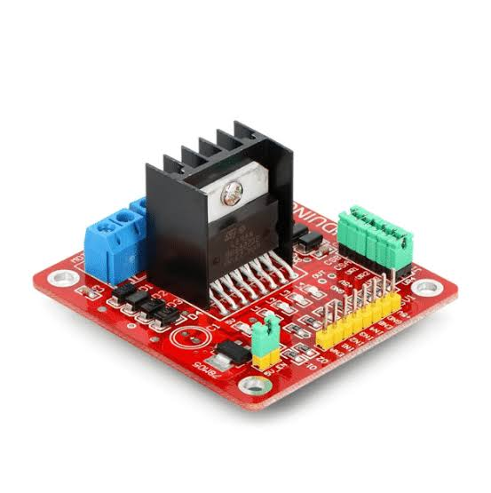
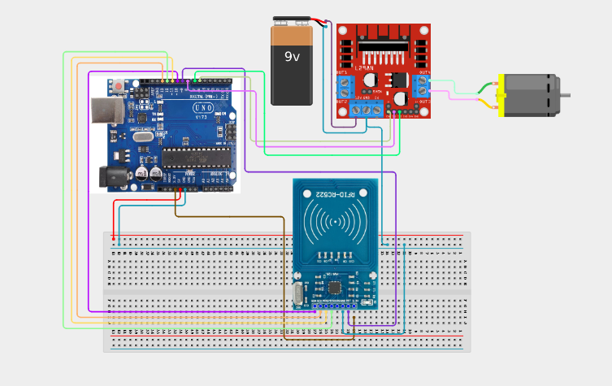

# Project 4.3.18: Project 138 RFID Keycard Motor Security Starter

| **Description** In Project 138, learners will build an RFID-controlled motor security starter that uses an MFRC522 RFID reader and an L298N motor driver to start and stop a DC motor. When an authorised RFID card is scanned, the Arduino commands the L298N to run the motor at a set speed for 5 seconds, then stops it. A green LED and buzzer confirm authorisation, simulating an industrial keycard motor-start interlock system.|
|------------------|----------------------------------------------------------------|
| **Use case**     |RFID motor starters are used in industrial machinery, CNC equipment, restricted workshop tools, and factory conveyors where only authorised personnel should be permitted to operate the equipment. This project teaches RFID authentication, motor driver control, and access interlocking.|

## Components (Things You will need)

|  |  |  |  |  |  |  |  |  |
|----------------------------------------------------- |----------------------------------------------------- |----------------------------------------------------- |----------------------------------------------------- |----------------------------------------------------- |----------------------------------------------------- |----------------------------------------------------- |----------------------------------------------------- |-----------------------------------------------------|

## Building the circuit

Things Needed:

- Arduino Uno Core Board = 1
- MFRC522 RFID Module = 1
- DC Motor = 1
- L298N Motor Driver Module = 1
- Active Buzzer = 1
- Green LED = 1
- 220 Ω Resistor = 1
- USB Cable & Jumper Wires

## Mounting the component on the breadboard and wiring the circuit

**Step 1:** Place the Arduino Uno and breadboard on your workspace. Connect the 5V and GND pins to the breadboard power rails.

**Step 2:** Place the MFRC522 RFID module. Connect 3.3V to Arduino 3.3V, GND to GND, SDA/SS to Pin 10, SCK to Pin 13, MOSI to Pin 11, MISO to Pin 12, and RST to Pin 9.

**Step 3:** Place the L298N motor driver module. Connect L298N ENA to Arduino Pin 6 (PWM), IN1 to Arduino Pin 8, and IN2 to Arduino Pin 7. Connect the DC motor terminals to L298N OUT1 and OUT2. Connect L298N VCC to an appropriate motor power supply (5V–12V), and the L298N GND to the Arduino GND (common ground).

**Step 4:** Place the active buzzer. Connect the positive (+) pin to Arduino Pin 4 and the negative (–) pin to GND.

**Step 5:** Place the green LED on the breadboard. Connect the anode through a 220 Ω resistor to Arduino Pin 5, and the cathode to GND.

**Step 6:** Verify all VCC, 3.3V, and GND polarities (especially the common ground between L298N and Arduino), then connect the Arduino USB cable to the computer.



_Make sure to connect the Arduino USB cable to the Arduino board._

## PROGRAMMING

**Step 1:** Open your Arduino IDE. See how to set up here: [Getting Started](../../../STEMAIDE_CODER_Kit_Manual/Getting_Started/Arduino_IDE_Setup.md).

**Step 2:** Copy and paste the program below into your IDE. Study each section to understand how the RFID Motor Security Starter works.

```cpp
#include <SPI.h>
#include <MFRC522.h>

#define SS_PIN   10
#define RST_PIN   9
#define ENA       6   // PWM speed control
#define IN1       8
#define IN2       7
#define BUZZER    4
#define GREEN_LED 5

MFRC522 rfid(SS_PIN, RST_PIN);

// Replace these bytes with your authorised tag's UID
byte authorizedUID[] = {0xDE, 0xAD, 0xBE, 0xEF};
bool motorRunning = false;

void setup() {
  Serial.begin(9600);
  SPI.begin();
  rfid.PCD_Init();
  pinMode(IN1,       OUTPUT);
  pinMode(IN2,       OUTPUT);
  pinMode(ENA,       OUTPUT);
  pinMode(BUZZER,    OUTPUT);
  pinMode(GREEN_LED, OUTPUT);
  stopMotor();
  Serial.println("Project 138: RFID Motor Security Starter Online");
  Serial.println("Scan authorised card to toggle motor...");
}

void loop() {
  if (!rfid.PICC_IsNewCardPresent() || !rfid.PICC_ReadCardSerial()) return;

  bool granted = true;
  for (int i = 0; i < 4; i++) {
    if (rfid.uid.uidByte[i] != authorizedUID[i]) { granted = false; break; }
  }

  if (granted) {
    if (!motorRunning) {
      startMotor();
      tone(BUZZER, 1200, 200);
      digitalWrite(GREEN_LED, HIGH);
      Serial.println("ACCESS GRANTED – Motor started for 5 s");
      delay(5000);
      stopMotor();
      digitalWrite(GREEN_LED, LOW);
    } else {
      stopMotor();
      digitalWrite(GREEN_LED, LOW);
      Serial.println("Motor stopped by card scan");
    }
  } else {
    tone(BUZZER, 400, 500);
    Serial.println("ACCESS DENIED");
  }

  rfid.PICC_HaltA();
  rfid.PCD_StopCrypto1();
  delay(1000);
}

void startMotor() {
  analogWrite(ENA, 200);
  digitalWrite(IN1, HIGH);
  digitalWrite(IN2, LOW);
  motorRunning = true;
}

void stopMotor() {
  analogWrite(ENA, 0);
  digitalWrite(IN1, LOW);
  digitalWrite(IN2, LOW);
  motorRunning = false;
}
```

**Step 7:** Save your code. _See the [Getting Started](../../../STEMAIDE_CODER_Kit_Manual/Getting_Started/Arduino_IDE_Setup.md) section_

**Step 8:** Select the arduino board and port _See the [Getting Started](../../../STEMAIDE_CODER_Kit_Manual/Getting_Started/Arduino_IDE_Setup.md)_.

**Step 9:** Upload your code.

## CONCLUSION

The RFID Keycard Motor Security Starter project demonstrates how RFID authentication "
can be used as a physical access interlock for motorised equipment. Only an authorised "
RFID card can toggle the motor on or off, with a green LED and buzzer providing clear "
visual and audio feedback.

The main system flow is:

RFID Card → MFRC522 → Arduino → L298N → DC Motor

Through this project, learners practise SPI communication, PWM motor speed control, "
and building industrial-style equipment access control systems.
