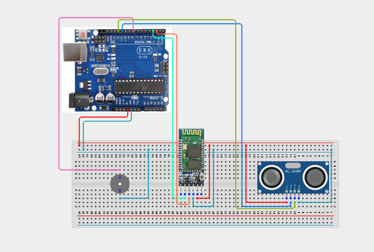

# Project 4.3.19:  Bluetooth Wireless Proximity Alarm System

| **Description** |In this Project, learners will build a Bluetooth-enabled proximity alarm system using an HC-05 Bluetooth module and an HC-SR04 Ultrasonic sensor. The smartphone activates or deactivates the monitoring zone via Bluetooth commands. When active and an object enters within 20 cm, the system triggers the buzzer, sets the RGB LED to Red, and sends an intrusion alert over Bluetooth to the smartphone.|
|------------------|----------------------------------------------------------------|
| **Use case**     |Wireless proximity alarms are used in security perimeters, industrial safety zones, warehouse dock monitoring, and anti-theft systems. The Bluetooth link allows remote arming/disarming from a smartphone without physical access to the device.|

## Components (Things You will need)

|  |  |  |  |  |  |  |
|----------------------------------------------------- |----------------------------------------------------- |----------------------------------------------------- |----------------------------------------------------- |----------------------------------------------------- |----------------------------------------------------- |-----------------------------------------------------|

## Building the circuit

Things Needed:

- Arduino Uno Core Board = 1
- HC-05 Bluetooth Module = 1
- HC-SR04 Ultrasonic Sensor = 1
- RGB LED Module = 1
- Active Buzzer = 1
- USB Cable & Jumper Wires

## Mounting the component on the breadboard and wiring the circuit

**Step 1:** Place the Arduino Uno and breadboard on your workspace. Connect the 5V and GND pins to the breadboard power rails.

**Step 2:** Place the HC-05 Bluetooth module. Connect HC-05 VCC to 5V, GND to GND, TXD to Arduino Pin 2 (RX), and RXD to Arduino Pin 3 (TX — use a voltage divider or level shifter).

**Step 3:** Place the HC-SR04 Ultrasonic sensor. Connect VCC to 5V, GND to GND, Trig to Arduino Pin 11, and Echo to Arduino Pin 12.

**Step 4:** Connect the RGB LED Module pins: Red (R) to Arduino Pin 5, Green (G) to Pin 6, and Blue (B) to Pin 7 through 220 Ω resistors. Connect the common cathode (or common anode) to GND (or 5V for common-anode modules).

**Step 5:** Place the active buzzer. Connect the positive (+) pin to Arduino Pin 8 and the negative (–) pin to GND.

**Step 6:** Verify all VCC and GND connections, then connect the Arduino USB cable to the computer.



_Make sure to connect the Arduino USB cable to the Arduino board._

## PROGRAMMING

**Step 1:** Open your Arduino IDE. See how to set up here: [Getting Started](../../../STEMAIDE_CODER_Kit_Manual/Getting_Started/Arduino_IDE_Setup.md).

**Step 2:** Copy and paste the program below into your IDE. Study each section to understand how the Bluetooth Proximity Alarm works.

```cpp
#include <SoftwareSerial.h>

SoftwareSerial BT(2, 3);  // RX, TX

const int trigPin  = 11;
const int echoPin  = 12;
const int redPin   = 5;
const int greenPin = 6;
const int bluePin  = 7;
const int buzzerPin = 8;
const int alertDist = 20; // cm

bool alarmArmed = false;

void setup() {
  Serial.begin(9600);
  BT.begin(9600);
  pinMode(trigPin,   OUTPUT);
  pinMode(echoPin,   INPUT);
  pinMode(redPin,    OUTPUT);
  pinMode(greenPin,  OUTPUT);
  pinMode(bluePin,   OUTPUT);
  pinMode(buzzerPin, OUTPUT);
  setRGB(0, 0, 255); // Blue = Standby
  Serial.println("Project 139: Bluetooth Proximity Alarm Online");
}

long measureDistance() {
  digitalWrite(trigPin, LOW); delayMicroseconds(2);
  digitalWrite(trigPin, HIGH); delayMicroseconds(10);
  digitalWrite(trigPin, LOW);
  long dur = pulseIn(echoPin, HIGH, 25000); // 25 ms timeout
  return dur * 0.034 / 2;
}

void setRGB(int r, int g, int b) {
  analogWrite(redPin, r); analogWrite(greenPin, g); analogWrite(bluePin, b);
}

void loop() {
  // Handle Bluetooth commands
  if (BT.available()) {
    char cmd = BT.read();
    if (cmd == '1') {
      alarmArmed = true;
      setRGB(0, 255, 0); // Green = Armed
      BT.println("ALARM ARMED");
      Serial.println("Alarm armed via Bluetooth");
    } else if (cmd == '0') {
      alarmArmed = false;
      setRGB(0, 0, 255); // Blue = Disarmed
      digitalWrite(buzzerPin, LOW);
      BT.println("ALARM DISARMED");
      Serial.println("Alarm disarmed via Bluetooth");
    }
  }

  if (alarmArmed) {
    long dist = measureDistance();
    Serial.print("Distance: "); Serial.print(dist); Serial.println(" cm");

    if (dist > 0 && dist < alertDist) {
      setRGB(255, 0, 0); // Red = Intrusion
      digitalWrite(buzzerPin, HIGH);
      BT.print("INTRUSION DETECTED! Dist: ");
      BT.print(dist); BT.println(" cm");
    } else {
      setRGB(0, 255, 0); // Green = Clear
      digitalWrite(buzzerPin, LOW);
    }
  }
  delay(200);
}
```

**Step 7:** Save your code. _See the [Getting Started](../../../STEMAIDE_CODER_Kit_Manual/Getting_Started/Arduino_IDE_Setup.md) section_

**Step 8:** Select the arduino board and port _See the [Getting Started](../../../STEMAIDE_CODER_Kit_Manual/Getting_Started/Arduino_IDE_Setup.md)_.

**Step 9:** Upload your code.

## CONCLUSION

The Bluetooth Wireless Proximity Alarm System demonstrates how a Bluetooth module "
and an ultrasonic sensor can be combined to create a remotely-armed security zone. "
When armed, any object within 20 cm triggers an immediate RGB and buzzer alert, "
while a notification is sent back to the smartphone over Bluetooth.

The main system flow is:

Smartphone → HC-05 → Arduino → HC-SR04 → Buzzer + RGB + BT Alert

Through this project, learners gain experience in multi-protocol IoT design, ultrasonic distance measurement, and remote alarm management.
