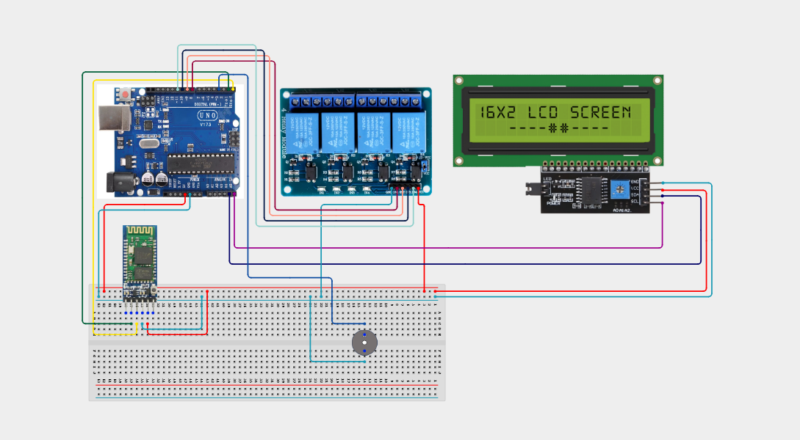

# Project 4.3.1:  Bluetooth Smart Home Automation Hub

| **Description** | In this Project, learners will build an industrial-grade wireless home automation hub combining an HC-05 Bluetooth Module, a 4-Channel Relay Module, an IIC 1602 LCD, and an Active Buzzer. Users send wireless text commands from a smartphone terminal app to independently toggle up to 4 high-voltage appliance relays while monitoring channel statuses on the LCD.|
|------------------|----------------------------------------------------------------|
| **Use case**     |This project connects to real-world industrial and IoT applications such as: Wireless Bluetooth multi-channel relay hubs form the baseline architecture for modern commercial smart-home appliances.|

## Components (Things You will need)

|  |  |  |  |  |  |  |
| --- | --- | --- | --- | --- | --- | --- |

## Building the circuit

Things Needed:

- Arduino Uno Core Board = 1
- HC-05 Bluetooth Module =
- 4-Channel Relay Module  
- LCD Module
- Buzzer 
- USB Cable
- Jumper Wires

## Mounting the component on the breadboard and wiring the circuit

**Step** 1: Place the Arduino Uno and breadboard on your workspace.

Step 2:** Connect the Arduino 5V pin to the breadboard positive (+) power rail.

Step 3: Connect the Arduino GND pin to the breadboard negative (–) ground rail.

Step 4: Place the HC-05 Bluetooth module on the breadboard.

Step 5: Connect the HC-05 VCC pin to the 5V power rail.

Step 6: Connect the HC-05 GND pin to the GND rail.

Step 7: Connect the HC-05 TXD pin to Arduino Pin 10.

Step 8: Connect Arduino Pin 11 to the HC-05 RXD pin through an appropriate voltage divider/level shifter.

Step 9: Place the 4-channel relay module beside the breadboard.

Step 10: Connect the relay module VCC pin to the 5V power rail.

Step 11: Connect the relay module GND pin to the GND rail.

Step 12: Connect relay IN1 to Arduino Pin 4.

Step 13: Connect relay IN2 to Arduino Pin 5.

Step 14: Connect relay IN3 to Arduino Pin 6.

Step 15: Connect relay IN4 to Arduino Pin 7.

Step 16: Place the I2C LCD module on the workspace.

Step 17: Connect the LCD VCC pin to the 5V power rail.

Step 18: Connect the LCD GND pin to the GND rail.

Step 19: Connect the LCD SDA pin to Arduino A4.

Step 20: Connect the LCD SCL pin to Arduino A5.

Step 21: Place the active buzzer on the breadboard.

Step 22: Connect the buzzer positive (+) pin to Arduino Pin 8.

Step 23: Connect the buzzer negative (–) pin to the GND rail.

Step 24: Check that all VCC, 5V, and GND connections are correctly connected.

Step 25: Check that the HC-05, relay module, LCD, and buzzer are connected to the correct Arduino pins.

Step 26: Connect the USB cable from the Arduino Uno to the computer.



_Make sure to connect the Arduino USB cable to the Arduino board._

## PROGRAMMING

**Step 1:** Open your Arduino IDE. See how to set up here: [Getting Started](../../../STEMAIDE_CODER_Kit_Manual/Getting_Started/Arduino_IDE_Setup.md).

**Step 2:** Write the complete program implementing the system logic with appropriate pin definitions, setup configuration, and the main control loop.

```cpp
// Project 121: Bluetooth Smart Home Automation Hub
#include <SoftwareSerial.h>
#include <Wire.h>
#include <LiquidCrystal_I2C.h>

SoftwareSerial BT(10, 11);
LiquidCrystal_I2C lcd(0x27, 16, 2);

void setup() {
  BT.begin(9600);
  lcd.init(); lcd.backlight();
  for(int p=4; p<=7; p++) pinMode(p, OUTPUT);
  pinMode(8, OUTPUT);
  lcd.print("Bluetooth Hub");
}

void loop() {
  if (BT.available()) {
    char cmd = BT.read();
    digitalWrite(8, HIGH); delay(50); digitalWrite(8, LOW);
    if (cmd == '1') digitalWrite(4, !digitalRead(4));
    lcd.setCursor(0, 1);
    lcd.print("Cmd Recv: "); lcd.print(cmd);
  }
}
```

**Step 7:** Save your code. _See the [Getting Started](../../../STEMAIDE_CODER_Kit_Manual/Getting_Started/Arduino_IDE_Setup.md) section_

**Step 8:** Select the arduino board and port _See the [Getting Started](../../../STEMAIDE_CODER_Kit_Manual/Getting_Started/Arduino_IDE_Setup.md).

**Step 9:** Upload your code. 

## CONCLUSION

The Bluetooth Smart Home Automation Hub allows learners to control four relay channels wirelessly using a smartphone and an HC-05 Bluetooth module. The Arduino receives commands, switches the selected relay, displays the system status on the LCD, and provides audio feedback through the buzzer.

This project demonstrates how wireless communication, automation, switching, and user feedback can work together to create a simple smart-home system.

The main system flow is:

Smartphone → Bluetooth → Arduino → Relay → Output

Through this project, learners gain practical experience in building and programming a basic wireless automation system.
