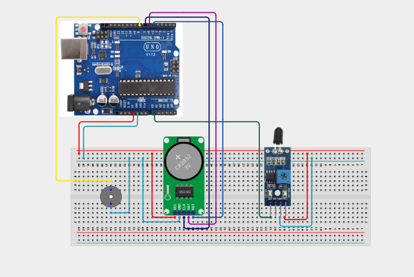

# Project 4.3.20: Real-Time Clock Fire Safeguard Logger

| **Description** | In this Project, learners will build a fire safeguard logging system that combines a DS3231 RTC, a Flame Sensor, a Relay Module, and an Active Buzzer. When the flame sensor detects infrared radiation from fire (analogue value below threshold), the buzzer activates, the relay trips a safety cut-off, and the event is time-stamped using the RTC and logged to the Serial Monitor — creating a permanent fire event record.|
|------------------|----------------------------------------------------------------|
| **Use case**     |Timestamped fire logging systems are deployed in server rooms, chemical storage facilities, industrial kitchens, and public buildings where fire events must be recorded for insurance, safety audits, and regulatory compliance. This project introduces learners to safety critical event logging with real-time timestamps.|

## Components (Things You will need)

|  |  |  |  |  |  |  |  |
|----------------------------------------------------- |----------------------------------------------------- |----------------------------------------------------- |----------------------------------------------------- |----------------------------------------------------- |----------------------------------------------------- |----------------------------------------------------- |-----------------------------------------------------|

## Building the circuit

Things Needed:

- Arduino Uno Core Board = 1
- DS3231 RTC Module = 1
- Flame Sensor Module = 1
- Active Buzzer = 1
- Relay Module = 1
- USB Cable & Jumper Wires

## Mounting the component on the breadboard and wiring the circuit

**Step 1:** Place the Arduino Uno and breadboard on your workspace. Connect the 5V and GND pins to the breadboard power rails.

**Step 2:** Place the DS3231 RTC. Connect VCC to 5V, GND to GND, SDA to Arduino A4, and SCL to Arduino A5.

**Step 3:** Place the Flame Sensor module. Connect VCC to 5V, GND to GND, and the Analogue Output (AO) pin to Arduino Analog Pin A0.

**Step 4:** Place the relay module. Connect relay VCC to 5V, GND to GND, and IN to Arduino Digital Pin 7.

**Step 5:** Place the active buzzer. Connect the positive (+) pin to Arduino Digital Pin 8 and the negative (–) pin to GND.

**Step 6:** Verify all VCC and GND connections, then connect the Arduino USB cable to the computer.



_Make sure to connect the Arduino USB cable to the Arduino board._

## PROGRAMMING

**Step 1:** Open your Arduino IDE. See how to set up here: [Getting Started](../../../STEMAIDE_CODER_Kit_Manual/Getting_Started/Arduino_IDE_Setup.md).

**Step 2:** Copy and paste the program below into your IDE. Study each section to understand how the RTC Fire Safeguard Logger works.

```cpp
#include <Wire.h>
#include <RTClib.h>

const int flamePin      = A0;
const int relayPin      = 7;
const int buzzerPin     = 8;
const int flameThreshold = 300; // Lower = more sensitive to flame

RTC_DS3231 rtc;
bool lastAlarmState = false;

void setup() {
  Serial.begin(9600);
  pinMode(relayPin,  OUTPUT);
  pinMode(buzzerPin, OUTPUT);
  digitalWrite(relayPin, HIGH); // Safety relay OFF (Active-LOW)
  digitalWrite(buzzerPin, LOW);

  Wire.begin();
  if (!rtc.begin()) {
    Serial.println("RTC not found!");
    while (1);
  }
  if (rtc.lostPower()) rtc.adjust(DateTime(F(__DATE__), F(__TIME__)));
  Serial.println("Project 140: Fire Safeguard Logger Online");
}

void loop() {
  int flameValue = analogRead(flamePin);
  bool fireDetected = (flameValue < flameThreshold);

  if (fireDetected && !lastAlarmState) {
    // New fire event — log it
    DateTime now = rtc.now();
    Serial.print("=== FIRE EVENT LOGGED === ");
    Serial.print(now.day()); Serial.print("/");
    Serial.print(now.month()); Serial.print("/");
    Serial.print(now.year()); Serial.print(" ");
    Serial.print(now.hour()); Serial.print(":");
    Serial.print(now.minute()); Serial.print(":");
    Serial.print(now.second());
    Serial.print(" | Sensor Value: "); Serial.println(flameValue);
  }

  if (fireDetected) {
    digitalWrite(relayPin,  LOW);  // Trip safety cut-off relay
    digitalWrite(buzzerPin, HIGH); // Sound alarm
  } else {
    digitalWrite(relayPin,  HIGH); // Restore relay
    digitalWrite(buzzerPin, LOW);  // Silence alarm
  }

  lastAlarmState = fireDetected;
  delay(500);
}
```

**Step 7:** Save your code. _See the [Getting Started](../../../STEMAIDE_CODER_Kit_Manual/Getting_Started/Arduino_IDE_Setup.md) section_

**Step 8:** Select the arduino board and port _See the [Getting Started](../../../STEMAIDE_CODER_Kit_Manual/Getting_Started/Arduino_IDE_Setup.md)_.

**Step 9:** Upload your code.

## CONCLUSION

The Real-Time Clock Fire Safeguard Logger demonstrates how a flame sensor, an RTC, "
and a relay can work together to detect fire, sound an alarm, trip a safety cut-off, "
and produce a timestamped event log — exactly as required in professional fire safety systems.

The main system flow is:

Flame Sensor → Arduino → RTC Timestamp → Serial Log + Buzzer + Relay Trip

Through this project, learners develop critical skills in safety-event detection, "
real-time timestamping, state-change logging, and emergency relay control.
