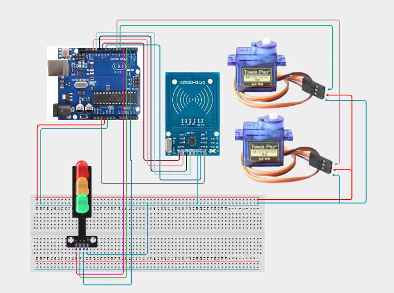

# Project 4.3.21: RFID Dual Barrier Access Gate

| **Description** | In this Project, learners will build a dual-barrier RFID access gate using an MFRC522 reader, an SG90 servo motor, a red LED, a green LED, and a buzzer. When an authorised RFID card is scanned, the servo sweeps from 0° to 90° to open the gate barrier, the green LED illuminates, and the buzzer confirms access. After 3 seconds the gate closes, the red LED resumes, and the system returns to standby, ready for the next scan.|
|------------------|----------------------------------------------------------------|
| **Use case**     |Automated RFID barrier gates are used in car parks, pedestrian turnstiles, factory access points, and restricted building areas. By automating the physical barrier, organisations can control throughput, log entries, and eliminate the need for a manned security post. This project gives learners a foundation for real commercial access gate design.|

## Components (Things You will need)

|  |  |  |  |  |  |  |  |
|----------------------------------------------------- |----------------------------------------------------- |----------------------------------------------------- |----------------------------------------------------- |----------------------------------------------------- |----------------------------------------------------- |----------------------------------------------------- |----------------------------------------------------- |

## Building the circuit

Things Needed:

- Arduino Uno Core Board = 1
- MFRC522 RFID Module = 1
- SG90 Servo Motor = 1
- Red LED = 1
- Green LED = 1
- Active Buzzer = 1
- 220 Ω Resistors = 2
- USB Cable & Jumper Wires

## Mounting the component on the breadboard and wiring the circuit

**Step 1:** Place the Arduino Uno and breadboard on your workspace. Connect the 5V and GND pins to the breadboard power rails.

**Step 2:** Place the MFRC522 RFID module. Connect 3.3V to Arduino 3.3V, GND to GND, SDA/SS to Pin 10, SCK to Pin 13, MOSI to Pin 11, MISO to Pin 12, and RST to Pin 9.

**Step 3:** Place the SG90 servo motor. Connect the servo red (VCC) wire to the 5V rail, the brown/black (GND) wire to GND, and the orange/yellow (signal) wire to Arduino Digital Pin 6.

**Step 4:** Place the Red LED on the breadboard. Connect the anode through a 220 Ω resistor to Arduino Digital Pin 2, and the cathode to GND.

**Step 5:** Place the Green LED on the breadboard. Connect the anode through a 220 Ω resistor to Arduino Digital Pin 3, and the cathode to GND.

**Step 6:** Place the active buzzer. Connect the positive (+) pin to Arduino Digital Pin 4 and the negative (–) pin to GND.

**Step 7:** Verify all VCC, 3.3V, and GND connections, then connect the Arduino USB cable to the computer.



_Make sure to connect the Arduino USB cable to the Arduino board._

## PROGRAMMING

**Step 1:** Open your Arduino IDE. See how to set up here: [Getting Started](../../../STEMAIDE_CODER_Kit_Manual/Getting_Started/Arduino_IDE_Setup.md).

**Step 2:** Copy and paste the program below into your IDE. Study each section to understand how the RFID Dual Barrier Gate works.

```cpp
#include <SPI.h>
#include <MFRC522.h>
#include <Servo.h>

#define SS_PIN    10
#define RST_PIN    9
#define SERVO_PIN  6
#define RED_LED    2
#define GREEN_LED  3
#define BUZZER     4

MFRC522 rfid(SS_PIN, RST_PIN);
Servo gateServo;

void setup() {
  Serial.begin(9600);
  SPI.begin();
  rfid.PCD_Init();
  gateServo.attach(SERVO_PIN);
  gateServo.write(0); // Gate closed
  pinMode(RED_LED,   OUTPUT);
  pinMode(GREEN_LED, OUTPUT);
  pinMode(BUZZER,    OUTPUT);
  digitalWrite(RED_LED,   HIGH); // Standby: Red ON
  digitalWrite(GREEN_LED, LOW);
  Serial.println("Project 141: RFID Dual Barrier Gate Online");
  Serial.println("Waiting for RFID scan...");
}

void openGate() {
  digitalWrite(RED_LED,   LOW);
  digitalWrite(GREEN_LED, HIGH);
  tone(BUZZER, 1500, 300);
  gateServo.write(90); // Open barrier
  Serial.println("Gate OPEN – Access Granted");
  delay(3000);
  gateServo.write(0);  // Close barrier
  digitalWrite(GREEN_LED, LOW);
  digitalWrite(RED_LED,   HIGH);
  Serial.println("Gate CLOSED");
}

void denyAccess() {
  tone(BUZZER, 400, 600);
  for (int i = 0; i < 3; i++) {
    digitalWrite(RED_LED, LOW);
    delay(150);
    digitalWrite(RED_LED, HIGH);
    delay(150);
  }
  Serial.println("ACCESS DENIED");
}

void loop() {
  if (!rfid.PICC_IsNewCardPresent() || !rfid.PICC_ReadCardSerial()) return;

  // Log UID
  Serial.print("Card UID: ");
  for (byte i = 0; i < rfid.uid.size; i++) {
    Serial.print(rfid.uid.uidByte[i] < 0x10 ? " 0" : " ");
    Serial.print(rfid.uid.uidByte[i], HEX);
  }
  Serial.println();

  // All scanned cards granted in this demo — add UID check to restrict access
  openGate();

  rfid.PICC_HaltA();
  rfid.PCD_StopCrypto1();
}
```

**Step 7:** Save your code. _See the [Getting Started](../../../STEMAIDE_CODER_Kit_Manual/Getting_Started/Arduino_IDE_Setup.md) section_

**Step 8:** Select the arduino board and port _See the [Getting Started](../../../STEMAIDE_CODER_Kit_Manual/Getting_Started/Arduino_IDE_Setup.md)_.

**Step 9:** Upload your code.

## CONCLUSION

The RFID Dual Barrier Access Gate project brings together RFID card reading, servo "
motor control, and LED/buzzer feedback to create a complete automated gate system. "
Scanning a valid card opens the physical gate barrier, signals clearance through "
the green LED and buzzer, then automatically closes after 3 seconds.

The main system flow is:

RFID Card Scan → Arduino → Servo Open → LED + Buzzer → Auto Close

Through this project, learners gain practical experience in designing physical "
access control mechanisms — a directly transferable skill for real-world security "
and building automation engineering.
