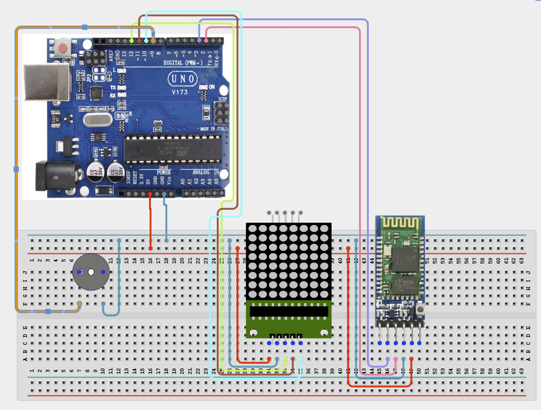

# Project 4.3.22: Project 142 Bluetooth Remote Matrix Display Scroller

| **Description** In Project 142, learners will build an expert wireless and automation system titled 'Bluetooth Remote Matrix Display Scroller'. This manual details the synthesis of HC-05 Bluetooth + MAX7219 8x8 Dot Matrix + Active Buzzer into an industrial IoT automation solution.|------------------|----------------------------------------------------------------|
| **Use case**     |This project connects to real-world industrial and IoT applications such as: Project 142 provides master-level competency in wireless communication, industrial IoT architecture, and automated system integration.|

## Components (Things You will need)

|  |  |  |  | | | |
|------------------------------------------------------ | ----------------------------------------------------------- | --------------------------------------------------------- | ------------------------------------------------------ | ------------------------------------------------------ |------------------------------------------------------ |------------------------------------------------------ |

## Building the circuit

Things Needed:

- Arduino Uno Core Board = 1
- HC-05 Bluetooth = 1
- MAX7219 8x8 Dot Matrix = 1
- Active Buzzer = 1
- USB Cable & Jumper Wires = 1

## Mounting the component on the breadboard and wiring the circuit

**Step 1:** Inventory all modules: Arduino Uno, HC-05, MAX7219, and Active Buzzer.

**Step 2:** Connect the HC-05 Bluetooth module: Connect VCC to 5V and GND to GND. Connect HC-05 TX to Arduino D2 (use a voltage divider) and HC-05 RX to Arduino D3.

**Step 3:** Connect the MAX7219 Dot Matrix: Connect VCC to 5V and GND to GND. Connect DIN to Arduino D12, CS to Arduino D10, and CLK to Arduino D11.

**Step 4:** Connect the Active Buzzer: Connect the positive pin (+) to Arduino D9 and the negative pin (-) to GND.

**Step 5:** Double-check all VCC and GND polarities to prevent electrical shorts.

**Step 6:** Connect the USB cable to the Arduino only after verifying all signal path wiring.



_Make sure to connect the Arduino USB cable to the Arduino board._

## PROGRAMMING

**Step 1:** Open your Arduino IDE. See how to set up here: [Getting Started](../../../Getting Started/Arduino_IDE_Setup.md).

**Step 2:** Write the complete program implementing the system logic with appropriate pin definitions, setup configuration, and the main control loop.

```cpp
#include <LedControl.h>
#include <SoftwareSerial.h>

// Pins: DIN=12, CLK=11, CS=10
LedControl lc = LedControl(12, 11, 10, 1);
SoftwareSerial BT(2, 3); // RX, TX
const int buzzerPin = 9;

void setup() {
  Serial.begin(9600);
  BT.begin(9600);
  pinMode(buzzerPin, OUTPUT);
  lc.shutdown(0, false);
  lc.setIntensity(0, 8);
  lc.clearDisplay(0);
  Serial.println("Project 142: Bluetooth Remote Matrix Display Scroller Online");
}

void loop() {
  if (BT.available()) {
    char data = BT.read();
    if (data == '1') {
      tone(buzzerPin, 1000, 200); // Beep on command
    }
  }
}
```

**Step 7:** Save your code. _See the [Getting Started](../../../Getting Started/Arduino_IDE_Setup.md) section_

**Step 8:** Select the arduino board and port _See the [Getting Started](../../../Getting Started/Arduino_IDE_Setup.md) section:Selecting Arduino Board Type and Uploading your code_.

**Step 9:** Upload your code. _See the [Getting Started](../../../Getting Started/Arduino_IDE_Setup.md) section:Selecting Arduino Board Type and Uploading your code_

## CONCLUSION

The system processes telemetry signals and security credentials in real time, driving relays, motors, and displays reliably.
