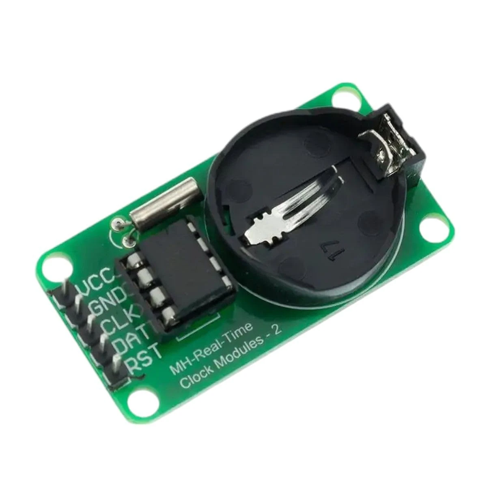
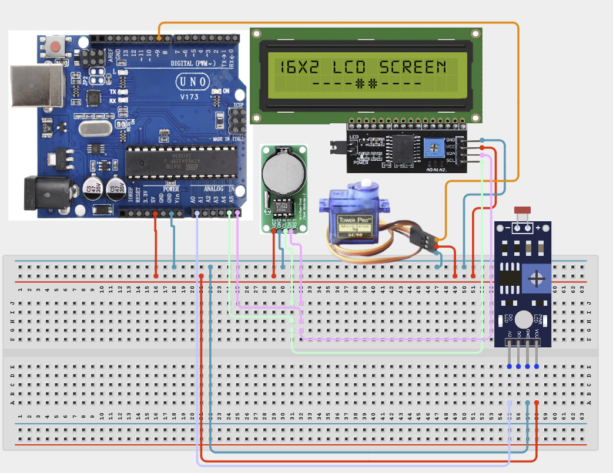

# Project 4.3.23: Smart RTC Solar Tracker Controller

| **Description** | In this Project, learners will build a time-aware solar tracker that combines a DS3231 RTC, a Photoresistor (LDR), an SG90 Servo Motor, and an I2C 1602 LCD. The RTC ensures the tracking servo is only active during daylight hours (06:00–19:00). Within those hours, the LDR reading drives the servo angle, pointing a solar panel mockup toward the brightest light source. The LCD displays the current time and light level in real time.|
|------------------|----------------------------------------------------------------|
| **Use case**     |Solar trackers are used in photovoltaic farms, solar water heaters, and concentrating solar power plants to maximise energy yield by following the sun's path throughout the day. By combining an RTC with a light sensor, the tracker avoids unnecessary movement at night, extending servo life and saving power.|

## Components (Things You will need)

|  |  |  |  |  |  |  |  |
|----------------------------------------------------- |----------------------------------------------------- |----------------------------------------------------- |----------------------------------------------------- |----------------------------------------------------- |----------------------------------------------------- |----------------------------------------------------- |-----------------------------------------------------|

## Building the circuit

Things Needed:

- Arduino Uno Core Board = 1
- DS3231 RTC Module = 1
- Photoresistor (LDR) with 10 kΩ resistor = 1
- SG90 Servo Motor = 1
- IIC 1602 LCD = 1
- USB Cable & Jumper Wires

## Mounting the component on the breadboard and wiring the circuit

**Step 1:** Place the Arduino Uno and breadboard on your workspace. Connect the 5V and GND pins to the breadboard power rails.

**Step 2:** Place the DS3231 RTC module. Connect VCC to 5V, GND to GND, SDA to Arduino A4, and SCL to Arduino A5.

**Step 3:** Place the IIC 1602 LCD. Connect VCC to 5V, GND to GND, SDA to A4, and SCL to A5 (sharing the I2C bus with the RTC — each device has a unique I2C address so no conflict occurs).

**Step 4:** Build the LDR voltage-divider: connect one leg of the LDR to 5V and the other to Analog Pin A0. Connect a 10 kΩ pull-down resistor from A0 to GND.

**Step 5:** Place the SG90 servo motor. Connect the red (VCC) wire to 5V, the brown/black (GND) wire to GND, and the orange/yellow (signal) wire to Arduino Digital Pin 6.

**Step 6:** Verify all VCC and GND connections, then connect the Arduino USB cable to the computer.



_Make sure to connect the Arduino USB cable to the Arduino board._

## PROGRAMMING

**Step 1:** Open your Arduino IDE. See how to set up here: [Getting Started](../../../Getting Started/Arduino_IDE_Setup.md).

**Step 2:** Copy and paste the program below into your IDE. Study each section to understand how the RTC Solar Tracker works.

```cpp
#include <Wire.h>
#include <RTClib.h>
#include <LiquidCrystal_I2C.h>
#include <Servo.h>

RTC_DS3231 rtc;
LiquidCrystal_I2C lcd(0x27, 16, 2);
Servo trackServo;

const int ldrPin    = A0;
const int servoPin  = 6;

void setup() {
  Serial.begin(9600);
  Wire.begin();
  if (!rtc.begin()) { Serial.println("RTC error!"); while (1); }
  if (rtc.lostPower()) rtc.adjust(DateTime(F(__DATE__), F(__TIME__)));
  lcd.init(); lcd.backlight();
  trackServo.attach(servoPin);
  trackServo.write(90); // Start at centre
  Serial.println("Project 143: Smart RTC Solar Tracker Online");
}

void loop() {
  DateTime now      = rtc.now();
  int ldrValue      = analogRead(ldrPin);
  bool isDaylight   = (now.hour() >= 6 && now.hour() < 19);

  // Map LDR value (0-1023) to servo angle (0-180 deg)
  int angle = map(ldrValue, 0, 1023, 0, 180);

  // Update LCD line 0: time
  lcd.setCursor(0, 0);
  char timeStr[16];
  sprintf(timeStr, "Time: %02d:%02d:%02d", now.hour(), now.minute(), now.second());
  lcd.print(timeStr);

  // Update LCD line 1: light + mode
  lcd.setCursor(0, 1);
  lcd.print("Lux:");
  lcd.print(ldrValue);
  lcd.print(isDaylight ? " TRKG" : " IDLE");

  if (isDaylight) {
    trackServo.write(angle);
    Serial.print("Tracking - Angle: "); Serial.print(angle);
  } else {
    trackServo.write(90); // Park at centre during night
    Serial.print("Parked - Night mode");
  }
  Serial.print(" | LDR: "); Serial.println(ldrValue);

  delay(1000);
}
```

**Step 7:** Save your code. _See the [Getting Started](../../../STEMAIDE_CODER_Kit_Manual/Getting_Started/Arduino_IDE_Setup.md) section_

**Step 8:** Select the arduino board and port _See the [Getting Started](../../../STEMAIDE_CODER_Kit_Manual/Getting_Started/Arduino_IDE_Setup.md)_.

**Step 9:** Upload your code.

## CONCLUSION

The Smart RTC Solar Tracker Controller integrates a DS3231 RTC, an LDR, and a servo "
motor to build a time-aware, light-following solar tracking mechanism. The servo "
actively follows the brightest light source during the defined daylight window, "
and parks at 90° at night to prevent unnecessary movement.

The main system flow is:

RTC (Time Gate) + LDR (Light Direction) → Arduino → Servo Angle + LCD Display

Through this project, learners apply real-time scheduling, analogue-to-servo "
mapping, and dual I2C device management — all core skills in modern renewable "
energy and automation engineering.
