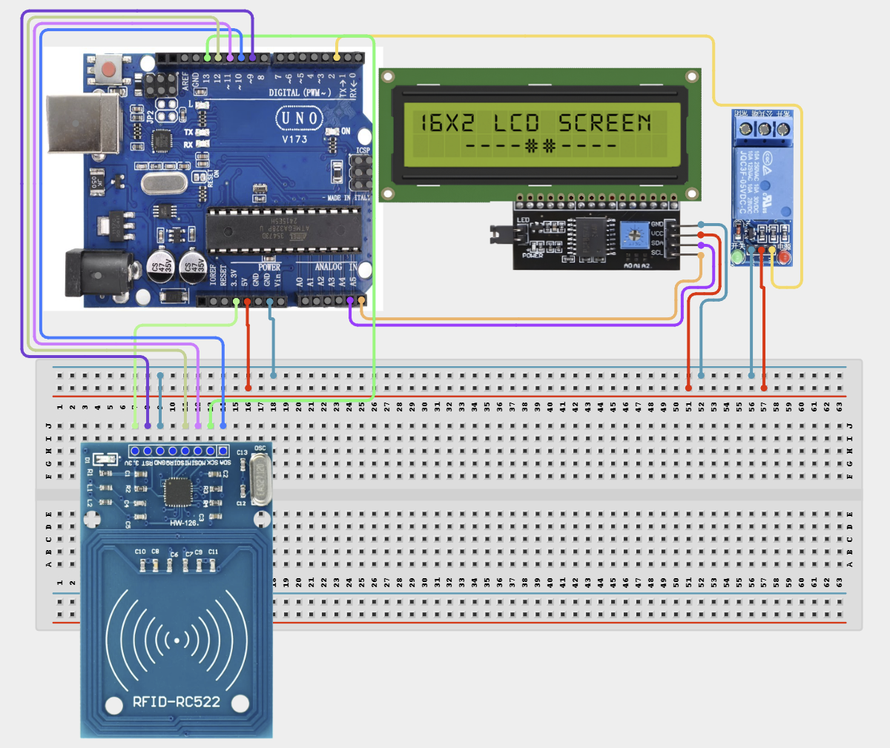

# Project 4.3.24:  RFID Keycard Multi-Relay Switching Console

| **Description** | In this Project, learners will build an RFID multi-relay switching console that uses an MFRC522 reader, a 4-channel relay module, an I2C LCD, and a buzzer. Different authorised RFID cards are pre-mapped to individual relay channels. When a card is scanned, the Arduino identifies it and toggles the corresponding relay channel, displaying the channel status on the LCD. This simulates an industrial keycard-based appliance switching panel.|
|------------------|----------------------------------------------------------------|
| **Use case**     |Multi-relay RFID consoles are used in smart offices, data centres, and hotels where different staff roles are granted access to specific electrical circuits. For example, a manager's card may control the boardroom AV system while a technician's card controls server room cooling. This project teaches RFID UID mapping and multi-channel relay logic.|

## Components (Things You will need)

|  |  |  |  |  |  |  |  |
|----------------------------------------------------- |----------------------------------------------------- |----------------------------------------------------- |----------------------------------------------------- |----------------------------------------------------- |----------------------------------------------------- |----------------------------------------------------- |-----------------------------------------------------|

## Building the circuit

Things Needed:

- Arduino Uno Core Board = 1
- MFRC522 RFID Module = 1
- 4-Channel Relay Module = 1
- IIC 1602 LCD = 1
- Active Buzzer = 1
- USB Cable & Jumper Wires

## Mounting the component on the breadboard and wiring the circuit

**Step 1:** Place the Arduino Uno and breadboard on your workspace. Connect the 5V and GND pins to the breadboard power rails.

**Step 2:** Place the MFRC522 RFID module. Connect 3.3V to Arduino 3.3V, GND to GND, SDA/SS to Pin 10, SCK to Pin 13, MOSI to Pin 11, MISO to Pin 12, and RST to Pin 9.

**Step 3:** Place the 4-channel relay module. Connect relay module VCC to 5V, GND to GND. Connect IN1 to Arduino Pin 2, IN2 to Pin 3, IN3 to Pin 4, and IN4 to Pin 5.

**Step 4:** Place the IIC 1602 LCD. Connect VCC to 5V, GND to GND, SDA to Arduino A4, and SCL to Arduino A5.

**Step 5:** Place the active buzzer. Connect the positive (+) pin to Arduino Pin 8 and the negative (–) pin to GND.

**Step 6:** Verify all VCC, 3.3V, and GND connections, then connect the Arduino USB cable to the computer.



_Make sure to connect the Arduino USB cable to the Arduino board._

## PROGRAMMING

**Step 1:** Open your Arduino IDE. See how to set up here: [Getting Started](../../../STEMAIDE_CODER_Kit_Manual/Getting_Started/Arduino_IDE_Setup.md).

**Step 2:** Copy and paste the program below into your IDE. Study each section to understand how the RFID Multi-Relay Console works.

```cpp
#include <SPI.h>
#include <MFRC522.h>
#include <Wire.h>
#include <LiquidCrystal_I2C.h>

#define SS_PIN   10
#define RST_PIN   9
#define BUZZER    8

const int relayPins[4] = {2, 3, 4, 5};
bool relayState[4]     = {false, false, false, false};

MFRC522 rfid(SS_PIN, RST_PIN);
LiquidCrystal_I2C lcd(0x27, 16, 2);

// Add your card UIDs here. Each entry maps to one relay channel.
// Get UIDs by scanning cards and reading the Serial Monitor.
byte cardUIDs[4][4] = {
  {0xAA, 0xBB, 0xCC, 0x01}, // Card 1 -> Relay 1
  {0xAA, 0xBB, 0xCC, 0x02}, // Card 2 -> Relay 2
  {0xAA, 0xBB, 0xCC, 0x03}, // Card 3 -> Relay 3
  {0xAA, 0xBB, 0xCC, 0x04}, // Card 4 -> Relay 4
};

void setup() {
  Serial.begin(9600);
  SPI.begin();
  rfid.PCD_Init();
  Wire.begin();
  lcd.init(); lcd.backlight();
  pinMode(BUZZER, OUTPUT);
  for (int i = 0; i < 4; i++) {
    pinMode(relayPins[i], OUTPUT);
    digitalWrite(relayPins[i], HIGH); // Relay OFF (Active-LOW)
  }
  lcd.print("RFID Relay Panel");
  lcd.setCursor(0, 1); lcd.print("Scan a card...");
  Serial.println("Project 144: RFID Multi-Relay Console Online");
}

int matchCard() {
  for (int c = 0; c < 4; c++) {
    bool match = true;
    for (int b = 0; b < 4; b++) {
      if (rfid.uid.uidByte[b] != cardUIDs[c][b]) { match = false; break; }
    }
    if (match) return c;
  }
  return -1;
}

void updateLCD() {
  lcd.setCursor(0, 0); lcd.print("R1:");
  lcd.print(relayState[0] ? "ON " : "OFF");
  lcd.print(" R2:"); lcd.print(relayState[1] ? "ON " : "OFF");
  lcd.setCursor(0, 1); lcd.print("R3:");
  lcd.print(relayState[2] ? "ON " : "OFF");
  lcd.print(" R4:"); lcd.print(relayState[3] ? "ON " : "OFF");
}

void loop() {
  if (!rfid.PICC_IsNewCardPresent() || !rfid.PICC_ReadCardSerial()) return;

  int channel = matchCard();
  if (channel >= 0) {
    relayState[channel] = !relayState[channel];
    digitalWrite(relayPins[channel], relayState[channel] ? LOW : HIGH);
    tone(BUZZER, 1200, 150);
    Serial.print("Relay "); Serial.print(channel + 1);
    Serial.println(relayState[channel] ? " ON" : " OFF");
    updateLCD();
  } else {
    tone(BUZZER, 300, 500);
    lcd.clear(); lcd.print("Unknown Card!");
    delay(1500);
    lcd.clear(); updateLCD();
    Serial.println("Unknown card scanned");
  }

  rfid.PICC_HaltA();
  rfid.PCD_StopCrypto1();
  delay(1000);
}
```

**Step 7:** Save your code. _See the [Getting Started](../../../STEMAIDE_CODER_Kit_Manual/Getting_Started/Arduino_IDE_Setup.md) section_

**Step 8:** Select the arduino board and port _See the [Getting Started](../../../STEMAIDE_CODER_Kit_Manual/Getting_Started/Arduino_IDE_Setup.md)_.

**Step 9:** Upload your code.

## CONCLUSION

The RFID Keycard Multi-Relay Switching Console demonstrates how individual RFID "
cards can be mapped to specific relay channels to create a role-based appliance "
control system. Each card toggles only its assigned channel, while the LCD "
provides a real-time status overview of all four relay channels.

The main system flow is:

RFID Card → MFRC522 → Arduino → UID Match → Relay Toggle → LCD Status

Through this project, learners develop skills in UID-based authentication, "
multi-channel relay logic, I2C display integration, and designing RFID access "
consoles for real-world automation applications.
