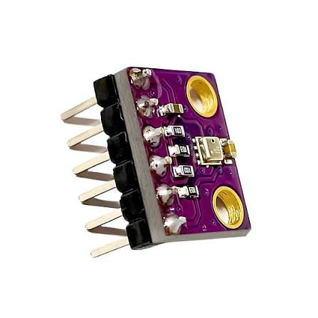

# Project 4.3.25: Project 145 Bluetooth Telemetry Environmental Logger

| **Description** In Project 145, learners will build a wireless environmental monitoring station that integrates an HC-05 Bluetooth module, a BME280 temperature/humidity/pressure sensor, and a DS18B20 waterproof temperature probe. Environmental telemetry is sent continuously to a smartphone over Bluetooth. If the DS18B20 temperature exceeds 35 °C, the buzzer sounds a high-temperature alarm, demonstrating real-time wireless sensor data logging with threshold alerting.|
|------------------|----------------------------------------------------------------|
| **Use case**     |Wireless environmental loggers are deployed in cold-chain logistics, server rooms, pharmaceutical warehouses, weather stations, and agricultural monitoring systems to continuously track atmospheric conditions and alert operators of out-of-range readings without requiring physical access to the sensor node.|

## Components (Things You will need)

|  |  |  |  |  |  |  |  |
|----------------------------------------------------- |----------------------------------------------------- |----------------------------------------------------- |----------------------------------------------------- |----------------------------------------------------- |----------------------------------------------------- |----------------------------------------------------- |-----------------------------------------------------|

## Building the circuit

Things Needed:

- Arduino Uno Core Board = 1
- HC-05 Bluetooth Module = 1
- BME280 Temperature/Humidity/Pressure Sensor = 1
- DS18B20 Temperature Sensor = 1
- 4.7 kΩ Pull-up Resistor (for DS18B20 data) = 1
- Active Buzzer = 1
- USB Cable & Jumper Wires

## Mounting the component on the breadboard and wiring the circuit

**Step 1:** Place the Arduino Uno and breadboard on your workspace. Connect the 5V and GND pins to the breadboard power rails.

**Step 2:** Place the HC-05 Bluetooth module. Connect HC-05 VCC to 5V, GND to GND, TXD to Arduino Pin 2 (RX), and RXD to Arduino Pin 3 (TX — use a voltage divider or level shifter).

**Step 3:** Place the BME280 sensor module. Connect VCC to 3.3V, GND to GND, SDA to Arduino A4, and SCL to Arduino A5. (The BME280 I2C address is 0x76; change to 0x77 if it does not respond.)

**Step 4:** Connect the DS18B20 temperature sensor. Connect the red (VCC) wire to 5V, the black (GND) wire to GND, and the yellow (data) wire to Arduino Digital Pin 4. Place a 4.7 kΩ resistor between the data line and 5V (pull-up).

**Step 5:** Place the active buzzer. Connect the positive (+) pin to Arduino Digital Pin 7 and the negative (–) pin to GND.

**Step 6:** Verify all VCC, 3.3V, and GND connections and ensure the DS18B20 pull-up resistor is fitted, then connect the Arduino USB cable to the computer.


_Make sure to connect the Arduino USB cable to the Arduino board._

## PROGRAMMING

**Step 1:** Open your Arduino IDE. See how to set up here: [Getting Started](../../../STEMAIDE_CODER_Kit_Manual/Getting_Started/Arduino_IDE_Setup.md).

**Step 2:** Copy and paste the program below into your IDE. Study each section to understand how the Bluetooth Environmental Logger works.

```cpp
#include <SoftwareSerial.h>
#include <Wire.h>
#include <Adafruit_Sensor.h>
#include <Adafruit_BME280.h>
#include <OneWire.h>
#include <DallasTemperature.h>

SoftwareSerial BT(2, 3);   // RX, TX (HC-05)

Adafruit_BME280 bme;
OneWire oneWire(4);
DallasTemperature ds18b20(&oneWire);

const int buzzerPin    = 7;
const float TEMP_LIMIT = 35.0; // °C high-temp alarm threshold

void setup() {
  Serial.begin(9600);
  BT.begin(9600);
  Wire.begin();
  ds18b20.begin();
  pinMode(buzzerPin, OUTPUT);

  if (!bme.begin(0x76)) {
    Serial.println("BME280 not found – check wiring or try 0x77");
    BT.println("BME280 ERROR");
    while (1);
  }
  Serial.println("Project 145: Bluetooth Environmental Logger Online");
  BT.println("=== Environmental Logger Ready ===");
}

void loop() {
  // Read BME280
  float bmeTemp = bme.readTemperature();
  float humidity = bme.readHumidity();
  float pressure = bme.readPressure() / 100.0F;

  // Read DS18B20
  ds18b20.requestTemperatures();
  float probeTemp = ds18b20.getTempCByIndex(0);

  // Build telemetry string
  String telemetry = "";
  telemetry += "BME Temp: "  + String(bmeTemp,   1) + " C | ";
  telemetry += "Humidity: "  + String(humidity,  1) + " % | ";
  telemetry += "Pressure: "  + String(pressure,  1) + " hPa | ";
  telemetry += "Probe Tmp: " + String(probeTemp, 1) + " C";

  // Send over Bluetooth and Serial
  BT.println(telemetry);
  Serial.println(telemetry);

  // High-temperature alarm
  if (probeTemp > TEMP_LIMIT) {
    tone(buzzerPin, 2000, 500);
    BT.println("!!! HIGH TEMP ALARM !!!");
    Serial.println("!!! HIGH TEMP ALARM !!!");
  } else {
    noTone(buzzerPin);
  }

  delay(2000);
}
```

**Step 7:** Save your code. _See the [Getting Started](../../../STEMAIDE_CODER_Kit_Manual/Getting_Started/Arduino_IDE_Setup.md) section_

**Step 8:** Select the arduino board and port _See the [Getting Started](../../../STEMAIDE_CODER_Kit_Manual/Getting_Started/Arduino_IDE_Setup.md)_.

**Step 9:** Upload your code. 

## CONCLUSION

The Bluetooth Telemetry Environmental Logger project demonstrates how two "
independent sensor technologies (I2C BME280 and 1-Wire DS18B20) can be "
combined and streamed wirelessly via Bluetooth. The system delivers continuous "
environmental telemetry to a smartphone and triggers a local alarm when a "
critical temperature threshold is exceeded.

The main system flow is:

BME280 + DS18B20 → Arduino → HC-05 → Smartphone Dashboard + Alarm

Through this project, learners develop skills in multi-sensor fusion, "
1-Wire and I2C protocol integration, wireless telemetry design, and "
threshold-based environmental alerting.
