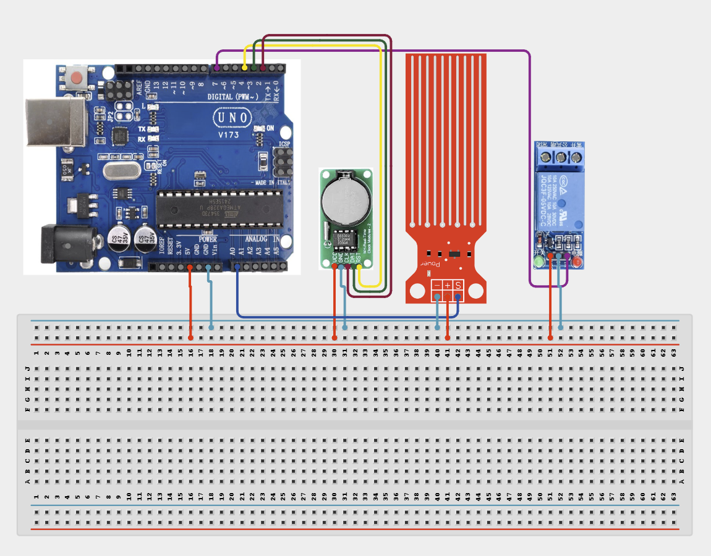

# Project 4.3.26: Real-Time Clock Liquid Tank Automated Pump

| **Description** | In Project 146, learners will build an automated pump controller that combines a DS3231 RTC module, a Water Level Sensor, a Relay Module, and an Active Buzzer. The RTC triggers scheduled pump checks at set intervals. During each check, the water-level sensor reading is evaluated. If the tank level is too low (analogue value below threshold), the relay activates the pump; if the level is adequate, the pump stays off. The buzzer alerts the operator when the tank runs critically low.|
|------------------|----------------------------------------------------------------|
| **Use case**     |Automated pump controllers are used in water storage tanks, hydroponics reservoirs, aquariums, fish farms, and irrigation cisterns where the pump must only run when the water level drops below a safe threshold. Combining level sensing with RTC-scheduled checks prevents over-pumping and dry-run motor damage.|

## Components (Things You will need)

|  |  |  |  |  |  |  |  |
|----------------------------------------------------- |----------------------------------------------------- |----------------------------------------------------- |----------------------------------------------------- |----------------------------------------------------- |----------------------------------------------------- |----------------------------------------------------- |-----------------------------------------------------|

## Building the circuit

Things Needed:

- Arduino Uno Core Board = 1
- DS3231 RTC Module = 1
- Water Level Sensor Module = 1
- Relay Module = 1
- Active Buzzer = 1
- USB Cable & Jumper Wires

## Mounting the component on the breadboard and wiring the circuit

**Step 1:** Place the Arduino Uno and breadboard on your workspace. Connect the 5V and GND pins to the breadboard power rails.

**Step 2:** Place the DS3231 RTC module. Connect VCC to 5V, GND to GND, SDA to Arduino A4, and SCL to Arduino A5.

**Step 3:** Place the water level sensor module. Connect VCC to 5V, GND to GND, and the SIG/Analogue output pin to Analog Pin A0.

**Step 4:** Place the relay module. Connect VCC to 5V, GND to GND, and IN to Arduino Digital Pin 7.

**Step 5:** Place the active buzzer. Connect the positive (+) pin to Arduino Digital Pin 8 and the negative (–) pin to GND.

**Step 6:** Verify all VCC and GND connections and ensure the water sensor SIG wire goes to A0, then connect the Arduino USB cable to the computer.



_Make sure to connect the Arduino USB cable to the Arduino board._

## PROGRAMMING

**Step 1:** Open your Arduino IDE. See how to set up here: [Getting Started](../../../STEMAIDE_CODER_Kit_Manual/Getting_Started/Arduino_IDE_Setup.md).

**Step 2:** Copy and paste the program below into your IDE. Study each section to understand how the RTC Liquid Tank Pump works.

```cpp
#include <Wire.h>
#include <RTClib.h>

const int relayPin       = 7;
const int buzzerPin      = 8;
const int levelPin       = A0;
const int lowThreshold   = 200;  // Analogue value: below this = low water
const int alarmThreshold = 100;  // Critical low — sound buzzer

RTC_DS3231 rtc;

// Schedule: check every minute at second 0
int lastCheckedMin = -1;

void setup() {
  Serial.begin(9600);
  pinMode(relayPin,  OUTPUT);
  pinMode(buzzerPin, OUTPUT);
  digitalWrite(relayPin, HIGH); // Relay OFF (Active-LOW)
  Wire.begin();
  if (!rtc.begin()) { Serial.println("RTC error!"); while (1); }
  if (rtc.lostPower()) rtc.adjust(DateTime(F(__DATE__), F(__TIME__)));
  Serial.println("Project 146: RTC Liquid Tank Pump Online");
}

void loop() {
  DateTime now = rtc.now();

  // Check once per minute
  if (now.minute() != lastCheckedMin) {
    lastCheckedMin = now.minute();
    int level = analogRead(levelPin);

    Serial.print("Time: "); Serial.print(now.hour()); Serial.print(":");
    Serial.print(now.minute()); Serial.print(" | Water Level: "); Serial.println(level);

    if (level < alarmThreshold) {
      tone(buzzerPin, 800, 1000); // Critical low alarm
      digitalWrite(relayPin, LOW);  // Pump ON
      Serial.println("CRITICAL LOW – Pump ON + Alarm");
    } else if (level < lowThreshold) {
      noTone(buzzerPin);
      digitalWrite(relayPin, LOW);  // Pump ON
      Serial.println("Low level – Pump ON");
    } else {
      noTone(buzzerPin);
      digitalWrite(relayPin, HIGH); // Pump OFF
      Serial.println("Level OK – Pump OFF");
    }
  }
  delay(500);
}
```

**Step 7:** Save your code. _See the [Getting Started](../../../STEMAIDE_CODER_Kit_Manual/Getting_Started/Arduino_IDE_Setup.md) section_

**Step 8:** Select the arduino board and port _See the [Getting Started](../../../STEMAIDE_CODER_Kit_Manual/Getting_Started/Arduino_IDE_Setup.md)_.

**Step 9:** Upload your code.

## CONCLUSION

The Real-Time Clock Liquid Tank Automated Pump project demonstrates how scheduled "
sensor polling and threshold-based actuation can be combined to build an "
automated water management system. The DS3231 RTC triggers a check every minute; "
the water level sensor determines whether the pump runs, and the buzzer alerts "
for critically low levels.

The main system flow is:

RTC (Schedule) → Water Sensor → Arduino → Relay (Pump) + Buzzer (Alert)

Through this project, learners gain practical experience with RTC-triggered "
scheduled tasks, analogue threshold control, and relay-driven pump automation — "
essential skills for agricultural, industrial, and residential water management systems.
