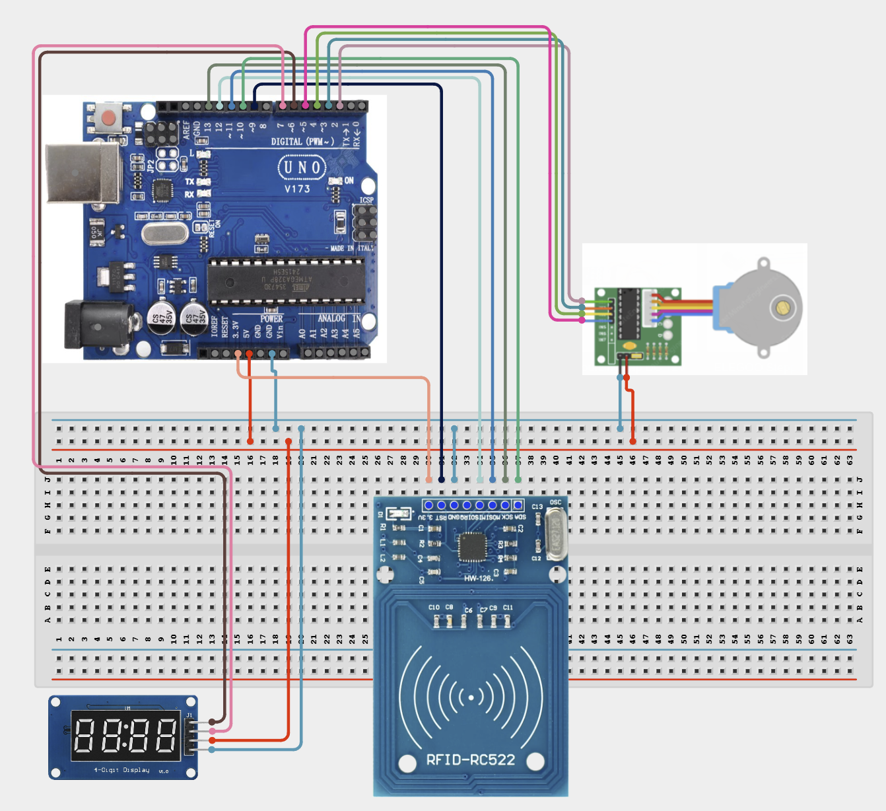

# Project 4.3.27: RFID Smart Warehouse Conveyor Indexer

| **Description** | In Project 147, learners will build an RFID-triggered conveyor indexer that uses an MFRC522 reader, a 28BYJ-48 Stepper Motor with ULN2003 driver, and a TM1637 4-digit display. Each time a valid RFID card is scanned, the Arduino commands the stepper motor to rotate the conveyor table by 180°, simulating one index step of a pick-and-place or packaging conveyor. The TM1637 display shows the running scan count and a buzzer confirms each indexed step.|
|------------------|----------------------------------------------------------------|
| **Use case**     |RFID-triggered conveyor indexers are used in warehouse pick systems, manufacturing assembly lines, and postal sorting facilities where items are scanned and the conveyor advances one position per scan. This project teaches stepper motor control, step counting, and RFID-driven mechanical automation.|

## Components (Things You will need)

|  |  |  |  |  |  |  |  |  |
|----------------------------------------------------- |----------------------------------------------------- |----------------------------------------------------- |----------------------------------------------------- |----------------------------------------------------- |----------------------------------------------------- |----------------------------------------------------- |----------------------------------------------------- |-----------------------------------------------------|

## Building the circuit

Things Needed:

- Arduino Uno Core Board = 1
- MFRC522 RFID Module = 1
- 28BYJ-48 Stepper Motor = 1
- ULN2003 Stepper Driver Board = 1
- TM1637 4-Digit Display = 1
- Active Buzzer = 1
- USB Cable & Jumper Wires

## Mounting the component on the breadboard and wiring the circuit

**Step 1:** Place the Arduino Uno and breadboard on your workspace. Connect the 5V and GND pins to the breadboard power rails.

**Step 2:** Place the MFRC522 RFID module. Connect 3.3V to Arduino 3.3V, GND to GND, SDA/SS to Pin 10, SCK to Pin 13, MOSI to Pin 11, MISO to Pin 12, and RST to Pin 9.

**Step 3:** Place the ULN2003 stepper driver board. Connect ULN2003 VCC to 5V and GND to GND. Connect IN1 to Arduino Pin 8, IN2 to Pin 9, IN3 to Pin 10 (Note: conflicts with RFID SCK on Pin 13 – see Step 2; use Pins 8, 9, 10, 11 only for the stepper), IN4 to Pin 11. Attach the 28BYJ-48 stepper motor cable to the ULN2003 connector.

**Step 4:** Place the TM1637 4-digit display. Connect VCC to 5V, GND to GND, CLK to Arduino Pin 3, and DIO to Arduino Pin 2.

**Step 5:** Place the active buzzer. Connect the positive (+) pin to Arduino Pin 4 and the negative (–) pin to GND.

**Step 6:** Verify all VCC, 3.3V, and GND connections, then connect the Arduino USB cable to the computer.



_Make sure to connect the Arduino USB cable to the Arduino board._

## PROGRAMMING

**Step 1:** Open your Arduino IDE. See how to set up here: [Getting Started](../../../STEMAIDE_CODER_Kit_Manual/Getting_Started/Arduino_IDE_Setup.md).

**Step 2:** Copy and paste the program below into your IDE. Study each section to understand how the RFID Conveyor Indexer works.

```cpp
#include <SPI.h>
#include <MFRC522.h>
#include <Stepper.h>
#include <TM1637Display.h>

#define SS_PIN    10
#define RST_PIN    9
#define BUZZER     4
#define TM_CLK     3
#define TM_DIO     2

// 28BYJ-48 steps per revolution at full-step = 2048
const int stepsPerRev = 2048;
Stepper conveyor(stepsPerRev, 8, 10, 9, 11); // IN1, IN3, IN2, IN4 (half-step order)
MFRC522 rfid(SS_PIN, RST_PIN);
TM1637Display display(TM_CLK, TM_DIO);

int scanCount = 0;

void setup() {
  Serial.begin(9600);
  SPI.begin();
  rfid.PCD_Init();
  conveyor.setSpeed(12); // RPM
  display.setBrightness(5);
  display.showNumberDec(scanCount);
  pinMode(BUZZER, OUTPUT);
  Serial.println("Project 147: RFID Conveyor Indexer Online");
  Serial.println("Scan a card to index conveyor...");
}

void loop() {
  if (!rfid.PICC_IsNewCardPresent() || !rfid.PICC_ReadCardSerial()) return;

  scanCount++;
  display.showNumberDec(scanCount);
  tone(BUZZER, 1500, 200);

  Serial.print("Scan #"); Serial.print(scanCount);
  Serial.println(" — Indexing 180 degrees...");

  // 180° = half revolution = stepsPerRev / 2
  conveyor.step(stepsPerRev / 2);

  Serial.println("Index complete.");

  rfid.PICC_HaltA();
  rfid.PCD_StopCrypto1();
  delay(1500); // Debounce before next scan
}
```

**Step 7:** Save your code. _See the [Getting Started](../../../STEMAIDE_CODER_Kit_Manual/Getting_Started/Arduino_IDE_Setup.md) section_

**Step 8:** Select the arduino board and port _See the [Getting Started](../../../STEMAIDE_CODER_Kit_Manual/Getting_Started/Arduino_IDE_Setup.md)_.

**Step 9:** Upload your code.

## CONCLUSION

The RFID Smart Warehouse Conveyor Indexer project demonstrates how RFID card "
scanning can trigger precise, repeatable mechanical motion through a stepper motor. "
Each scan advances the conveyor by exactly 180° and increments the TM1637 counter, "
creating an auditable, automated index system.

The main system flow is:

RFID Card Scan → MFRC522 → Arduino → Stepper Motor (180°) → Display Count

Through this project, learners gain skills in stepper motor control, RFID "
event-driven actuation, and building industrial conveyor index systems — all "
core competencies in smart manufacturing and warehouse automation.
