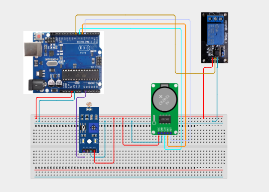

# Project 4.3.29:  Real-Time Clock Multi-Stage School Bell

| **Description** | In Project 149, learners will build an automated multi-stage school bell system using a DS3231 RTC, a TM1637 4-digit display, a relay, and an active buzzer. The TM1637 continuously displays the current time. A configurable schedule table holds the hour:minute of each bell period. When the RTC matches a scheduled entry, the relay energises a bell (or buzzer) for 5 seconds and the active buzzer sounds, then both reset until the next scheduled period.|
|------------------|----------------------------------------------------------------|
| **Use case**     |Automated school bell systems are used in schools, colleges, factories, and offices where shift changes, breaks, or class periods need to be signalled at fixed, repeating times without manual intervention. The RTC ensures accuracy independent of Arduino reset or power cycles. This project teaches time-table scheduling, multi-output triggering, and persistent timekeeping.|

## Components (Things You will need)

|  |  |  |  |  |  |  |  |
|----------------------------------------------------- |----------------------------------------------------- |----------------------------------------------------- |----------------------------------------------------- |----------------------------------------------------- |----------------------------------------------------- |----------------------------------------------------- |-----------------------------------------------------|

## Building the circuit

Things Needed:

- Arduino Uno Core Board = 1
- DS3231 RTC Module = 1
- TM1637 4-Digit Display = 1
- Relay Module = 1
- Active Buzzer = 1
- USB Cable & Jumper Wires

## Mounting the component on the breadboard and wiring the circuit

**Step 1:** Place the Arduino Uno and breadboard on your workspace. Connect the 5V and GND pins to the breadboard power rails.

**Step 2:** Place the DS3231 RTC module. Connect VCC to 5V, GND to GND, SDA to Arduino A4, and SCL to Arduino A5.

**Step 3:** Place the TM1637 4-digit display. Connect VCC to 5V, GND to GND, CLK to Arduino Pin 2, and DIO to Arduino Pin 3.

**Step 4:** Place the relay module. Connect VCC to 5V, GND to GND, and IN to Arduino Digital Pin 7.

**Step 5:** Place the active buzzer. Connect the positive (+) pin to Arduino Digital Pin 8 and the negative (–) pin to GND.

**Step 6:** Verify all VCC and GND connections, then connect the Arduino USB cable to the computer.



_Make sure to connect the Arduino USB cable to the Arduino board._

## PROGRAMMING

**Step 1:** Open your Arduino IDE. See how to set up here: [Getting Started](../../../Getting Started/Arduino_IDE_Setup.md).

**Step 2:** Copy and paste the program below into your IDE. Study each section to understand how the RTC School Bell works.

```cpp
#include <Wire.h>
#include <RTClib.h>
#include <TM1637Display.h>

#define TM_CLK    2
#define TM_DIO    3
#define RELAY_PIN 7
#define BUZZER    8

RTC_DS3231 rtc;
TM1637Display display(TM_CLK, TM_DIO);

// Bell schedule: {hour, minute}
// Edit these to match your timetable
const int bellCount = 6;
int bellSchedule[bellCount][2] = {
  {8,  0},  // Start of morning session
  {10, 30}, // Morning break
  {12, 0},  // Lunch begin
  {13, 0},  // Lunch end
  {15, 0},  // Afternoon break
  {16, 0},  // End of day
};

int lastRingMinute = -1; // Prevent double-trigger in same minute

void ringBell() {
  digitalWrite(RELAY_PIN, LOW);  // Energise relay (Active-LOW)
  tone(BUZZER, 1000);
  delay(5000); // Bell duration: 5 seconds
  noTone(BUZZER);
  digitalWrite(RELAY_PIN, HIGH); // De-energise relay
  Serial.println("Bell sequence complete.");
}

void setup() {
  Serial.begin(9600);
  Wire.begin();
  if (!rtc.begin()) { Serial.println("RTC not found!"); while (1); }
  if (rtc.lostPower()) rtc.adjust(DateTime(F(__DATE__), F(__TIME__)));
  display.setBrightness(5);
  pinMode(RELAY_PIN, OUTPUT);
  pinMode(BUZZER,    OUTPUT);
  digitalWrite(RELAY_PIN, HIGH);
  Serial.println("Project 149: RTC School Bell Online");
}

void loop() {
  DateTime now = rtc.now();

  // Display current time as HHMM
  int timeVal = now.hour() * 100 + now.minute();
  display.showNumberDecEx(timeVal, 0b01000000, true); // Colon ON

  // Check schedule
  if (now.second() == 0 && now.minute() != lastRingMinute) {
    for (int i = 0; i < bellCount; i++) {
      if (now.hour() == bellSchedule[i][0] && now.minute() == bellSchedule[i][1]) {
        Serial.print("BELL TIME: "); Serial.print(now.hour());
        Serial.print(":"); Serial.println(now.minute());
        lastRingMinute = now.minute();
        ringBell();
        break;
      }
    }
  }
  delay(500);
}
```

**Step 7:** Save your code. _See the [Getting Started](../../../STEMAIDE_CODER_Kit_Manual/Getting_Started/Arduino_IDE_Setup.md) section_

**Step 8:** Select the arduino board and port _See the [Getting Started](../../../STEMAIDE_CODER_Kit_Manual/Getting_Started/Arduino_IDE_Setup.md)_.

**Step 9:** Upload your code. 

## CONCLUSION

The Real-Time Clock Multi-Stage School Bell project demonstrates how a DS3231 RTC "
and a programmable schedule table can be used to automate a multi-period bell system. "
The TM1637 displays live time while the relay and buzzer fire in sync for exactly "
5 seconds at each scheduled period, independent of human intervention.

The main system flow is:

DS3231 RTC → Arduino (Schedule Match) → Relay + Buzzer → TM1637 Clock Display

Through this project, learners gain experience in timetable-based automation, "
RTC-accurate scheduling, and multi-output synchronised triggering — skills that "
transfer directly to factory shift change systems, building management timers, "
and industrial process schedulers.
