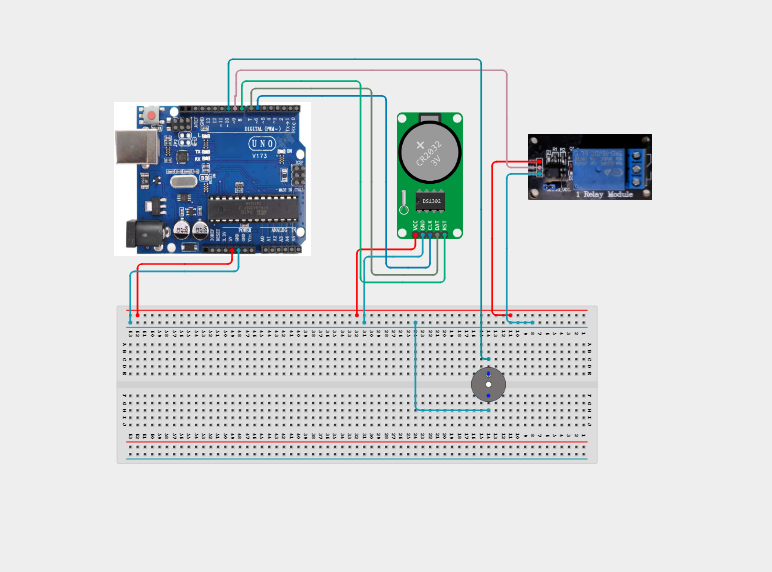

# Project 4.3.2: Smart Clock Schedule Alarm Controller

| **Description** | In this project, learners will build a time-based automation system using a DS3231 Real-Time Clock (RTC), TM1637 4-Digit Display, relay module, and active buzzer. The DS3231 keeps track of the current time, the TM1637 displays it, and the Arduino uses the programmed schedule to activate the relay and buzzer at a specific time.|
|------------------|----------------------------------------------------------------|
| **Use case**     |This system can be used for scheduled automation such as automatically switching lights, fans, pumps, or other low-voltage devices ON or OFF at specific times. It introduces learners to real-time clocks, digital displays, scheduling, and automated control systems.|

## Components (Things You will need)

|  |  |  |  | | | |
| --- | --- | --- | --- | --- | --- | --- |

## Building the circuit

Things Needed:

- Arduino Uno
- DS3231 RTC Module 
- Relay Module 
- Active Buzzer
- USB Cable
- Jumper Wires

## Mounting the component on the breadboard and wiring the circuit

Step 1: Place the Arduino Uno and breadboard on your workspace.

Step 2: Connect the Arduino 5V pin to the breadboard positive (+) power rail.

Step 3: Connect the Arduino GND pin to the breadboard negative (–) ground rail.

Step 4: Place the DS3231 RTC module on the breadboard.

Step 5: Connect the DS3231 VCC pin to the 5V power rail.

Step 6: Connect the DS3231 GND pin to the GND rail.

Step 7: Connect the DS3231 SDA pin to Arduino A4.

Step 8: Connect the DS3231 SCL pin to Arduino A5.

Step 9: Place the relay module on the workspace.

Step 10: Connect the relay module VCC pin to the 5V power rail.

Step 11: Connect the relay module GND pin to the GND rail.

Step 12: Connect the relay module IN pin to Arduino Pin 7.

Step 13: Place the active buzzer on the breadboard.

Step 14: Connect the buzzer positive (+) pin to Arduino Pin 8.

Step 15: Connect the buzzer negative (–) pin to the GND rail.

Step 16: Place the TM1637 4-Digit Display on the workspace.

Step 17: Connect the TM1637 VCC pin to the 5V power rail.

Step 18: Connect the TM1637 GND pin to the GND rail.

Step 19: Connect the TM1637 CLK pin to Arduino Pin 2.

Step 20: Connect the TM1637 DIO pin to Arduino Pin 3.

Step 21: Check that all VCC, 5V, and GND connections are correctly connected.

Step 22: Check that the DS3231 SDA and SCL wires are connected to A4 and A5.

Step 23: Check that the relay, buzzer, and TM1637 display are connected to the correct Arduino pins.

Step 24: Connect the USB cable from the Arduino Uno to the computer.



_Make sure to connect the Arduino USB cable to the Arduino board._

## PROGRAMMING

**Step 1:** Open your Arduino IDE. See how to set up here: [Getting Started](../../../STEMAIDE_CODER_Kit_Manual/Getting_Started/Arduino_IDE_Setup.md).

Step 2: Install the RTClib and TM1637Display libraries through the Arduino IDE Library Manager.

Step 3: Enter the following code:
``` cpp

#include <Wire.h>
#include <RTClib.h>
#include <TM1637Display.h>

RTC_DS3231 rtc;

const int relayPin = 7;
const int buzzerPin = 8;

const int CLK = 2;
const int DIO = 3;

TM1637Display display(CLK, DIO);

// Scheduled time
const int alarmHour = 18;
const int alarmMinute = 0;

bool eventTriggered = false;

void setup() {
  Serial.begin(9600);

  pinMode(relayPin, OUTPUT);
  pinMode(buzzerPin, OUTPUT);

  digitalWrite(relayPin, LOW);
  digitalWrite(buzzerPin, LOW);

  display.setBrightness(7);

  if (!rtc.begin()) {
    Serial.println("RTC not found!");
    while (1);
  }

  if (rtc.lostPower()) {
    rtc.adjust(DateTime(F(__DATE__), F(__TIME__)));
  }

  Serial.println("Smart Clock Controller Ready");
}

void loop() {
  DateTime now = rtc.now();

  int hour = now.hour();
  int minute = now.minute();
  int second = now.second();

  // Display time in HHMM format
  int displayTime = hour * 100 + minute;
  display.showNumberDecEx(displayTime, 0b01000000, true);

  // Trigger scheduled event once per minute
  if (hour == alarmHour && minute == alarmMinute && !eventTriggered) {

    digitalWrite(relayPin, HIGH);

    digitalWrite(buzzerPin, HIGH);
    delay(1000);
    digitalWrite(buzzerPin, LOW);

    eventTriggered = true;

    Serial.println("Scheduled event activated!");
  }

  // Allow the event to trigger again the next day
  if (minute != alarmMinute) {
    eventTriggered = false;
  }

  delay(500);
}

Step 4: Change alarmHour and alarmMinute to the time you want the system to activate.

For example:

const int alarmHour = 18;
const int alarmMinute = 0;

means the scheduled event will occur at 6:00 PM.

```
**Step 5:** Save your code. _See the [Getting Started](../../../STEMAIDE_CODER_Kit_Manual/Getting_Started/Arduino_IDE_Setup.md) section_

**Step 6:** Select the arduino board and port _See the [Getting Started](../../../STEMAIDE_CODER_Kit_Manual/Getting_Started/Arduino_IDE_Setup.md).

**Step 7:** Upload your code.

## CONCLUSION

The Smart Clock Schedule Alarm Controller uses the DS3231 RTC to keep accurate time and allows the Arduino to perform scheduled actions. The TM1637 display shows the current time, while the relay controls an output and the buzzer provides an alarm when a scheduled event occurs.

This project demonstrates how real-time clocks, displays, alarms, and automated switching can work together to create a simple time-based automation system.

The main system flow is:

RTC → Arduino → Schedule → Relay/Buzzer → Display

Through this project, learners gain practical experience in building a basic automated scheduling and alarm system.
