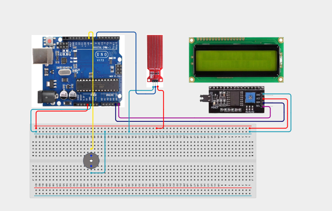

# Project 4.3.30: Project 150 Grand Master Wireless IoT Smart City Controller

| **Description** In Project 150, the capstone project of the Coder Pro Expert series, learners will integrate every core subsystem into one Grand Master IoT Smart City Controller. An HC-05 Bluetooth module enables two-way wireless control and monitoring. A DS3231 RTC drives a time-based schedule for the relay. A BME280 sensor streams environmental telemetry. The I2C LCD provides a local dashboard, and the buzzer signals alerts. Bluetooth commands from a smartphone can override the scheduled relay state, demonstrating manual-override logic in a live multi-sensor IoT node.|
|------------------|----------------------------------------------------------------|
| **Use case**     |Smart city IoT controllers are deployed at street-level nodes to manage street lighting, environmental quality monitoring, HVAC scheduling, and emergency alerts — all from a central management platform. This capstone project combines every system element learners have studied across the Coder Pro kit into a single, production-grade architecture.|

## Components (Things You will need)

|  |  |  |  |  |  |  |  |  |  |
|----------------------------------------------------- |----------------------------------------------------- |----------------------------------------------------- |----------------------------------------------------- |----------------------------------------------------- |----------------------------------------------------- |----------------------------------------------------- |----------------------------------------------------- |----------------------------------------------------- |-----------------------------------------------------|

## Building the circuit

Things Needed:

- Arduino Uno Core Board = 1
- HC-05 Bluetooth Module = 1
- DS3231 RTC Module = 1
- BME280 Sensor = 1
- Relay Module = 1
- IIC 1602 LCD = 1
- Active Buzzer = 1
- USB Cable & Jumper Wires

## Mounting the component on the breadboard and wiring the circuit

**Step 1:** Place the Arduino Uno and breadboard on your workspace. Connect the 5V and GND pins to the breadboard power rails.

**Step 2:** Place the HC-05 Bluetooth module. Connect VCC to 5V, GND to GND, TXD to Arduino Pin 2 (RX), and RXD to Arduino Pin 3 (TX — use a voltage divider or level shifter).

**Step 3:** Place the DS3231 RTC module. Connect VCC to 5V, GND to GND, SDA to Arduino A4, and SCL to A5.

**Step 4:** Place the BME280 sensor. Connect VCC to 3.3V, GND to GND, SDA to A4, and SCL to A5. (The BME280 default I2C address is 0x76; try 0x77 if undetected. It shares the I2C bus with the RTC and LCD safely.)

**Step 5:** Place the IIC 1602 LCD. Connect VCC to 5V, GND to GND, SDA to A4, and SCL to A5 (all sharing the same I2C bus).

**Step 6:** Place the relay module. Connect VCC to 5V, GND to GND, and IN to Arduino Digital Pin 7.

**Step 7:** Place the active buzzer. Connect the positive (+) pin to Arduino Digital Pin 8 and the negative (–) pin to GND.

**Step 8:** Verify all VCC, 3.3V, and GND connections, and confirm all I2C devices (RTC, BME280, LCD) are on the A4/A5 bus. Then connect the Arduino USB cable to the computer.



_Make sure to connect the Arduino USB cable to the Arduino board._

## PROGRAMMING

**Step 1:** Open your Arduino IDE. See how to set up here: [Getting Started](../../../STEMAIDE_CODER_Kit_Manual/Getting_Started/Arduino_IDE_Setup.md).

**Step 2:** Copy and paste the program below into your IDE. Study each section to understand how the Grand Master IoT Smart City Controller works.

```cpp
#include <SoftwareSerial.h>
#include <Wire.h>
#include <RTClib.h>
#include <Adafruit_Sensor.h>
#include <Adafruit_BME280.h>
#include <LiquidCrystal_I2C.h>

SoftwareSerial BT(2, 3); // HC-05 RX, TX

RTC_DS3231 rtc;
Adafruit_BME280 bme;
LiquidCrystal_I2C lcd(0x27, 16, 2);

const int relayPin  = 7;
const int buzzerPin = 8;

// Relay schedule: ON from 18:00 to 06:00 (street lights)
bool relayOverride  = false;  // true = manual BT override active
bool overrideState  = false;  // state when override is active

void setup() {
  Serial.begin(9600);
  BT.begin(9600);
  Wire.begin();

  if (!rtc.begin()) { Serial.println("RTC error!"); while (1); }
  if (rtc.lostPower()) rtc.adjust(DateTime(F(__DATE__), F(__TIME__)));

  if (!bme.begin(0x76)) {
    Serial.println("BME280 not found – try 0x77");
    // Continue with zero readings rather than halt
  }

  lcd.init(); lcd.backlight();
  lcd.print("IoT City Node");
  lcd.setCursor(0, 1); lcd.print("Starting...");

  pinMode(relayPin,  OUTPUT);
  pinMode(buzzerPin, OUTPUT);
  digitalWrite(relayPin, HIGH); // Relay OFF initially
  delay(1500);
  lcd.clear();
  Serial.println("Project 150: Grand Master IoT Smart City Controller Online");
  BT.println("=== IoT Smart City Controller Ready ===");
  BT.println("Commands: R1=Relay ON  R0=Relay OFF  RA=Auto Mode");
}

void loop() {
  // ---- Bluetooth command handling ----
  if (BT.available()) {
    String cmd = BT.readStringUntil('\n');
    cmd.trim();
    if (cmd == "R1") {
      relayOverride = true; overrideState = true;
      tone(buzzerPin, 1200, 200);
      BT.println("OVERRIDE: Relay ON");
      Serial.println("BT Override: Relay ON");
    } else if (cmd == "R0") {
      relayOverride = true; overrideState = false;
      tone(buzzerPin, 600, 200);
      BT.println("OVERRIDE: Relay OFF");
      Serial.println("BT Override: Relay OFF");
    } else if (cmd == "RA") {
      relayOverride = false;
      BT.println("AUTO mode restored");
      Serial.println("BT: Auto mode restored");
    } else {
      BT.println("Unknown cmd. Use R1, R0, or RA.");
    }
  }

  // ---- Read sensors ----
  DateTime now  = rtc.now();
  float temp    = bme.readTemperature();
  float hum     = bme.readHumidity();
  float pres    = bme.readPressure() / 100.0F;

  // ---- Relay schedule logic (street light: ON 18:00-06:00) ----
  bool scheduledON = (now.hour() >= 18 || now.hour() < 6);

  if (relayOverride) {
    digitalWrite(relayPin, overrideState ? LOW : HIGH);
  } else {
    digitalWrite(relayPin, scheduledON ? LOW : HIGH);
  }

  // ---- LCD display (alternates between time and environment) ----
  static unsigned long lastSwitch = 0;
  static bool showEnv = false;
  if (millis() - lastSwitch > 3000) { showEnv = !showEnv; lastSwitch = millis(); }

  lcd.clear();
  if (!showEnv) {
    char line0[17], line1[17];
    sprintf(line0, "%02d:%02d:%02d %s", now.hour(), now.minute(), now.second(),
            (relayOverride ? (overrideState ? "OVR-ON" : "OVR-OF") : (scheduledON ? "ON    " : "OFF   ")));
    sprintf(line1, "T:%.1fC H:%.0f%%", temp, hum);
    lcd.setCursor(0, 0); lcd.print(line0);
    lcd.setCursor(0, 1); lcd.print(line1);
  } else {
    char line0[17], line1[17];
    sprintf(line0, "P:%.1fhPa", pres);
    sprintf(line1, relayOverride ? "MANUAL OVERRIDE" : "AUTO SCHEDULE");
    lcd.setCursor(0, 0); lcd.print(line0);
    lcd.setCursor(0, 1); lcd.print(line1);
  }

  // ---- Serial + Bluetooth telemetry ----
  String telem = "Time:" + String(now.hour()) + ":" + String(now.minute()) +
                 " T:" + String(temp,1) + "C H:" + String(hum,1) +
                 "% P:" + String(pres,1) + "hPa Relay:" +
                 (relayOverride ? (overrideState ? "OVR-ON" : "OVR-OFF") : (scheduledON ? "SCHED-ON" : "SCHED-OFF"));
  Serial.println(telem);
  BT.println(telem);

  delay(2000);
}
```

**Step 7:** Save your code. _See the [Getting Started](../../../STEMAIDE_CODER_Kit_Manual/Getting_Started/Arduino_IDE_Setup.md) section_

**Step 8:** Select the arduino board and port _See the [Getting Started](../../../STEMAIDE_CODER_Kit_Manual/Getting_Started/Arduino_IDE_Setup.md) 

**Step 9:** Upload your code. 

## CONCLUSION

The Grand Master Wireless IoT Smart City Controller is the capstone project of the "
STEMAIDE Coder Pro Expert series. It integrates Bluetooth wireless communication, "
real-time RTC scheduling, multi-sensor environmental monitoring, LCD dashboarding, "
relay actuation, and Bluetooth manual override into a single, production-capable IoT node.

The main system flow is:

HC-05 (Commands) + DS3231 (Schedule) + BME280 (Environment) → Arduino → Relay + LCD + BT Telemetry

Through this project, learners demonstrate mastery of the entire Coder Pro "
curriculum — wireless protocols, real-time scheduling, sensor fusion, automated "
control, and manual-override IoT architecture — the complete skill set of a "
professional embedded IoT systems engineer.
