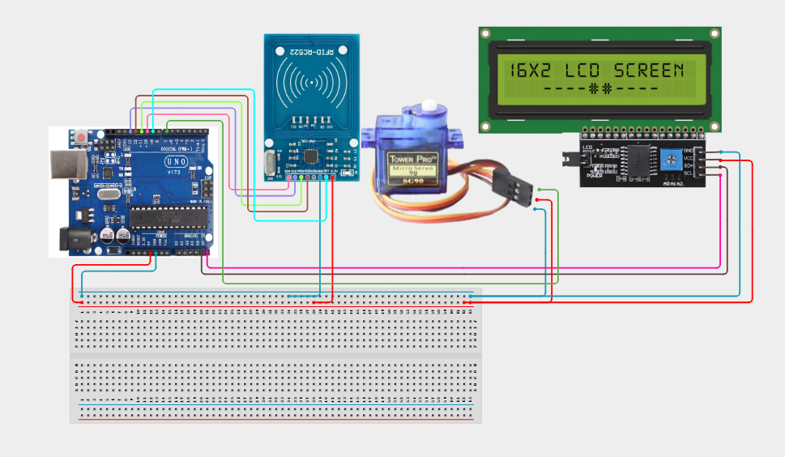

# Project 4.3.3: RFID Automated Garage Barrier System

| **Description** | In this project, learners will build an automated garage barrier system using an RFID RC522 reader, SG90 servo motor, I2C 1602 LCD, and traffic light module. The RFID reader identifies an authorized card or tag, the Arduino checks the card's UID, and the servo motor opens the barrier when access is granted. The LCD displays the access status while the traffic light provides a visual indication of whether access is allowed or denied.|
|------------------|----------------------------------------------------------------|
| **Use case**     |This system demonstrates how RFID identification can be used for automated access control. Similar systems are used in parking lots, office entrances, restricted areas, schools, and other locations where users need to be identified before gaining access.|

## Components (Things You will need)

|  |  |  |  | | | |
| --- | --- | --- | --- | --- | --- | --- |

## Building the circuit

Things Needed:

- Arduino Uno 
- RFID RC522
- Servo Motor 
- IIC 1602 LCD 
- USB Cable
- Jumper Wires

## Mounting the component on the breadboard and wiring the circuit

Step 1: Place the Arduino Uno and breadboard on your workspace.

Step 2: Connect the Arduino 5V pin to the breadboard positive (+) power rail.

Step 3: Connect the Arduino GND pin to the breadboard negative (–) ground rail.

Step 4: Place the RFID RC522 module on the workspace.

Step 5: Connect the RC522 3.3V pin to the Arduino 3.3V pin.

Step 6: Connect the RC522 GND pin to the GND rail.

Step 7: Connect the RC522 SDA/SS pin to Arduino Pin 10.

Step 8: Connect the RC522 SCK pin to Arduino Pin 13.

Step 9: Connect the RC522 MOSI pin to Arduino Pin 11.

Step 10: Connect the RC522 MISO pin to Arduino Pin 12.

Step 11: Connect the RC522 RST pin to Arduino Pin 9.

Step 12: Place the SG90 servo motor on the workspace.

Step 13: Connect the servo VCC wire to the appropriate 5V supply.

Step 14: Connect the servo GND wire to the GND rail.

Step 15: Connect the servo signal wire to Arduino Pin 6.

Step 16: Place the I2C 1602 LCD on the workspace.

Step 17: Connect the LCD VCC pin to the 5V power rail.

Step 18: Connect the LCD GND pin to the GND rail.

Step 19: Connect the LCD SDA pin to Arduino A4.

Step 20: Connect the LCD SCL pin to Arduino A5.

Step 21: Place the traffic light module on the workspace.

Step 22: Connect the traffic light module GND pin to the GND rail.

Step 23: Connect the traffic light red signal to Arduino Pin 4.

Step 24: Connect the traffic light yellow signal to Arduino Pin 5.

Step 25: Connect the traffic light green signal to Arduino Pin 7.

Step 26: Connect the traffic light module VCC to the appropriate power supply according to the module's specifications.

Step 27: Check all VCC, 3.3V, and GND connections before powering the circuit.

Step 28: Check that the RFID module is connected to the correct SPI pins.

Step 29: Check that the servo, LCD, and traffic light are connected to the same pins used in the program.



_Make sure to connect the Arduino USB cable to the Arduino board._

## PROGRAMMING

**Step 1:** Open your Arduino IDE. See how to set up here: [Getting Started](../../../STEMAIDE_CODER_Kit_Manual/Getting_Started/Arduino_IDE_Setup.md).

**Step 2:** Write the complete program implementing the system logic with appropriate pin definitions, setup configuration, and the main control loop.

```cpp
#include <SPI.h>
#include <MFRC522.h>
#include <Servo.h>
#include <Wire.h> 
#include <LiquidCrystal_I2C.h>

// Pin Definitions
#define SS_PIN 10
#define RST_PIN 9
#define SERVO_PIN 6 // Adjust based on your specific PWM pin connection

MFRC522 mfrc522(SS_PIN, RST_PIN);
Servo garageServo;
LiquidCrystal_I2C lcd(0x27, 16, 2); // Verify your I2C address (often 0x27 or 0x3F)

void setup() {
  Serial.begin(9600);
  SPI.begin();
  mfrc522.PCD_Init();
  garageServo.attach(SERVO_PIN);
  garageServo.write(0); // Initial barrier closed position

  lcd.init();
  lcd.backlight();
  lcd.setCursor(0, 0);
  lcd.print("Garage System");
  lcd.setCursor(0, 1);
  lcd.print("Ready...");
  
  Serial.println("Project 123: RFID Automated Garage Barrier System Online");
}

void loop() {
  // Look for new cards
  if (!mfrc522.PICC_IsNewCardPresent()) return;
  if (!mfrc522.PICC_ReadCardSerial()) return;

  // Show UID on Serial Monitor
  Serial.print("UID tag :");
  String content= "";
  for (byte i = 0; i < mfrc522.uid.size; i++) {
     content.concat(String(mfrc522.uid.uidByte[i] < 0x10 ? " 0" : " "));
     content.concat(String(mfrc522.uid.uidByte[i], HEX));
  }
  content.toUpperCase();

  // Authentication Logic
  if (content.substring(1) == "YOUR_TAG_UID_HERE") { // Replace with your tag's UID
    lcd.clear();
    lcd.print("Access Granted");
    garageServo.write(90); // Open barrier
    delay(3000); // Keep open for 3 seconds
    garageServo.write(0);  // Close barrier
    lcd.clear();
    lcd.print("Garage System");
  } else {
    lcd.clear();
    lcd.print("Access Denied");
    delay(2000);
    lcd.clear();
    lcd.print("Garage System");
  }
}
```

**Step 7:** Save your code. _See the [Getting Started](../../../STEMAIDE_CODER_Kit_Manual/Getting_Started/Arduino_IDE_Setup.md) section_

**Step 8:** Select the arduino board and port _See the [Getting Started](../../../STEMAIDE_CODER_Kit_Manual/Getting_Started/Arduino_IDE_Setup.md).

**Step 9:** Upload your code. 

## CONCLUSION

The system processes telemetry signals and security credentials in real time, driving relays, motors, and displays reliably.
