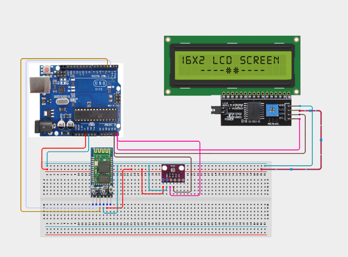

# Project 4.3.4: Bluetooth Wireless Weather Telemetry Node

| **Description** | In this project, learners will build an environmental telemetry system combining an HC-05 Bluetooth module, a BME280 sensor, an I2C 1602 LCD, and an RGB LED. The Arduino reads temperature, humidity, and barometric pressure from the BME280, outputs it on the LCD, transmits it over Bluetooth to a smartphone, and changes the RGB LED color depending on temperature levels.|
|------------------|----------------------------------------------------------------|
| **Use case**     |This project models wireless IoT weather stations, remote agricultural sensors, climate telemetry nodes, and industrial atmospheric monitors.|

## Components (Things You will need)

|  |  |  |  |  |  |  |  |
| --- | --- | --- | --- | --- | --- | --- | --- |

## Building the circuit

Things Needed:

- Arduino Uno Core Board = 1
- HC-05 Bluetooth Module = 1
- BME280 Sensor = 1
- I2C 1602 LCD Module = 1
- RGB LED Module = 1
- Resistors (220 ohm) = 3
- USB Cable & Jumper Wires

## Mounting the component on the breadboard and wiring the circuit

**Step 1:** Establish 5V, 3.3V, and GND rails on the breadboard from the Arduino.
**Step 2:** Connect the BME280: VCC to the 3.3V rail, GND to the GND rail, SDA to A4, and SCL to A5.
**Step 3:** Connect the HC-05 Bluetooth: VCC to the 5V rail, GND to the GND rail, TXD to Pin 2, and RXD to Pin 3.
**Step 4:** Place the I2C LCD: connect VCC to the 5V rail, GND to the GND rail, SDA to A4, and SCL to A5. (Since SDA/SCL are shared, wire them in parallel).
**Step 5:** Connect the RGB LED: Red pin to Pin 5, Green pin to Pin 6, and Blue pin to Pin 7 (each through a 220 ohm resistor), Common pin to GND rail.
**Step 6:** Verify all wire connections and polarities, then plug in the USB cable.



_Make sure to connect the Arduino USB cable to the Arduino board._

## PROGRAMMING

**Step 1:** Open your Arduino IDE. See how to set up here: [Getting Started](../../../STEMAIDE_CODER_Kit_Manual/Getting_Started/Arduino_IDE_Setup.md).

**Step 2:** Write the complete program implementing the system logic with appropriate pin definitions, setup configuration, and the main control loop.

```cpp
#include <Wire.h>
#include <Adafruit_Sensor.h>
#include <Adafruit_BME280.h>
#include <LiquidCrystal_I2C.h>
#include <SoftwareSerial.h>

SoftwareSerial BT(2, 3);   // RX, TX
LiquidCrystal_I2C lcd(0x27, 16, 2);
Adafruit_BME280 bme;

const int redPin = 5;
const int greenPin = 6;
const int bluePin = 7;

void setup() {
  Serial.begin(9600);
  BT.begin(9600);
  lcd.init();
  lcd.backlight();

  pinMode(redPin, OUTPUT);
  pinMode(greenPin, OUTPUT);
  pinMode(bluePin, OUTPUT);

  lcd.setCursor(0, 0);
  lcd.print("Weather Node");

  if (!bme.begin(0x76)) { // 0x76 is default, change to 0x77 if needed
    lcd.clear();
    lcd.print("BME280 Error");
    while (1);
  }
  delay(1500);
}

void loop() {
  float temp = bme.readTemperature();
  float hum = bme.readHumidity();
  float pres = bme.readPressure() / 100.0F;

  // Display locally on I2C LCD
  lcd.clear();
  lcd.setCursor(0, 0);
  lcd.print("T:"); lcd.print(temp, 1); lcd.print("C H:"); lcd.print(hum, 0); lcd.print("%");
  lcd.setCursor(0, 1);
  lcd.print("P:"); lcd.print(pres, 1); lcd.print("hPa");

  // Output over Bluetooth to mobile terminal
  BT.println("--- Weather Telemetry ---");
  BT.print("Temperature: "); BT.print(temp); BT.println(" C");
  BT.print("Humidity: "); BT.print(hum); BT.println(" %");
  BT.print("Pressure: "); BT.print(pres); BT.println(" hPa");
  BT.println("-------------------------");

  // RGB Threshold Indicators
  if (temp > 30.0) {
    digitalWrite(redPin, HIGH);   // Red indicates hot
    digitalWrite(greenPin, LOW);
    digitalWrite(bluePin, LOW);
  } else if (temp >= 20.0 && temp <= 30.0) {
    digitalWrite(redPin, LOW);
    digitalWrite(greenPin, HIGH); // Green indicates comfortable
    digitalWrite(bluePin, LOW);
  } else {
    digitalWrite(redPin, LOW);
    digitalWrite(greenPin, LOW);
    digitalWrite(bluePin, HIGH);  // Blue indicates cold
  }

  delay(3000);
}
```

**Step 3:** Save your code. _See the [Getting Started](../../../STEMAIDE_CODER_Kit_Manual/Getting_Started/Arduino_IDE_Setup.md) section_

**Step 4:** Select the Arduino board and port. _See the [Getting Started](../../../STEMAIDE_CODER_Kit_Manual/Getting_Started/Arduino_IDE_Setup.md) section: Selecting Arduino Board Type and Uploading your code_.

**Step 5:** Upload your code. _See the [Getting Started](../../../STEMAIDE_CODER_Kit_Manual/Getting_Started/Arduino_IDE_Setup.md) section: Selecting Arduino Board Type and Uploading your code_

## CONCLUSION

The Bluetooth Wireless Weather Telemetry Node integrates environmental sensing with wireless communications. By parsing atmospheric values over the I2C bus and transmitting the strings via serial emulation, learners create an active remote monitor.
